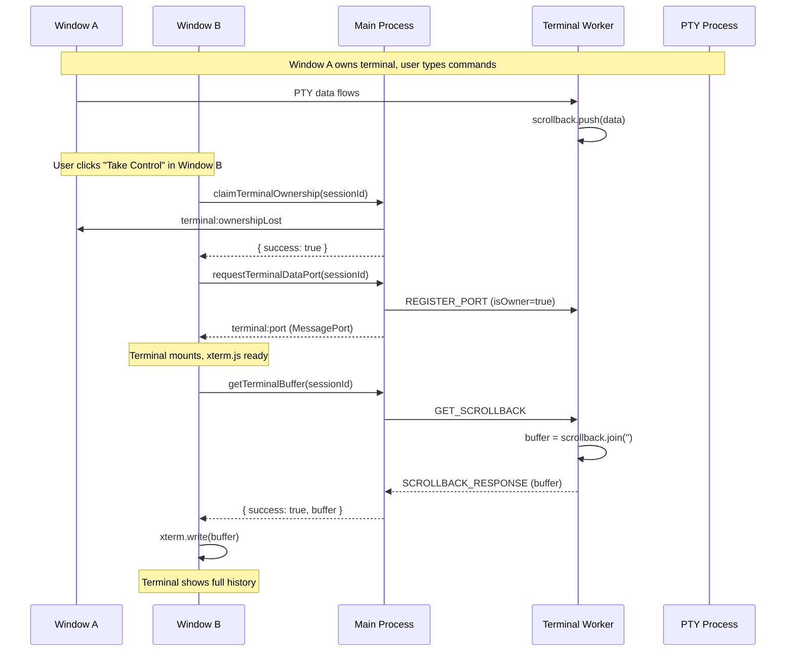

# Terminal Session Management Architecture

## Overview

This architecture documents the lifecycle management of terminal sessions in the Electron application. The `TerminalSessionManager` is the central authority for all terminal state, including session creation, destruction, ownership, port management, and activity tracking.

## Problem Statement

Terminal sessions need to be:

1. Created with proper PTY processes in a utility worker
2. Tracked centrally for cross-window visibility
3. Owned by specific windows (with transfer capability)
4. Connected via MessagePorts for efficient data streaming
5. Cleaned up properly when destroyed (including activity state)

## Architecture Decision

**Approach: Centralized Session Manager with Utility Process Worker**

The `TerminalSessionManager` maintains minimal state in the main process while delegating PTY operations to a utility process worker. This provides:

- Process isolation (PTY crashes don't affect main process)
- Efficient data streaming via MessagePorts (bypasses main process)
- Central tracking of all sessions, ownership, and activity
- Clean lifecycle management with automatic cleanup

## Data Structures

### Session Store
```typescript
// Primary session tracking
private sessions: Map<string, TerminalSession> = new Map();

// Secondary index by repository
private sessionsByRepo: Map<string, string> = new Map(); // "repoPath:context" -> sessionId

// Activity tracking (which terminals have agents working)
private activityStore: Map<string, TerminalActivityState> = new Map();

// MessagePort tracking
private sessionPorts: Map<string, Map<number, MessageChannelMain>> = new Map();
```

### TerminalSession Shape
```typescript
interface TerminalSession {
  id: string;
  pty: null;                    // PTY lives in worker
  directory: string;
  context?: string;
  createdAt: number;
  lastActivity: number;
  repoPath?: string;
  repoId?: string;              // "owner/repo" format
  owner: TerminalOwner | null;
  remoteAttachments: Set<string>;
  metadata?: TerminalSessionMetadata;
}
```

## Data Flow

### Session Creation
```
Renderer (TIPC Client)
         │
         ▼
terminalRouter.createTerminalSession()
         │
         ▼
sessionManager.createSession()
         │
    ┌────┴────┐
    ▼         ▼
sessions.set()  worker.postMessage(CREATE_SESSION)
    │                    │
    │                    ▼
    │         Utility Process creates PTY
    │                    │
    │                    ▼
    │         worker.postMessage(SESSION_CREATED)
    │                    │
    ▼                    ▼
createMessageChannelForSession()
         │
    ┌────┴────┐
    ▼         ▼
port1 → Worker    port2 → Renderer
```

### Session Destruction
```
destroySession(sessionId)
         │
         ▼
worker.postMessage(DESTROY_SESSION)
         │
         ▼
cleanupSession()
    │
    ├── closeAllPortsForSession()
    ├── ownershipManager.removeSession()
    ├── sessions.delete()
    ├── activityStore.delete()  ← Prevents ghost entries
    └── sessionsByRepo cleanup
```

## Key Components

### TerminalSessionManager
- `src/main/terminal/TerminalSessionManager.ts`
- Central authority for session state
- Manages utility worker communication
- Handles MessagePort creation and cleanup

### TerminalOwnershipManager
- `src/main/terminal/TerminalOwnershipManager.ts`
- Tracks which window owns each session
- Handles ownership claims and transfers

### Terminal Worker
- `src/terminal-worker/`
- Utility process that runs PTY instances
- Communicates via postMessage and MessagePorts

### TIPC Router
- `src/main/terminal/tipc/terminalRouter.ts`
- Type-safe RPC interface for renderers
- Delegates to sessionManager and ownershipManager

## Session Limits

- **Maximum sessions**: 20 (configurable via `maxSessions`)
- Enforced in `canCreateSession()` before creation

## Terminal Sessions Panel

The `TerminalSessionsPanel` provides a UI for viewing and switching between terminal sessions across all windows.

### Features
- Lists all terminal sessions sorted by creation time
- Visual distinction between local (this window) and external sessions
- Click local session → switch to that terminal tab
- Click external session → focus the owning window

### Session Broadcast
When sessions are created or destroyed, the router broadcasts to all windows:
```typescript
// In terminalRouter.ts
function broadcastSessionsChanged(): void {
  const sessions = Array.from(sessionManager.getAllSessions().entries()).map(...);
  BrowserWindow.getAllWindows().forEach((win) => {
    win.webContents.send('terminal:sessions-changed', sessions);
  });
}
```

### Window Focus
External session clicks trigger window focus via IPC:
```typescript
// In TerminalSessionsPanel
if (!isLocalSession && session.ownedByWindowId) {
  await WindowService.focusWindowById(session.ownedByWindowId);
}
```

## Session Persistence & Reconnection

### PTY Daemon Architecture

Terminal sessions persist across app restarts via a **PTY daemon** - a standalone process that manages PTY sessions independently of the Electron app:

```
App Shutdown:
├─ TerminalSessionManager.shutdown()
├─ Worker disconnects from daemon (but doesn't destroy sessions)
└─ Sessions continue running in daemon

App Restart:
├─ Worker reconnects to daemon via Unix socket
├─ Daemon sends DAEMON_SESSIONS with all existing sessions
├─ SessionManager restores sessions to memory
└─ Broadcasts SESSIONS_RESTORED to all windows
```

### Session Reconnection Flow

When a renderer window starts (or restarts), terminal tabs appear but are **not automatically connected**. The reconnection sequence is:

1. **Load Sessions**: `TerminalContext` fetches session list via `TerminalService.list()`
2. **Display Tabs**: Tabs are created for each session in the list
3. **User Interaction Required**: Currently, reconnection only triggers when user clicks a tab
4. **Reconnection Steps** (in `onTerminalData`):
   - Claim ownership via `TerminalService.claimOwnership()`
   - Request data port via `TerminalService.requestDataPort()`
   - Refresh terminal display via `TerminalService.refresh()`

### Reconnection Gap (Known Issue)

**Problem**: After renderer restart, tabs show blank/stale terminals because:
- Session list is loaded (tabs appear)
- But ownership is not automatically claimed
- MessagePort is not automatically delivered
- Terminal shows no content until user manually clicks the tab

**Solution** (Draft): Add auto-reconnection handler in `TerminalContext`:

```typescript
// Listen for SESSIONS_RESTORED event
useEffect(() => {
  const unsubscribe = TerminalService.onSessionsRestored((sessions) => {
    // Filter sessions matching this window's terminalContext
    const matchingSessions = sessions.filter(s =>
      s.context?.startsWith(terminalContext)
    );

    // Auto-reconnect each matching session
    for (const session of matchingSessions) {
      TerminalService.claimOwnership(session.id)
        .then(() => TerminalService.requestDataPort(session.id))
        .then(() => TerminalService.refresh(session.id));
    }
  });

  return () => unsubscribe();
}, [terminalContext]);
```

### Buffer Restoration (Ownership Transfer)

When a window takes control of a terminal from another window, the terminal needs to display the previous output history. This is handled via a **pull-based** `getTerminalBuffer()` mechanism.



**Legacy Mode**: Worker joins `session.scrollback[]` array and returns full buffer.

**Daemon Mode**: Currently returns `null` (uses existing push-based `attach` flow). See backlog task for pull-based daemon enhancement.

This pull-based mechanism complements the existing push-based scrollback replay that occurs when `registerPort(isOwner=true)` is called, providing deterministic buffer restoration when xterm.js is ready.

### Events

| Event | Direction | Description |
|-------|-----------|-------------|
| `DAEMON_SESSIONS` | Daemon → Worker | Sessions sent when worker connects |
| `SESSIONS_RESTORED` | Main → Renderer | Broadcast after restoring from daemon |
| `PORT_READY` | Main → Renderer | MessagePort delivered for data streaming |
| `OWNERSHIP_LOST` | Main → Renderer | Another window claimed this session |
| `GET_SCROLLBACK` | Main → Worker | Request scrollback buffer for session |
| `SCROLLBACK_RESPONSE` | Worker → Main | Returns scrollback buffer data |

## Related Architecture

- **Terminal Activity Tracking**: See `.principal-views/terminal-activity-tracking/` for agent working state propagation
- Activity store is now integrated into TerminalSessionManager for proper lifecycle management

## Key Files

**Main Process:**
- `src/main/terminal/TerminalSessionManager.ts` - Central session management
- `src/main/terminal/TerminalOwnershipManager.ts` - Ownership tracking
- `src/main/terminal/tipc/terminalRouter.ts` - TIPC procedures
- `src/main/terminal/sessionManagerSingleton.ts` - Singleton access

**Worker:**
- `src/terminal-worker/worker-entry.ts` - Utility process entry, handles GET_SCROLLBACK
- `src/terminal-worker/types.ts` - Message types (incl. GetScrollbackMessage, ScrollbackResponseMessage)

**Renderer:**
- `src/renderer/panels/terminal-sessions/TerminalSessionsPanel.tsx` - Sessions panel UI
- `src/renderer/tipc/terminalClient.ts` - TIPC client with onSessionsChanged()
- `src/renderer/main-process-api/WindowService.ts` - Window focus API

**Shared:**
- `src/shared/tipc/terminalRouterTypes.ts` - Shared type definitions
