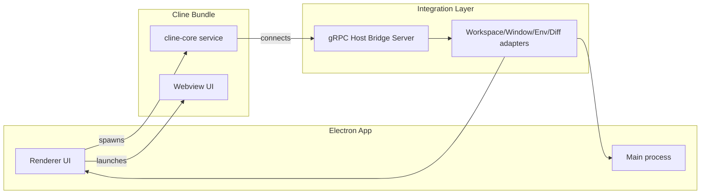
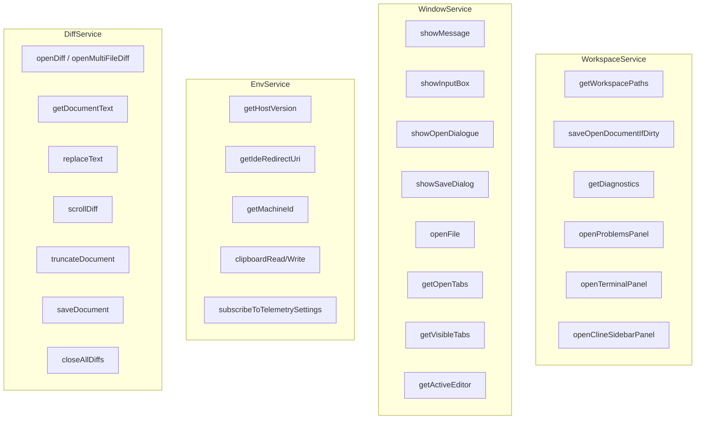

# Cline Extension Host Requirements

## Summary

To run the `cline` VS Code extension inside the Electron host, we must reproduce the environment VS Code provides: a gRPC bridge that exposes workspace, window, environment, and diff capabilities, plus the extension runtime scaffolding (webviews, extension context, storage, auth redirects, and binary access). Missing any surface either blocks core AI workflows or silently degrades user experience.

## Runtime Architecture

* `cline-core` is the compiled extension logic from `standalone/cline-core.ts`.
* The Host Bridge must be reachable at `HOST_BRIDGE_ADDRESS` so `ExternalHostBridgeClientManager` (in `cline`) can call into the Electron environment.
* Host adapters translate each RPC into Electron behaviours (editor focus, dialogs, file IO, telemetry settings, diff handling).

## Required Host Subsystems

| Subsystem | What it must provide | Why it matters |
| --- | --- | --- |
| **Host bridge transport** | gRPC server implementing `proto/host/*.proto` surfaces | All controller actions (open files, save buffers, show messages) are invoked via these RPCs; without them tasks stall.
| **Extension context scaffolding** | `ExtensionContext` analog (`standalone/vscode-context.ts`), secret/global storage directories, `HostProvider.initialize` wiring | Cline caches per-user state (auth, task history) and requires stable storage plus logging output channels.
| **Webview hosting** | Serves `webview-ui` build via `ExternalWebviewProvider`; maps resources under `https://internal.resources/` | Sidebar/chat UI renders entirely in the webview; CSP and asset paths must align or the UI fails to load.
| **Auth redirect handler** | Local HTTPS endpoint (see `hosts/external/AuthHandler.ts`) to receive OAuth callbacks and translate to `getCallbackUrl` | Logging into model providers relies on auth redirects; without this, account linkage never succeeds.
| **Binary resolution** | Provide `rg` path through `HostProvider.getBinaryLocation` | File search and context gathering rely on ripgrep access; missing binary breaks context fetch requests.

## Service Responsibilities

### WorkspaceService

- **`getWorkspacePaths`**: Seeds project understanding and file context resolution; without it, Cline cannot map relative paths.
- **`saveOpenDocumentIfDirty`**: Ensures edits staged in the host editor sync before diffing, avoiding stale file snapshots.
- **`getDiagnostics`**: Powers error-driven repair prompts; missing calls leave the assistant blind to compile/lint failures.
- **Panel openers (`openProblemsPanel`, `openTerminalPanel`, `openClineSidebarPanel`)**: Match VS Code UX by surfacing relevant panes when tasks require user input or output.

### WindowService

- **`showMessage` / `showInputBox`**: Deliver approval prompts, auth flows, and small forms; failure blocks user-driven steps.
- **`showOpenDialogue` / `showSaveDialog` / `openFile`**: Used when the assistant needs file selections or to reveal generated outputs.
- **Tab queries (`getOpenTabs`, `getVisibleTabs`, `getActiveEditor`)**: Drive context heuristics and guard against acting on the wrong file.

### EnvService

- **`getHostVersion` / `getIdeRedirectUri`**: Sent with telemetry and auth flows, letting SaaS endpoints tailor redirects per host.
- **`clipboardReadText` / `clipboardWriteText`**: Used for terminal capture and dictation features to reliably move text between host and agent.
- **`subscribeToTelemetrySettings` & `getTelemetrySettings`**: Align Cline’s analytics with host privacy toggles; ignoring this breaches expectations.
- **`getMachineId`**: Deduplicates installations for telemetry/distinct IDs.

### DiffService

- **`openDiff` / `openMultiFileDiff`**: Present proposed changes for approval; central to Cline’s review loop.
- **`replaceText`, `truncateDocument`, `scrollDiff`, `saveDocument`, `closeAllDiffs`**: Let the assistant refine diffs, animate reveals, and persist user approvals.
- **`getDocumentText`**: Reads back modified diff state for validation and follow-up edits.

## Implementation Checklist

1. **Host bridge server**: Stand up a gRPC server inside the Electron app exposing every RPC defined in `proto/host/{workspace,window,env,diff}.proto`; reuse `src/hosts/vscode/hostbridge/*` from the extension as functional references.
2. **Runtime boot**: Launch `cline-core` with environment variables `HOST_BRIDGE_ADDRESS`, `CLINE_DIR`, and `INSTALL_DIR` pointing at writable storage and packaged assets.
3. **Extension context**: Mount directories referenced in `standalone/vscode-context.ts` (global state, secrets, workspace storage) and pass them into `HostProvider.initialize` along with Electron-specific implementations of logging and binary resolution.
4. **Webview delivery**: Serve the compiled `webview-ui` assets over the internal resource scheme expected by `ExternalWebviewProvider`; wire CSP to allow PostHog and model endpoints.
5. **Auth + clipboard**: Proxy the redirect listener from `AuthHandler` and map clipboard RPCs to Electron main-process APIs to preserve cross-platform behaviour.
6. **Binary availability**: Ship or bundle a compatible `rg` binary and ensure `getBinaryLocation` returns its absolute path.

## Failure Modes When Requirements Are Missing

- **No workspace RPCs** → context fetches return empty arrays, causing the AI to halt with “Could not resolve workspace path.”
- **Dialog APIs absent** → Cline retries forever on auth or approval prompts, producing poor UX and possible deadlocks.
- **Telemetry hooks skipped** → privacy toggles in the host are ignored, creating compliance risks.
- **Diff operations incomplete** → multi-file edits cannot be reviewed, and tasks end with “Unable to open diff” errors.
- **Auth redirect unavailable** → model provider sign-in never completes, preventing most agent actions.

Documenting and honoring these surfaces lets the Electron host support VS Code-class extensions like Cline without regressing on reliability or UX.
