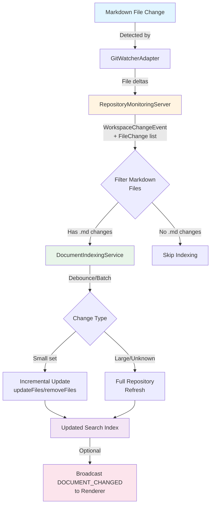

# Markdown Search Real-time Indexing Plan

## Objective
Introduce an event-driven refresh path so the markdown search index automatically re-processes repositories when markdown files change, using the repository monitoring infrastructure instead of manual re-index operations.

## Architecture Overview

## Current State Summary
- `DocumentIndexingService` exposes a `MarkdownFileProvider.watchFiles` hook but currently returns a no-op disposable, so the search engine never receives file change notifications. 【F:src/main/services/DocumentIndexingService.ts†L192-L195】
- The repository monitoring stack already forwards git and workspace change notifications from the worker process to the main process and renderer via `MonitoringInternalEvent.WORKSPACE_CHANGED`. 【F:src/main/repository-monitoring/ipcHandlers.ts†L240-L262】
- Workspace events currently carry only the repository path (and optional git state) and clear repository caches on the monitoring server, but they do not yet deliver explicit markdown file change details. 【F:src/repository-monitoring-server/RepositoryMonitoringServer.ts†L341-L370】【F:src/repository-monitoring-server/types.ts†L188-L191】

## Proposed Integration Steps

### 1. Surface file-change metadata from repository monitoring
1. Extend `RepositoryMonitoringServer.handleWorkspaceChangeEvent` to request the precise file deltas from the monitoring library (or compute them from the `GitState` payload when available) and include paths plus change types in the forwarded event.
   - Update `WorkspaceChangeEventPayload` to add a `changes: FileChange[]` field so downstream consumers can determine whether markdown files were touched. 【F:src/repository-monitoring-server/types.ts†L118-L124】【F:src/repository-monitoring-server/types.ts†L188-L191】
2. Ensure `GitWatcherAdapter` captures the library’s change notifications (commit payloads include `modified`, `created`, `deleted`, etc.) and emits them with the workspace event, debounced in the same way current cache invalidation happens.
3. Add unit coverage in `RepositoryMonitoringServer.test.ts` verifying the workspace event now contains file change lists and that markdown-only commits produce the expected payload.

### 2. Subscribe `DocumentIndexingService` to monitoring events in the main process
1. Inject or lazily acquire a reference to `RepositoryMonitoringManager` inside `DocumentIndexingService` (same process) so it can subscribe directly to `MonitoringInternalEvent.WORKSPACE_CHANGED` without hopping through the renderer IPC layer. 【F:src/main/services/DocumentIndexingService.ts†L69-L119】【F:src/main/repository-monitoring/ipcHandlers.ts†L240-L262】
2. During initialization, register an event handler that:
   - Filters change lists for markdown extensions.
   - Maps repository paths back to Alexandria repository entries (preserved in `alexandriaRepositories`).
   - Queues re-index work when relevant files are detected.
3. Replace the `watchFiles` stub in the markdown provider so that calling `dispose` detaches the repository monitoring subscription, keeping the search engine’s lifecycle well-behaved. 【F:src/main/services/DocumentIndexingService.ts†L192-L195】

### 3. Add batching, deduplication, and fallbacks
1. Implement a debounce/buffer strategy inside `DocumentIndexingService` so rapid sequences of workspace events collapse into a single refresh per repository, preventing redundant full re-index jobs.
2. When only a small set of markdown files changed, call the markdown-search library’s incremental APIs (e.g., `updateFiles`/`removeFiles`) if available; otherwise, enqueue a scoped re-index for the affected repository and fall back to `refreshIndex` when incremental updates are unsupported.
3. Persist the last successful re-index timestamp per repository and log skipped events for observability, ensuring we can trace why an index refresh did or did not fire.

### 4. Wire renderer affordances (optional follow-up)
1. Broadcast `DOCUMENT_CHANGED` events through the existing document search IPC once the service processes a change so the UI can invalidate caches or show progress updates.
2. Update the markdown search documentation to describe the new event-driven refresh behavior and recommended monitoring configuration.

## Testing Strategy
- Extend repository monitoring unit tests to assert that workspace change payloads include markdown diffs and that the manager forwards them unchanged.
- Add integration tests (or a targeted unit test for `DocumentIndexingService`) that simulate a workspace event and confirm the service schedules a re-index for the appropriate repository.
- Perform a manual end-to-end test: modify a markdown file in a registered repository, observe the monitoring event via logs, and verify the search index updates without invoking `refreshIndex` manually.
