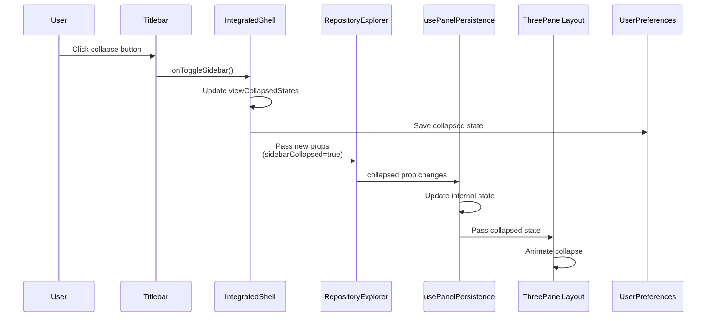
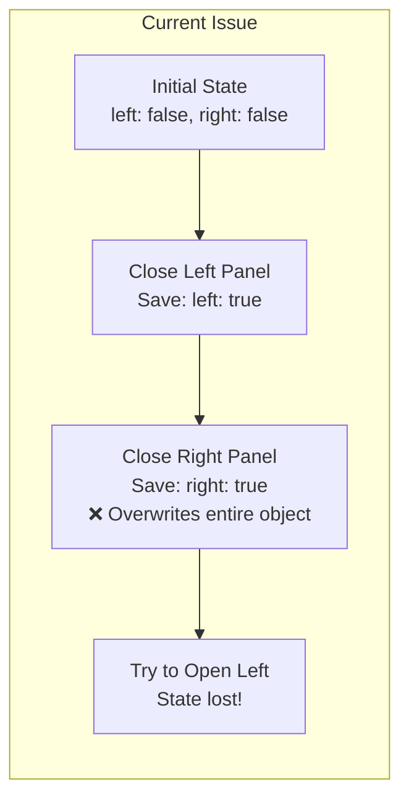

# Panel State Management Documentation

## Overview

This document describes the panel state management system in the Electron app, specifically focusing on the three-panel layout used in views like Repository Explorer and Rooms Manager.

## Problem Statement

**Issue**: When two panels are open and closed sequentially, the first closed panel won't reopen.

**Expected Behavior**: Each panel should independently track its collapsed state and be able to reopen regardless of the order in which panels were closed.

## Architecture Overview

```mermaid
graph TB
    subgraph "Renderer Process"
        IT[IntegratedTitlebar<br/>Controls UI buttons]
        IS[IntegratedShell<br/>Main container]
        RE[RepositoryExplorer<br/>View component]
        RM[RoomsManager<br/>View component]
        UPH[usePanelPersistence<br/>Hook]
        TPL[ThreePanelLayout<br/>@a24z/panels component]
    end

    subgraph "Main Process"
        UPS[UserPreferencesService<br/>IPC API]
        UPHAN[UserPreferencesHandler<br/>Storage handler]
        MS[MultiStore<br/>Persistence layer]
    end

    IT -->|Toggle events| IS
    IS -->|collapsed props| RE
    IS -->|collapsed props| RM
    RE -->|uses| UPH
    RM -->|uses| UPH
    UPH -->|provides state| TPL
    IS -->|Save state| UPS
    UPH -->|Save sizes| UPS
    UPS -->|IPC| UPHAN
    UPHAN -->|Store| MS
```

## Component Responsibilities

### 1. IntegratedTitlebar (`IntegratedTitlebar.tsx`)
- **Purpose**: Renders the titlebar with collapse/expand buttons
- **State**: None (controlled component)
- **Props**:
  - `sidebarCollapsed`: boolean
  - `rightSidebarCollapsed`: boolean
  - `onToggleSidebar`: callback
  - `onToggleRightSidebar`: callback

### 2. IntegratedShell (`IntegratedShell.tsx`)
- **Purpose**: Main container managing view navigation and panel states
- **State**:
  - `viewCollapsedStates`: Record of collapsed states per view
  - `activeView`: Current active view
- **Responsibilities**:
  - Maintains collapsed state for all views
  - Saves collapsed state to preferences
  - Passes collapsed state to child views

### 3. RepositoryExplorer / RoomsManager
- **Purpose**: View components that display three-panel layouts
- **Props**:
  - `sidebarCollapsed`: boolean from parent
  - `rightSidebarCollapsed`: boolean from parent
- **Uses**: `usePanelPersistence` hook

### 4. usePanelPersistence Hook
- **Purpose**: Manages panel sizes and syncs collapsed state
- **State**:
  - `sizes`: Panel size configuration
  - `collapsed`: Local collapsed state
- **Features**:
  - Saves panel sizes to preferences
  - Syncs with parent's collapsed props
  - Provides callbacks to ThreePanelLayout

### 5. UserPreferencesHandler (`userPreferencesHandler.ts`)
- **Purpose**: Main process handler for preferences
- **Issue**: Uses shallow merge for updates
- **Fix Applied**: Added deep merge to preserve nested objects

## Data Flow

### Collapse/Expand Flow



### State Synchronization Issue



## State Structure

### Preferences Storage Structure
```typescript
{
  panelLayouts: {
    repositoryExplorer: {
      sizes: { left: 20, middle: 50, right: 30 },
      collapsed: { left: boolean, right: boolean }
    },
    roomsManager: {
      sizes: { left: 25, middle: 55, right: 20 },
      collapsed: { left: boolean, right: boolean }
    },
    terminalManager: {
      sizes: { left: 30, right: 70 },
      collapsed: { left: boolean }
    }
  },
  interactiveShell: {
    activeNavigationView: 'repository' | 'rooms' | 'terminal' | ...
  }
}
```

### Component State Structure
```typescript
// IntegratedShell state
viewCollapsedStates: {
  repository: { left: false, right: true },
  rooms: { left: false, right: true },
  terminal: { left: false, right: false },
  // ... other views
}
```

## Key Issues Identified

### Issue 1: Shallow Merge in UserPreferencesHandler
**Location**: `src/main/stores/userPreferencesHandler.ts:43`

**Problem**:
```javascript
const updated = { ...current, ...updates };  // Shallow merge
```

When updating nested objects, this overwrites the entire nested object instead of merging it.

**Fix Applied**:
```javascript
const updated = this.deepMerge(current, updates);  // Deep merge
```

### Issue 2: Static Prop Destructuring in Hook
**Location**: `src/renderer/hooks/usePanelPersistence.ts:54`

**Problem**:
```javascript
const { collapsed: initialCollapsed } = options;  // Captured once
```

The destructured value is captured at initialization and never updates.

**Fix Applied**:
```javascript
// Use options.collapsed directly in useEffect
useEffect(() => {
  if (options.collapsed.left !== prevCollapsedRef.current.left) {
    setCollapsed(options.collapsed);
  }
}, [options.collapsed.left, ...]);
```

### Issue 3: Incomplete State Updates
**Location**: `src/renderer/principal-window/components/IntegratedShell/IntegratedShell.tsx:146-154`

**Problem**:
```javascript
collapsed: {
  left: newCollapsed,
  // right state was not preserved
}
```

**Fix Applied**:
```javascript
collapsed: {
  left: newCollapsed,
  right: viewCollapsedStates[activeView]?.right,  // Preserve right state
}
```

## Current State After Fixes

### What Was Fixed:
1. ✅ Deep merge implementation in UserPreferencesHandler
2. ✅ Proper prop tracking in usePanelPersistence hook
3. ✅ State preservation when updating single panel

### What Might Still Be Wrong:
1. ❓ ThreePanelLayout component may not be responding to collapsed prop changes
2. ❓ Animation callbacks might not be firing correctly
3. ❓ State synchronization timing issues between parent and child

## Debug Checklist

To diagnose the remaining issue:

1. **Verify State Updates**:
   ```javascript
   // Add logging to IntegratedShell handleToggleSidebar
   console.log('Before toggle:', viewCollapsedStates[activeView]);
   console.log('After toggle:', newCollapsed);
   ```

2. **Check Hook State Sync**:
   ```javascript
   // Add logging to usePanelPersistence useEffect
   console.log('Props collapsed:', options.collapsed);
   console.log('Local collapsed:', collapsed);
   ```

3. **Verify ThreePanelLayout Props**:
   ```javascript
   // Log props passed to ThreePanelLayout
   console.log('TPL collapsed prop:', panelState.collapsed);
   ```

4. **Check Storage**:
   - Open DevTools Application tab
   - Check Local Storage / Electron Store
   - Verify the stored preferences structure

## Potential Solutions to Try

### Solution 1: Force Re-render
```javascript
// In usePanelPersistence
useEffect(() => {
  setCollapsed({ ...options.collapsed });  // Force new object
}, [JSON.stringify(options.collapsed)]);  // Deep comparison
```

### Solution 2: Direct State Pass-through
```javascript
// Remove local state in hook, use props directly
return {
  collapsed: options.collapsed,  // Direct pass-through
  // ... other properties
};
```

### Solution 3: Key-based Re-mount
```javascript
// In RepositoryExplorer
<ThreePanelLayout
  key={`${sidebarCollapsed}-${rightSidebarCollapsed}`}  // Force remount
  collapsed={{ left: sidebarCollapsed, right: rightSidebarCollapsed }}
  // ... other props
/>
```

## Testing Strategy

1. **Open both panels**
2. **Close left panel** → Verify state saved correctly
3. **Close right panel** → Verify both states preserved
4. **Reopen left panel** → Should work
5. **Reopen right panel** → Should work
6. **Switch views** → States should persist per view
7. **Reload app** → States should restore from storage

## Related Files

- `/src/renderer/principal-window/components/IntegratedShell/IntegratedShell.tsx`
- `/src/renderer/principal-window/components/IntegratedShell/IntegratedTitlebar.tsx`
- `/src/renderer/principal-window/views/RepositoryExplorer/RepositoryExplorer.tsx`
- `/src/renderer/principal-window/views/RoomsManager/RoomsManager.tsx`
- `/src/renderer/hooks/usePanelPersistence.ts`
- `/src/main/stores/userPreferencesHandler.ts`
- `/src/window/main-process-api-implementations/userPreferencesApi.ts`
- `node_modules/@a24z/panels` (external dependency)

## Next Steps

1. Add comprehensive logging at each layer
2. Test if the issue is in the ThreePanelLayout component itself
3. Consider bypassing the usePanelPersistence hook temporarily
4. Check if the @a24z/panels library has any known issues with dynamic collapsed prop changes