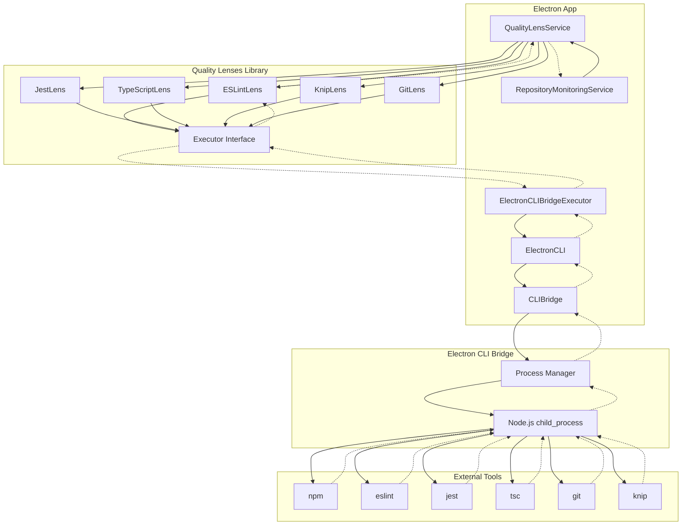

# Quality Lens Architecture Documentation

## Overview

This document describes the architecture of our quality tool execution system, which integrates the `@principal-ai/codebase-quality-lenses` library with our Electron application's command execution infrastructure.

## Architecture Diagram



## Components and Responsibilities

### 1. RepositoryMonitoringService
**Location**: `src/main/repository-monitoring/`
**Responsibilities**:
- Entry point for tool execution requests
- Manages repository context and monitoring
- Delegates tool execution to QualityLensService

### 2. QualityLensService
**Location**: `src/main/quality-lenses/QualityLensService.ts`
**Responsibilities**:
- Singleton service managing all quality lenses
- Maps tool names to appropriate lenses (eslint → ESLintLens, jest → JestLens, etc.)
- Configures lenses with repository and package context
- Orchestrates the lens execution pipeline: `execute → parse → format`

**Key Methods**:
- `executeTool(request: ToolExecutionRequest)` - Main execution entry point
- `findLensForTool(toolName, command)` - Maps tools to lenses
- `initializeLenses()` - Sets up all available lenses

### 3. ElectronCLIBridgeExecutor
**Location**: `src/main/quality-lenses/ElectronCLIBridgeExecutor.ts`
**Responsibilities**:
- Implements the `Executor` interface from quality-lenses library
- Bridges quality lenses with our electron-cli-bridge infrastructure
- Translates lens execution requests to ElectronCLI calls
- Handles command availability checking

**Key Methods**:
- `execute(command, args, options)` - Execute any command via electron-cli-bridge
- `isAvailable(command)` - Check if a command is available
- `stream()` - Streaming interface (not currently used)

### 4. Quality Lenses (Library Components)
**Library**: `@principal-ai/codebase-quality-lenses`
**Responsibilities**:

#### ESLintLens
- Executes ESLint commands with `--format json`
- Parses ESLint JSON output into standardized issues
- Handles different ESLint configurations and rule sets

#### JestLens
- Executes Jest with `--json` and `--no-colors` flags
- Parses test results, coverage data, and performance metrics
- Identifies test failures and slow tests

#### TypeScriptLens
- Executes TypeScript compiler (`tsc`)
- Parses TypeScript error output
- Reports compilation issues and type errors

#### KnipLens
- Executes Knip for dead code detection
- Parses unused exports, imports, and dependencies
- Reports code quality issues

#### GitLens
- Executes Git commands for repository analysis
- Parses Git status, diff, and history information
- Provides repository state information

### 5. ElectronCLI
**Location**: `src/main/electron-cli-bridge/ElectronCLI.ts`
**Responsibilities**:
- High-level API for electron-cli-bridge
- Provides convenient methods for common operations
- Handles command execution with proper error handling and timeouts

**Key Methods**:
- `execute(command, args, options)` - General command execution
- `eslint(patterns, options)` - Specialized ESLint execution
- `git` - GitExecutor instance for Git operations

### 6. CLIBridge
**Location**: `src/main/electron-cli-bridge/CLIBridge.ts`
**Responsibilities**:
- Low-level command execution infrastructure
- Process management and lifecycle
- Environment and working directory handling
- Timeout and error management

## Data Flow

### 1. Tool Execution Request
```typescript
interface ToolExecutionRequest {
  repoPath: string;
  packagePath?: string;
  toolName: string;
  command: string;
  args?: string[];
}
```

### 2. Lens Result
```typescript
interface LensResult {
  lensName: string;
  tool: string;
  timestamp: number;
  success: boolean;
  issues: Issue[];
  metrics: Metrics;
}
```

### 3. Tool Execution Response
```typescript
interface ToolExecutionResponse {
  success: boolean;
  toolName: string;
  command: string;
  packagePath?: string;
  exitCode: number;
  duration: number;
  stdout: string;
  stderr: string;
  lensResult?: LensResult;
}
```

## Command Mapping

| Tool Name | Lens | Typical Command | Output Format |
|-----------|------|-----------------|---------------|
| `eslint` | ESLintLens | `npm run lint` or `eslint . --format json` | JSON |
| `jest` | JestLens | `npm run test` or `jest --json` | JSON |
| `typescript`/`tsc` | TypeScriptLens | `npm run typecheck` or `tsc --noEmit` | Text |
| `knip` | KnipLens | `npx knip` | JSON |
| `git` | GitLens | `git status`, `git diff`, etc. | Text |

## Known Issues and Troubleshooting

### 1. ts-node Configuration Issues
**Problem**: ESLint config uses ES modules, triggering ts-node which expects `tsconfig.node.json`
**Error**: `Cannot read file 'tsconfig.node.json'`
**Solution**: Ensure proper ts-node configuration or use alternative ESLint execution

### 2. npm Script vs Direct Execution
**Problem**: `npm run lint` may fail while `npx eslint` works
**Root Cause**: Different execution environments and configuration loading
**Workaround**: Use ElectronCLI's specialized `eslint()` method

### 3. Command Environment Differences
**Problem**: Commands work in terminal but fail through our system
**Root Cause**: Different environment variables, working directories, or PATH
**Debug**: Compare execution environments and ensure proper option passing

## Testing Strategy

### 1. Unit Tests
- Test each component in isolation
- Mock dependencies and executors
- Verify command parsing and result formatting

### 2. Integration Tests
- Test full pipeline from request to response
- Use real tools with known outputs
- Verify lens parsing accuracy

### 3. Manual Testing
- Test with different repository configurations
- Verify tool availability checking
- Test error handling and timeouts

## Recommendations

1. **Standardize on one execution path** - Either use lenses fully or use ElectronCLI directly
2. **Improve error handling** - Provide clear error messages for configuration issues
3. **Add comprehensive logging** - Track execution flow for debugging
4. **Create fallback strategies** - Handle cases where tools are not available
5. **Document tool requirements** - Specify what tools need to be installed and configured