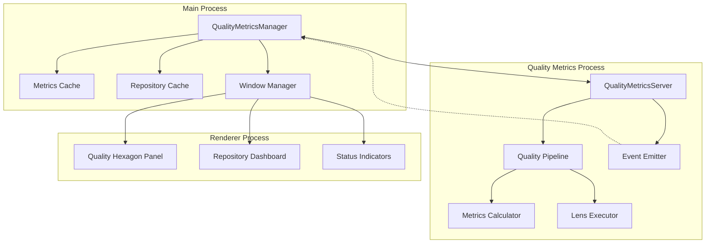
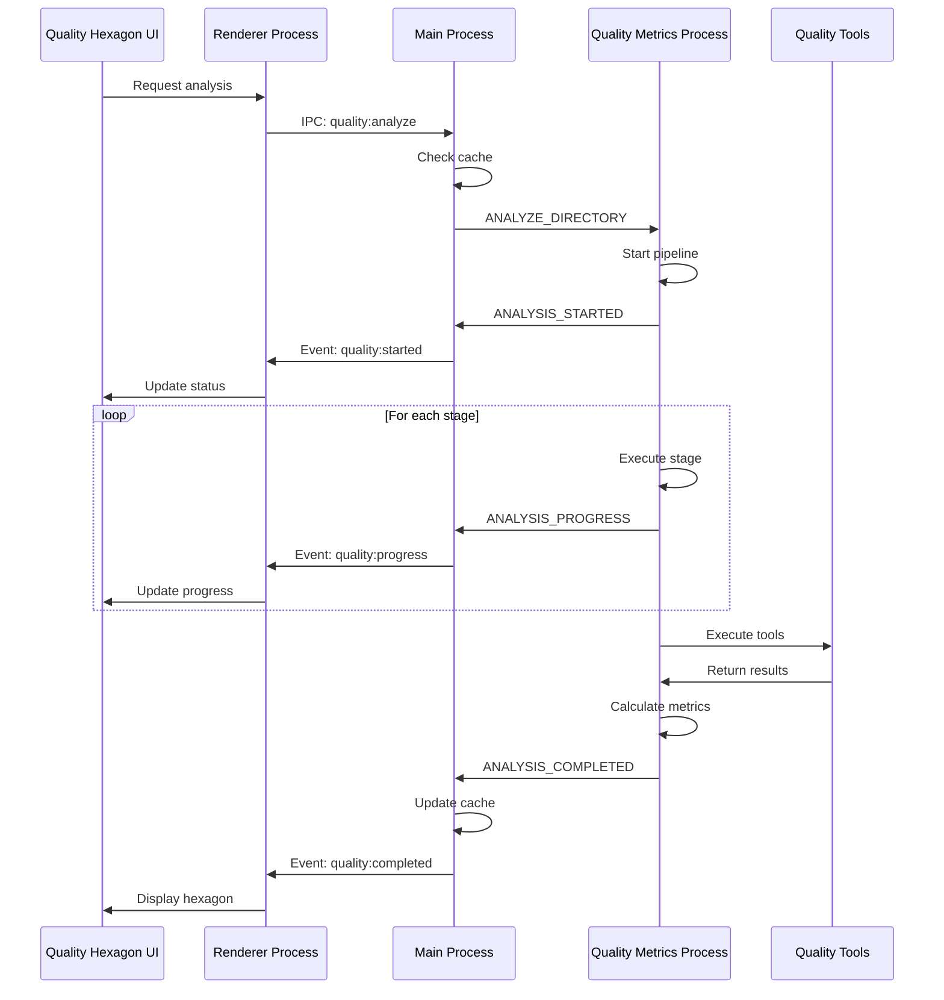
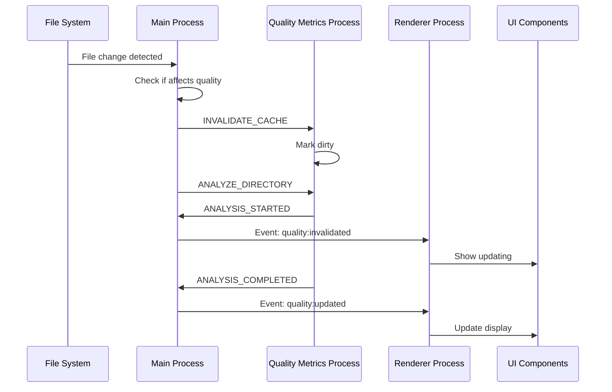

# Quality Metrics Processing Service Architecture

## Executive Summary

This document outlines the architecture for an isolated Quality Metrics Processing Service that will run as a utility process in Electron, similar to the existing EventProcessingServer. This service will be responsible for:

1. Computing quality metrics for directories (for the Quality Hexagon visualization)
2. Caching and managing quality analysis results
3. Providing real-time updates via event-based communication
4. Serving as a centralized source for quality metrics across the application

## Architecture Overview



## Core Components

### 1. Quality Metrics Process (Utility Process)

#### QualityMetricsServer (`src/quality-metrics-server/QualityMetricsServer.ts`)

The main server class that runs in the utility process, responsible for:
- Managing the quality analysis pipeline
- Handling requests from the main process
- Emitting events for real-time updates
- Managing concurrent analysis operations

```typescript
export class QualityMetricsServer extends EventEmitter {
  private pipeline: QualityAnalysisPipeline;
  private activeAnalyses: Map<string, AnalysisState>;
  private config: QualityMetricsServerConfig;

  constructor(config: QualityMetricsServerConfig) {
    super();
    this.config = config;
    this.pipeline = new QualityAnalysisPipeline(config);
    this.activeAnalyses = new Map();
    this.setupMessageHandlers();
  }

  async analyzeDirectory(request: AnalysisRequest): Promise<void> {
    // Queue analysis for processing
    const analysisId = this.generateAnalysisId(request);

    // Emit start event
    this.emit('analysis:started', {
      analysisId,
      directory: request.directory,
      timestamp: Date.now()
    });

    // Process through pipeline
    const result = await this.pipeline.process(request);

    // Store and emit result
    this.activeAnalyses.set(analysisId, result);
    this.emit('analysis:completed', {
      analysisId,
      result,
      timestamp: Date.now()
    });
  }
}
```

#### QualityAnalysisPipeline (`src/quality-metrics-server/QualityAnalysisPipeline.ts`)

Orchestrates the quality analysis workflow:

```typescript
export class QualityAnalysisPipeline {
  private stages: AnalysisStage[] = [
    new DiscoveryStage(),      // Discover available tools
    new ValidationStage(),      // Validate tool configuration
    new ExecutionStage(),       // Execute quality lenses
    new NormalizationStage(),   // Normalize results
    new CalculationStage(),     // Calculate hexagon metrics
    new CacheStage()           // Cache results
  ];

  async process(request: AnalysisRequest): Promise<QualityMetrics> {
    let context: AnalysisContext = {
      request,
      fileTree: null,
      packageLayer: null,
      availableTools: [],
      rawResults: {},
      normalizedResults: {},
      metrics: null
    };

    for (const stage of this.stages) {
      context = await stage.execute(context);

      // Emit progress events
      this.emit('stage:completed', {
        stage: stage.name,
        progress: this.calculateProgress(stage),
        context
      });
    }

    return context.metrics;
  }
}
```

### 2. Main Process Management

#### QualityMetricsManager (`src/main/quality-metrics/QualityMetricsManager.ts`)

Manages the utility process lifecycle and communication:

```typescript
export class QualityMetricsManager extends EventEmitter {
  private worker: UtilityProcess | null = null;
  private requestQueue: RequestQueue;
  private cache: MetricsCache;
  private subscriptions: Map<string, Set<WebContents>>;

  async start(): Promise<void> {
    // Spawn utility process
    this.worker = utilityProcess.fork(workerPath, [], {
      serviceName: 'quality-metrics-server',
      stdio: 'pipe',
      env: {
        ...process.env,
        NODE_ENV: process.env.NODE_ENV || 'development',
      }
    });

    this.setupMessageHandlers();
    this.setupEventForwarding();
  }

  async analyzeDirectory(directory: string, options?: AnalysisOptions): Promise<QualityMetrics> {
    // Check cache first
    const cached = await this.cache.get(directory);
    if (cached && !options?.forceRefresh) {
      return cached;
    }

    // Queue request
    const request: AnalysisRequest = {
      id: generateId(),
      directory,
      options,
      timestamp: Date.now()
    };

    return this.requestQueue.enqueue(request);
  }

  subscribeToUpdates(directory: string, webContents: WebContents): void {
    // Register for real-time updates
    if (!this.subscriptions.has(directory)) {
      this.subscriptions.set(directory, new Set());
    }
    this.subscriptions.get(directory)!.add(webContents);
  }
}
```

### 3. Message Protocol

#### Message Types (`src/quality-metrics-server/types.ts`)

```typescript
// Server to Main Messages
export type ServerToMainMessage =
  | ReadyMessage
  | AnalysisStartedMessage
  | AnalysisProgressMessage
  | AnalysisCompletedMessage
  | AnalysisErrorMessage
  | MetricsCacheUpdateMessage
  | ServerStatsMessage;

export interface AnalysisStartedMessage {
  type: 'ANALYSIS_STARTED';
  id: string;
  timestamp: number;
  directory: string;
  estimatedDuration?: number;
}

export interface AnalysisProgressMessage {
  type: 'ANALYSIS_PROGRESS';
  id: string;
  timestamp: number;
  directory: string;
  stage: string;
  progress: number; // 0-100
  currentTool?: string;
}

export interface AnalysisCompletedMessage {
  type: 'ANALYSIS_COMPLETED';
  id: string;
  timestamp: number;
  directory: string;
  metrics: QualityMetrics;
  duration: number;
}

// Main to Server Messages
export type MainToServerMessage =
  | AnalyzeDirectoryMessage
  | CancelAnalysisMessage
  | GetCachedMetricsMessage
  | InvalidateCacheMessage
  | UpdateConfigMessage;

export interface AnalyzeDirectoryMessage {
  type: 'ANALYZE_DIRECTORY';
  id: string;
  timestamp: number;
  directory: string;
  options?: AnalysisOptions;
}

export interface QualityMetrics {
  directory: string;
  timestamp: number;
  hexagon: {
    tests: number;        // 0-100
    deadCode: number;     // 0-100
    formatting: number;   // 0-100
    linting: number;      // 0-100
    types: number;        // 0-100
    documentation: number; // 0-100
  };
  tier: 'bronze' | 'silver' | 'gold' | 'platinum';
  availableTools: string[];
  toolResults: Record<string, ToolResult>;
  suggestions: QualitySuggestion[];
}
```

### 4. Integration Points

#### IPC Handlers (`src/main/services/ipc/qualityMetricsHandlers.ts`)

```typescript
export function setupQualityMetricsHandlers(manager: QualityMetricsManager) {
  // Analyze directory
  ipcMain.handle('quality:analyze', async (event, directory: string, options?: AnalysisOptions) => {
    return manager.analyzeDirectory(directory, options);
  });

  // Subscribe to real-time updates
  ipcMain.handle('quality:subscribe', async (event, directory: string) => {
    manager.subscribeToUpdates(directory, event.sender);
    return true;
  });

  // Get cached metrics
  ipcMain.handle('quality:getCached', async (event, directory: string) => {
    return manager.getCachedMetrics(directory);
  });

  // Invalidate cache
  ipcMain.handle('quality:invalidate', async (event, directory: string) => {
    return manager.invalidateCache(directory);
  });
}
```

#### Renderer API (`src/renderer/main-process-api/QualityMetricsService.ts`)

```typescript
class QualityMetricsServiceImpl {
  async analyzeDirectory(directory: string, options?: AnalysisOptions): Promise<QualityMetrics> {
    return window.mainProcess.quality.analyze(directory, options);
  }

  subscribeToUpdates(directory: string, callback: (metrics: QualityMetrics) => void): () => void {
    const listener = (event: any, data: QualityUpdateEvent) => {
      if (data.directory === directory) {
        callback(data.metrics);
      }
    };

    window.mainProcess.quality.subscribe(directory);
    window.mainProcess.on('quality:update', listener);

    return () => {
      window.mainProcess.off('quality:update', listener);
    };
  }
}

export const QualityMetricsService = new QualityMetricsServiceImpl();
```

## Event Flow

### 1. Initial Analysis Request



### 2. Real-time Updates (File Changes)



## Caching Strategy

### Multi-Level Cache

1. **Memory Cache** (Quality Metrics Process)
   - Hot cache for active analyses
   - TTL: 5 minutes
   - Max entries: 100

2. **Disk Cache** (Main Process)
   - Persistent cache using typed storage
   - TTL: 24 hours
   - Invalidated on file changes

3. **Invalidation Triggers**
   - File system changes in directory
   - Package.json modifications
   - Configuration file changes
   - Manual refresh request

```typescript
interface CacheEntry {
  directory: string;
  metrics: QualityMetrics;
  timestamp: number;
  hash: string; // Directory content hash
  dependencies: string[]; // Files that affect this entry
}
```

## Performance Optimizations

### 1. Incremental Analysis
- Only re-run affected tools when files change
- Cache individual tool results separately
- Merge cached and new results

### 2. Parallel Execution
- Run independent quality tools in parallel
- Limit concurrency based on system resources
- Priority queue for user-initiated requests

### 3. Progressive Loading
- Return partial results as tools complete
- Update UI progressively
- Cache partial results

### 4. Smart Scheduling
```typescript
class AnalysisScheduler {
  private highPriority: Queue<AnalysisRequest>;  // User-initiated
  private lowPriority: Queue<AnalysisRequest>;   // Background
  private inProgress: Map<string, AnalysisTask>;

  scheduleAnalysis(request: AnalysisRequest): void {
    if (request.options?.priority === 'high') {
      this.highPriority.enqueue(request);
    } else {
      this.lowPriority.enqueue(request);
    }
    this.processNext();
  }
}
```

## Integration with Existing Features

### 1. Repository Manager
```typescript
// src/renderer/repo-manager/RepositoryManager.tsx
const QualityMetricsPanel: React.FC<{ directory: string }> = ({ directory }) => {
  const [metrics, setMetrics] = useState<QualityMetrics | null>(null);

  useEffect(() => {
    // Get initial metrics
    QualityMetricsService.getCached(directory).then(setMetrics);

    // Subscribe to updates
    const unsubscribe = QualityMetricsService.subscribeToUpdates(
      directory,
      setMetrics
    );

    return unsubscribe;
  }, [directory]);

  return <QualityHexagon metrics={metrics} />;
};
```

### 2. Landing Page Integration
```typescript
// src/renderer/pages/LandingPage/LandingPage.tsx
const LandingPageQualityPanel: React.FC = () => {
  const { currentRepository } = useRepository();
  const [metrics, setMetrics] = useState<QualityMetrics | null>(null);
  const [loading, setLoading] = useState(false);

  const analyzeRepository = async () => {
    setLoading(true);
    try {
      const result = await QualityMetricsService.analyzeDirectory(
        currentRepository.path,
        { priority: 'high', forceRefresh: true }
      );
      setMetrics(result);
    } finally {
      setLoading(false);
    }
  };

  return (
    <Panel title="Code Quality">
      {metrics ? (
        <QualityHexagon
          metrics={metrics.hexagon}
          tier={metrics.tier}
          size="md"
        />
      ) : (
        <Button onClick={analyzeRepository} loading={loading}>
          Analyze Quality
        </Button>
      )}
    </Panel>
  );
};
```

### 3. Event Processing Server Integration
- Share repository information cache
- Reuse file system monitoring
- Coordinate analysis scheduling

### 4. Package Layer Integration
- Leverage existing PackageLayerModule discoveries
- Share package.json parsing results
- Coordinate tool execution

## Error Handling

### Graceful Degradation
```typescript
interface PartialMetrics {
  available: Partial<HexagonMetrics>;
  unavailable: string[];
  errors: Record<string, Error>;
}

// Show partial hexagon even if some tools fail
const handleToolFailure = (tool: string, error: Error): void => {
  // Log error
  logger.error(`Tool ${tool} failed:`, error);

  // Mark as unavailable but continue
  partialMetrics.unavailable.push(tool);
  partialMetrics.errors[tool] = error;

  // Emit partial update
  emit('quality:partial', partialMetrics);
};
```

### Recovery Strategies
1. **Retry with exponential backoff** for transient failures
2. **Fallback to cached data** when tools fail
3. **Provide suggestions** for missing tools
4. **Queue for later retry** on resource constraints

## Monitoring & Observability

### Metrics to Track
```typescript
interface QualityServiceMetrics {
  // Performance
  analysisCount: number;
  averageDuration: number;
  cacheHitRate: number;

  // Reliability
  successRate: number;
  toolFailures: Record<string, number>;

  // Resource usage
  memoryUsage: number;
  cpuUsage: number;
  queueLength: number;
}
```

### Event Logging
```typescript
// Structured logging for analysis events
logger.info('analysis.started', {
  directory,
  requestId,
  tools: availableTools,
  cacheStatus: 'miss'
});

logger.info('analysis.completed', {
  directory,
  requestId,
  duration,
  toolsRun: successfulTools.length,
  toolsFailed: failedTools.length,
  cacheStatus: 'updated'
});
```

## Security Considerations

### 1. Process Isolation
- Run in separate utility process with limited permissions
- No direct file system write access
- Communicate only through structured messages

### 2. Command Injection Prevention
```typescript
// Sanitize all paths and commands
const sanitizePath = (path: string): string => {
  // Remove special characters
  // Validate against whitelist
  // Ensure within project boundaries
  return sanitizedPath;
};
```

### 3. Resource Limits
- Maximum concurrent analyses: 3
- Maximum analysis duration: 5 minutes
- Maximum memory usage: 512MB

## Implementation Phases

### Phase 1: Core Infrastructure (Week 1)
- [ ] Create QualityMetricsServer utility process
- [ ] Implement basic message protocol
- [ ] Set up QualityMetricsManager in main process
- [ ] Create simple memory cache

### Phase 2: Analysis Pipeline (Week 2)
- [ ] Integrate codebase-composition for discovery
- [ ] Implement quality lens execution
- [ ] Create metrics calculation logic
- [ ] Add result normalization

### Phase 3: UI Integration (Week 3)
- [ ] Add Quality Hexagon to Landing Page
- [ ] Create QualityMetricsService for renderer
- [ ] Implement real-time updates
- [ ] Add loading states and error handling

### Phase 4: Optimization (Week 4)
- [ ] Implement disk caching
- [ ] Add incremental analysis
- [ ] Optimize parallel execution
- [ ] Add performance monitoring

### Phase 5: Polish & Testing (Week 5)
- [ ] Comprehensive error handling
- [ ] Unit and integration tests
- [ ] Documentation
- [ ] Performance benchmarking

## Configuration

### Server Configuration (`quality-metrics.config.json`)
```json
{
  "server": {
    "maxConcurrent": 3,
    "analysisTimeout": 300000,
    "memoryLimit": 536870912,
    "logLevel": "info"
  },
  "cache": {
    "memoryTTL": 300000,
    "diskTTL": 86400000,
    "maxMemoryEntries": 100,
    "maxDiskSize": 104857600
  },
  "tools": {
    "eslint": { "enabled": true, "timeout": 60000 },
    "typescript": { "enabled": true, "timeout": 60000 },
    "jest": { "enabled": true, "timeout": 120000 },
    "prettier": { "enabled": true, "timeout": 30000 },
    "knip": { "enabled": true, "timeout": 90000 }
  }
}
```

## Testing Strategy

### Unit Tests
- Message protocol serialization/deserialization
- Cache invalidation logic
- Metrics calculation algorithms

### Integration Tests
- End-to-end analysis flow
- Multi-process communication
- Cache consistency

### Performance Tests
- Concurrent analysis handling
- Memory usage under load
- Cache performance

## Migration Path

For existing features to adopt this service:

1. **ViolationsService** → Use quality metrics for linting data
2. **ValidationRunner** → Delegate to quality metrics process
3. **PackageCommandPanel** → Show quality status indicators
4. **RepositoryManager** → Display mini hexagon in header

## Future Enhancements

### 1. Predictive Analysis
- Predict quality trends based on history
- Suggest optimizations before issues arise
- Alert on quality degradation

### 2. Comparative Analysis
- Compare quality across branches
- Track quality over time
- Benchmark against similar projects

### 3. Custom Quality Rules
- User-defined quality metrics
- Project-specific thresholds
- Team quality gates

### 4. IDE Integration
- Real-time quality hints in editor
- Inline quality indicators
- Quick-fix suggestions

## Conclusion

This architecture provides a robust, scalable foundation for quality metrics processing that:
- Isolates heavy computation in a dedicated process
- Provides real-time updates through events
- Scales to support future features
- Integrates seamlessly with existing systems

The event-driven design ensures loose coupling while maintaining performance, and the multi-level caching strategy minimizes redundant computation while keeping data fresh.