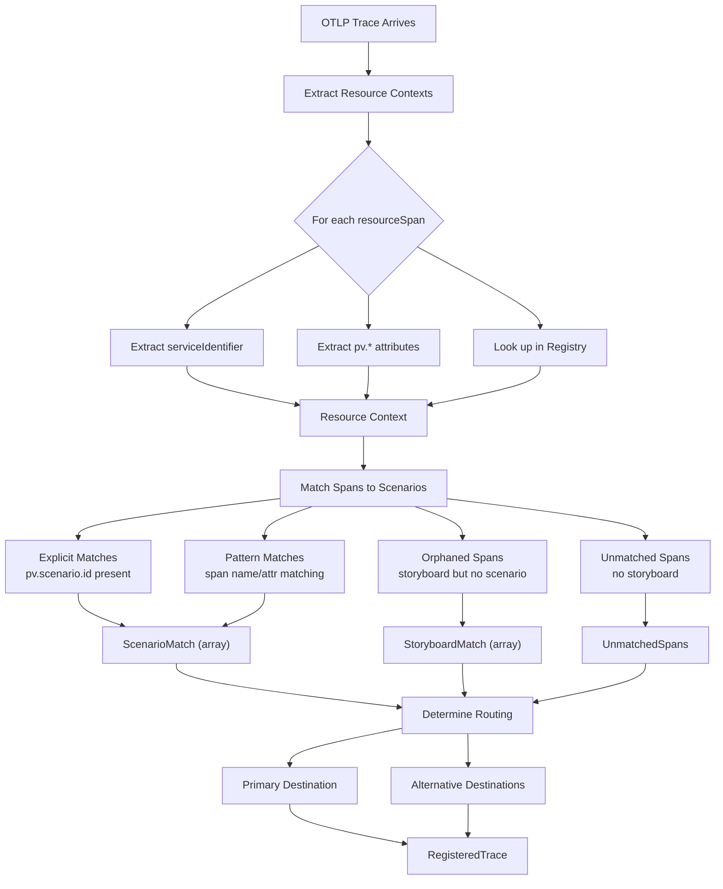
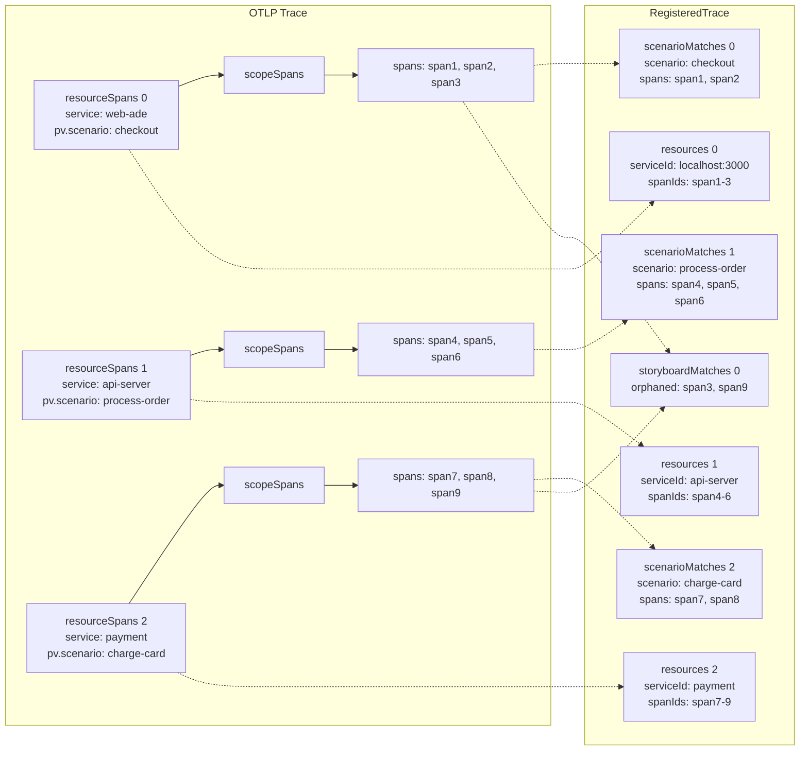
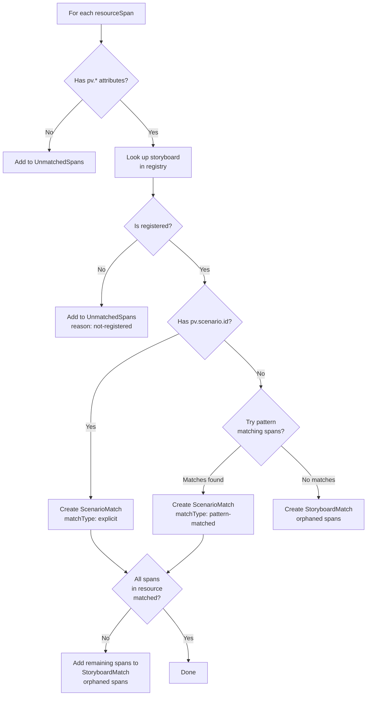
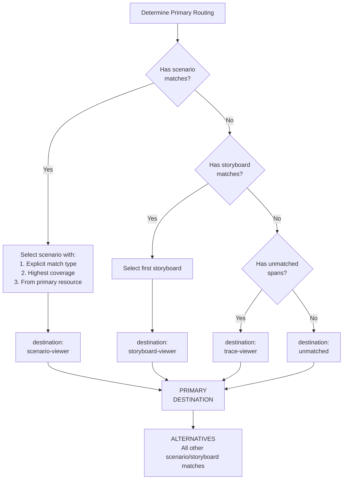
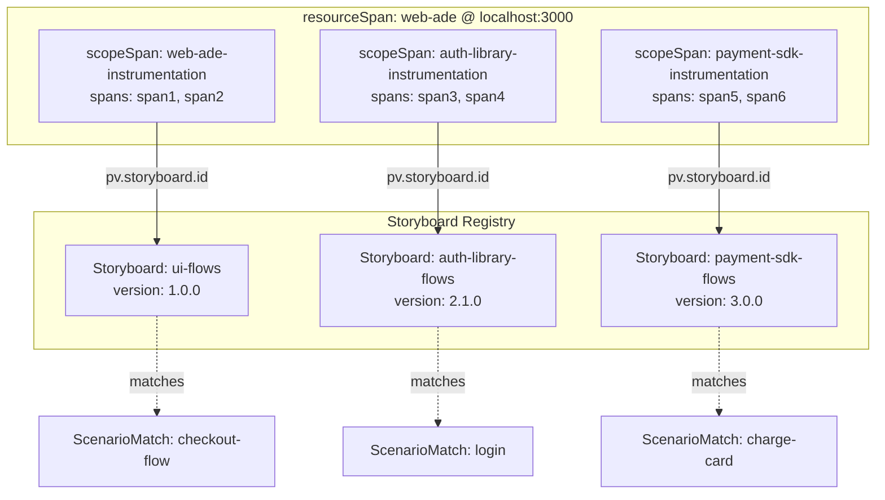
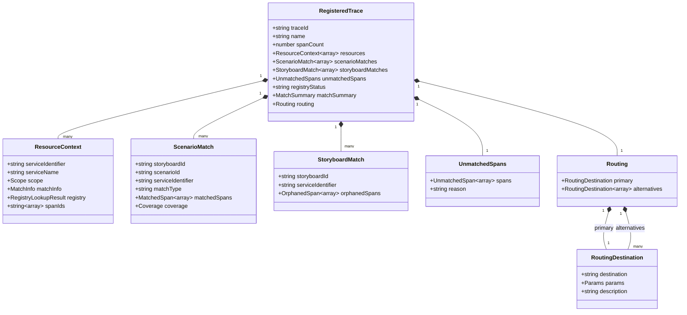
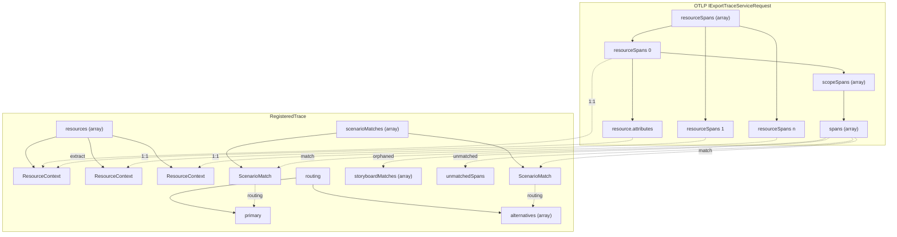
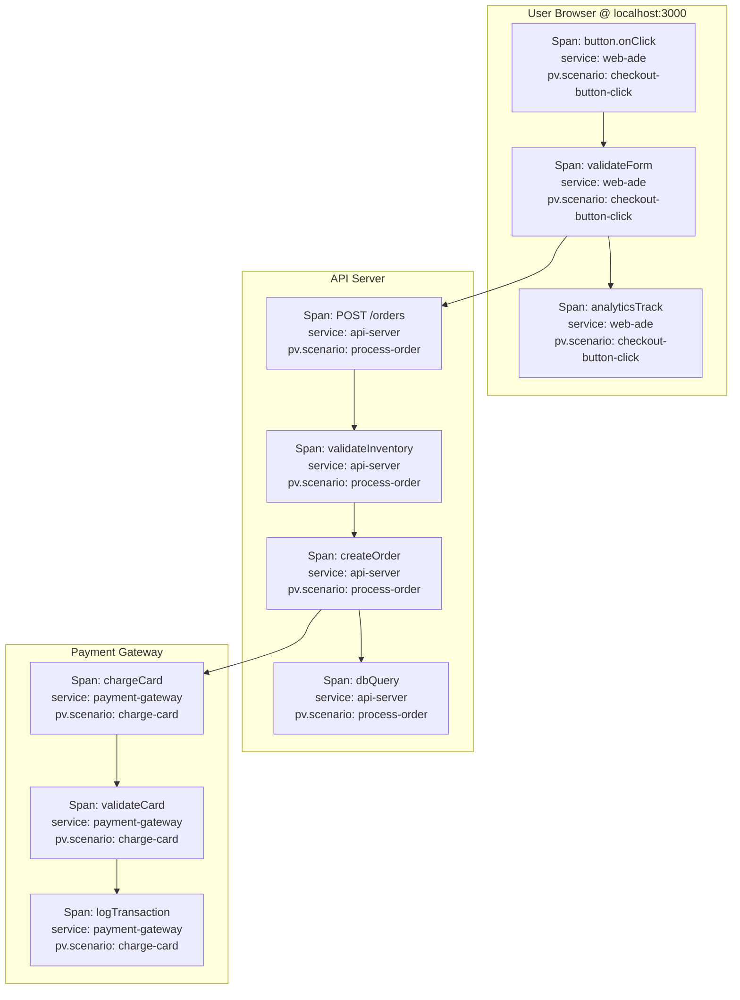
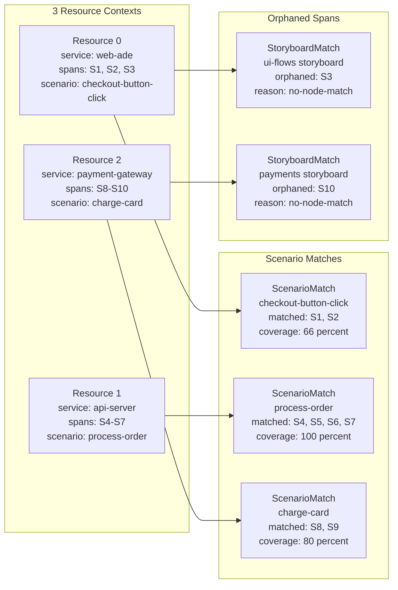
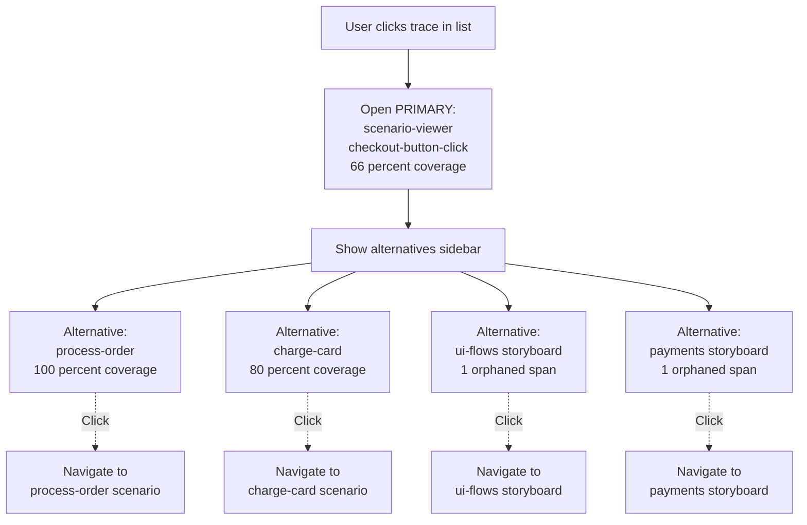

# RegisteredTrace Redesign - Multi-Service & Multi-Scenario Support

**Date**: February 18, 2026
**Status**: 🚧 Design Phase
**Reason**: Current design only supports single service/scenario routing, breaking distributed traces

---

## The Problem

Current `RegisteredTrace` assumes:
- One trace = one service identifier = one storyboard = one scenario = **one routing destination**

**Reality**:
- Distributed traces span multiple services (resourceSpans)
- Each service may have different `pv.*` attributes pointing to different storyboards/scenarios
- Spans within a trace may match multiple scenarios across different storyboards
- Some spans may match a storyboard but not a specific scenario (orphaned)

---

## Visual Overview

### High-Level Flow



### OTLP Structure → RegisteredTrace Mapping



### Span Matching Flow



### Routing Decision Tree



---

## Understanding OTLP Hierarchy: Resources vs. Scopes

### OTLP Structure

```
IExportTraceServiceRequest
└─ resourceSpans[0]          ← One per SERVICE/PROCESS (e.g., "web-ade")
   ├─ resource
   │  └─ attributes[]        ← Service-level: service.name, dev.server.url
   └─ scopeSpans[0]          ← One per INSTRUMENTATION SCOPE (library)
      ├─ scope
      │  ├─ name             ← e.g., "web-ade-instrumentation"
      │  ├─ version          ← e.g., "1.0.0"
      │  └─ attributes[]     ← Scope-level: pv.* attributes CAN BE HERE!
      └─ spans[]             ← Actual trace spans
   └─ scopeSpans[1]          ← Different library in same service
      ├─ scope
      │  ├─ name             ← e.g., "auth-library-instrumentation"
      │  ├─ version          ← e.g., "2.1.0"
      │  └─ attributes[]     ← This library's pv.* attributes
      └─ spans[]

└─ resourceSpans[1]          ← Different SERVICE/PROCESS (e.g., "api-server")
   └─ scopeSpans[0]
      └─ spans[]
```

### Resource vs. Scope: When to Use Each

| Concept | Represents | Example | Attributes |
|---------|------------|---------|------------|
| **resourceSpan** | Service/Process | `web-ade` server, `api-server` microservice | `service.name`, `dev.server.url`, `host.name` |
| **scopeSpan** | Instrumentation Library | Main app code, auth library, payment SDK | `scope.name`, `scope.version`, library-specific `pv.*` |

### Critical Design Decision: Scope-Level Matching

**Why this matters:**

A single service can have **multiple instrumentation scopes** (libraries), and each scope can have **its own storyboard/registry**!

**Key Rules:**
1. ✅ **One resource (service) can have multiple scopes** (one per library)
2. ✅ **Each scope can match a different storyboard** (library has its own registry)
3. ✅ **Scopes within the same resource are independent** (different pv.* attributes)
4. ✅ **Each scope's spans only match that scope's storyboard** (no cross-contamination)

**Example:**
```
Service: web-ade (one resourceSpan)
├─ Scope: web-ade-instrumentation     → Storyboard: ui-flows
├─ Scope: auth-library-instrumentation → Storyboard: auth-library-flows
└─ Scope: payment-sdk-instrumentation  → Storyboard: payment-sdk-flows

Result: 3 different storyboards in the same service!
```

### Visual: Multiple Scopes → Multiple Storyboards



**Result**: One trace, one service, **three different storyboards matched!**

**Example: web-ade using auth-library**

```typescript
{
  resourceSpans: [
    {
      resource: {
        attributes: [
          { key: "service.name", value: "web-ade" },
          { key: "dev.server.url", value: "http://localhost:3000" }
        ]
      },
      scopeSpans: [
        // Main app instrumentation
        {
          scope: {
            name: "web-ade-instrumentation",
            version: "1.0.0"
          },
          spans: [
            { spanId: "span1", name: "handleCheckout", ... },
            { spanId: "span2", name: "validateForm", ... }
          ]
        },
        // Auth library instrumentation (different storyboard!)
        {
          scope: {
            name: "auth-library-instrumentation",
            version: "2.1.0",
            attributes: [
              { key: "pv.storyboard.id", value: "auth-library-flows" },
              { key: "pv.schema.version", value: "2.1.0" }
            ]
          },
          spans: [
            { spanId: "span3", name: "checkPermissions", ... },
            { spanId: "span4", name: "validateToken", ... }
          ]
        }
      ]
    }
  ]
}
```

**Result:**
- Same service (`web-ade`)
- Two different scopes with two different storyboards
- `web-ade-instrumentation` spans match `web-ade-ui-flows` storyboard
- `auth-library-instrumentation` spans match `auth-library-flows` storyboard

### Attribute Priority: Where to Look for pv.* Attributes

**Priority order** (most specific to least):

1. **scope.attributes** (library-specific) ← **CHECK HERE FIRST!**
2. **resource.attributes** (service-wide fallback)

```typescript
function extractMatchInfo(resourceSpan: ResourceSpan, scopeSpan: ScopeSpan) {
  // 1. Try scope-level attributes first (library-specific)
  const scopeMatchInfo = extractAttributes(scopeSpan.scope.attributes);

  // 2. Fall back to resource-level attributes (service-wide)
  const resourceMatchInfo = extractAttributes(resourceSpan.resource.attributes);

  // Scope attributes take precedence
  return scopeMatchInfo || resourceMatchInfo;
}
```

---

## Key Concepts Mapping

| OTLP Concept | Registry Concept | Purpose |
|--------------|------------------|---------|
| `resourceSpans[n]` | Resource/Service Context | Each represents a different service - check registry for each |
| `scopeSpans[n]` within a resource | Scope/Library Context | Each represents a library - can have its own storyboard! |
| `spans[n]` within a scope | Span matching | Match spans against storyboard schemas to find scenario matches |
| Spans with `pv.*` attrs | Explicit matches | Direct scenario/storyboard identification |
| Spans without scenario match | Orphaned spans | Belong to a storyboard but no specific scenario |
| Spans without storyboard match | Unmatched spans | Generic trace viewer only |

---

## Data Structure Overview



### Relationship: OTLP → RegisteredTrace



---

## New RegisteredTrace Type

```typescript
export interface RegisteredTrace {
  // ============================================================================
  // Core Trace Identity (unchanged)
  // ============================================================================

  traceId: string;
  name: string;
  startTime: number;
  endTime: number;
  duration: number;
  spanCount: number;
  serviceName: string;  // Primary service (from first resource)
  hasErrors: boolean;

  // ============================================================================
  // NEW: Multi-Resource Support
  // ============================================================================

  /**
   * Resource contexts - one per OTLP resourceSpan
   * Each represents a different service that contributed to this trace
   */
  resources: ResourceContext[];

  /**
   * Primary resource (usually the originating service)
   */
  primaryResourceIndex: number;

  // ============================================================================
  // NEW: Multi-Scenario Matching
  // ============================================================================

  /**
   * All scenario matches found across all resources
   */
  scenarioMatches: ScenarioMatch[];

  /**
   * Storyboard matches for orphaned spans
   * (spans that belong to a storyboard but don't match a specific scenario)
   */
  storyboardMatches: StoryboardMatch[];

  /**
   * Spans that don't match any storyboard
   */
  unmatchedSpans: UnmatchedSpans;

  // ============================================================================
  // Overall Registry Status
  // ============================================================================

  /**
   * Overall status for this trace
   */
  registryStatus: 'fully-matched' | 'partially-matched' | 'unmatched' | 'error';

  /**
   * Match statistics
   */
  matchSummary: {
    totalSpans: number;
    matchedToScenarios: number;
    orphanedInStoryboards: number;
    completelyUnmatched: number;

    uniqueStoryboards: number;
    uniqueScenarios: number;
    uniqueServices: number;
  };

  // ============================================================================
  // NEW: Routing (Primary + Alternatives)
  // ============================================================================

  routing: {
    /**
     * Primary destination (where to route initially)
     * Chosen based on:
     * 1. Explicit pv.scenario.id in primary resource
     * 2. Best scenario match by coverage
     * 3. First storyboard match
     * 4. Unmatched viewer
     */
    primary: RoutingDestination;

    /**
     * Alternative destinations (other scenarios/storyboards this trace matched)
     * UI can show these as "Also matched: Scenario A, Scenario B"
     */
    alternatives: RoutingDestination[];
  };

  // ============================================================================
  // Raw Data Reference (unchanged)
  // ============================================================================

  otlpData?: OtelExportTraceServiceRequest;

  /**
   * Validation issues (unchanged)
   */
  validationIssues?: ValidationIssue[];
}

// ============================================================================
// Supporting Types
// ============================================================================

/**
 * Resource context - one per OTLP resourceSpan
 * Represents a service/process that contributed to this trace
 */
export interface ResourceContext {
  /**
   * Service identifier for routing
   * Priority: dev.server.url > service.name
   */
  serviceIdentifier: string;

  /**
   * Service name from resource attributes
   */
  serviceName: string;

  /**
   * Instrumentation scopes within this resource
   * Each scope represents a different library/instrumentation
   * that can have its own storyboard/registry
   */
  scopes: ScopeContext[];

  /**
   * All span IDs that belong to this resource (across all scopes)
   */
  spanIds: string[];
}

/**
 * Scope context - one per OTLP scopeSpan
 * Represents an instrumentation library (can have its own storyboard)
 */
export interface ScopeContext {
  /**
   * Instrumentation scope info
   */
  scope: {
    name: string;
    version?: string;
    attributes?: Record<string, unknown>;
    schemaUrl?: string;
  };

  /**
   * Match info from pv.* attributes
   * Priority: scope.attributes > resource.attributes
   */
  matchInfo?: {
    storyboardId: string;
    storyboardName: string;
    workflowId?: string;
    workflowName?: string;
    scenarioId?: string;
    scenarioName?: string;
    schemaVersion?: string;
  };

  /**
   * Registry lookup result for this scope's storyboard
   */
  registry?: RegistryLookupResult;

  /**
   * Span IDs that belong to this scope
   */
  spanIds: string[];
}

/**
 * Scenario match result
 */
export interface ScenarioMatch {
  /**
   * Storyboard containing this scenario
   */
  storyboardId: string;

  /**
   * Workflow (optional)
   */
  workflowId?: string;

  /**
   * Scenario ID
   */
  scenarioId: string;

  /**
   * Schema version used
   */
  schemaVersion?: string;

  /**
   * Which resource (service) this match came from
   */
  serviceIdentifier: string;

  /**
   * Which scope (instrumentation library) this match came from
   * Important: Different scopes in same service can match different storyboards!
   */
  scopeName: string;

  /**
   * How this match was determined
   */
  matchType: 'explicit' | 'pattern-matched';  // explicit = pv.* attrs, pattern-matched = span matching

  /**
   * Spans that matched this scenario
   */
  matchedSpans: Array<{
    spanId: string;
    spanName: string;
    matchedNodeIds: string[];  // Nodes in the scenario this span matched
    matchConfidence?: 'exact' | 'pattern' | 'wildcard';
  }>;

  /**
   * Coverage statistics
   */
  coverage: {
    spansMatched: number;
    totalSpansInTrace: number;
    nodesMatched: number;
    totalNodesInScenario: number;
    coveragePercent: number;  // 0-100
  };
}

/**
 * Storyboard match for orphaned spans
 */
export interface StoryboardMatch {
  /**
   * Storyboard ID
   */
  storyboardId: string;

  /**
   * Schema version
   */
  schemaVersion?: string;

  /**
   * Which resource
   */
  serviceIdentifier: string;

  /**
   * Orphaned spans (belong to storyboard but don't match a specific scenario)
   */
  orphanedSpans: Array<{
    spanId: string;
    spanName: string;
    reason: 'no-scenario-id' | 'scenario-not-found' | 'no-node-match';
  }>;
}

/**
 * Unmatched spans
 */
export interface UnmatchedSpans {
  spans: Array<{
    spanId: string;
    spanName: string;
    serviceIdentifier: string;
  }>;

  reason: 'no-pv-attributes' | 'storyboard-not-registered' | 'no-match';
}

/**
 * Routing destination
 */
export interface RoutingDestination {
  destination: 'scenario-viewer' | 'storyboard-viewer' | 'trace-viewer' | 'unmatched';

  params?: {
    storyboardId?: string;
    workflowId?: string;
    scenarioId?: string;
    highlightNodeIds?: string[];
    schemaVersion?: string;

    // For multi-service traces, which service to focus on
    focusServiceIdentifier?: string;
  };

  /**
   * Human-readable description of why this destination was chosen
   */
  description?: string;
}

export interface ValidationIssue {
  level: 'error' | 'warning' | 'info';
  category: 'registry' | 'version' | 'matching' | 'data';
  message: string;
  spanId?: string;
  suggestion?: string;
}

export interface RegistryLookupResult {
  isRegistered: boolean;
  storyboardId?: string;
  resolvedVersion?: string;
  availableVersions?: string[];
  latestVersion?: string;
  isLatestVersion?: boolean;
  versionStatus?: 'exact-match' | 'fallback-to-latest' | 'not-found' | 'deprecated';
}
```

---

## Processing Flow

### 1. Extract Resource Contexts (with Scope-Level Matching)

```typescript
// Iterate through ALL resourceSpans (not just [0])
const resources: ResourceContext[] = [];

for (const resourceSpan of otlpData.resourceSpans) {
  const serviceIdentifier = extractServiceIdentifier(resourceSpan.resource);
  const serviceName = extractServiceName(resourceSpan.resource);

  // Extract resource-level matchInfo as fallback
  const resourceLevelMatchInfo = extractMatchInfo(resourceSpan.resource.attributes);

  // Process each scope within this resource
  const scopes: ScopeContext[] = [];

  for (const scopeSpan of resourceSpan.scopeSpans) {
    // IMPORTANT: Check scope-level attributes FIRST!
    const scopeLevelMatchInfo = extractMatchInfo(scopeSpan.scope.attributes);

    // Scope takes precedence over resource
    const matchInfo = scopeLevelMatchInfo || resourceLevelMatchInfo;

    // Look up in registry if matchInfo exists
    const registry = matchInfo
      ? await storyboardRegistry.lookup(matchInfo.storyboardId, matchInfo.schemaVersion)
      : undefined;

    // Collect span IDs for this scope
    const spanIds = (scopeSpan.spans || []).map(span => span.spanId);

    scopes.push({
      scope: {
        name: scopeSpan.scope.name,
        version: scopeSpan.scope.version,
        attributes: convertAttributes(scopeSpan.scope.attributes),
        schemaUrl: scopeSpan.schemaUrl,
      },
      matchInfo,
      registry,
      spanIds,
    });
  }

  // Collect all span IDs across all scopes
  const allSpanIds = scopes.flatMap(s => s.spanIds);

  resources.push({
    serviceIdentifier,
    serviceName,
    scopes,
    spanIds: allSpanIds,
  });
}
```

### 2. Match Spans to Scenarios (Per-Scope Matching)

```typescript
const scenarioMatches: ScenarioMatch[] = [];

for (const resource of resources) {
  // Process each scope within the resource
  for (const scope of resource.scopes) {
    // If explicit pv.scenario.id, that's an explicit match
    if (scope.matchInfo?.scenarioId && scope.registry?.isRegistered) {
      const match = await matchExplicitScenario(
        resource.serviceIdentifier,
        scope,
        otlpData
      );
      scenarioMatches.push(match);
    }

    // Also try pattern matching spans against all registered scenarios
    if (scope.matchInfo?.storyboardId && scope.registry?.isRegistered) {
      const patternMatches = await patternMatchScenarios(
        resource.serviceIdentifier,
        scope,
        otlpData
      );
      scenarioMatches.push(...patternMatches);
    }
  }
}

async function matchExplicitScenario(
  serviceIdentifier: string,
  scope: ScopeContext,
  otlpData: IExportTraceServiceRequest
): Promise<ScenarioMatch> {
  // Match spans belonging to this scope against the scenario
  const matchedSpans = findMatchingSpans(
    scope.spanIds,
    scope.matchInfo!,
    otlpData
  );

  return {
    storyboardId: scope.matchInfo!.storyboardId,
    workflowId: scope.matchInfo!.workflowId,
    scenarioId: scope.matchInfo!.scenarioId!,
    schemaVersion: scope.matchInfo!.schemaVersion,
    serviceIdentifier,
    scopeName: scope.scope.name,  // Track which scope matched!
    matchType: 'explicit',
    matchedSpans,
    coverage: calculateCoverage(matchedSpans, scope.matchInfo!),
  };
}
```

### 3. Identify Orphaned Spans

```typescript
const storyboardMatches: StoryboardMatch[] = [];
const matchedSpanIds = new Set(
  scenarioMatches.flatMap(sm => sm.matchedSpans.map(s => s.spanId))
);

for (const resource of resources) {
  if (!resource.matchInfo?.storyboardId) continue;
  if (!resource.registry?.isRegistered) continue;

  // Find spans in this resource that didn't match any scenario
  const orphanedSpanIds = resource.spanIds.filter(id => !matchedSpanIds.has(id));

  if (orphanedSpanIds.length > 0) {
    storyboardMatches.push({
      storyboardId: resource.matchInfo.storyboardId,
      schemaVersion: resource.matchInfo.schemaVersion,
      serviceIdentifier: resource.serviceIdentifier,
      orphanedSpans: orphanedSpanIds.map(id => ({
        spanId: id,
        spanName: findSpanName(id, otlpData),
        reason: determineOrphanReason(id, resource),
      })),
    });
  }
}
```

### 4. Determine Routing

```typescript
// Priority for primary routing:
// 1. Explicit scenario match with highest coverage
// 2. Pattern-matched scenario with highest coverage
// 3. First storyboard match (orphaned spans)
// 4. Unmatched viewer

const primary: RoutingDestination = determinePrimaryDestination(
  scenarioMatches,
  storyboardMatches,
  unmatchedSpans
);

const alternatives: RoutingDestination[] = [
  ...scenarioMatches.map(sm => ({
    destination: 'scenario-viewer' as const,
    params: {
      storyboardId: sm.storyboardId,
      workflowId: sm.workflowId,
      scenarioId: sm.scenarioId,
      schemaVersion: sm.schemaVersion,
      focusServiceIdentifier: sm.serviceIdentifier,
    },
    description: `${sm.scenarioId} (${sm.coverage.coveragePercent}% coverage)`,
  })),
  ...storyboardMatches.map(sm => ({
    destination: 'storyboard-viewer' as const,
    params: {
      storyboardId: sm.storyboardId,
      schemaVersion: sm.schemaVersion,
      focusServiceIdentifier: sm.serviceIdentifier,
    },
    description: `${sm.storyboardId} (${sm.orphanedSpans.length} orphaned spans)`,
  })),
].filter(alt => !isEqual(alt, primary));
```

---

## Example Visualization: Distributed Checkout Trace

### Trace Topology



**Span grouping:**
- S1-S3: web-ade spans (resource 0)
- S4-S7: api-server spans (resource 1)
- S8-S10: payment-gateway spans (resource 2)
- S3, S10: Orphaned spans (don't match scenario nodes)

### Matching Results



### UI Routing



---

## Example: Distributed Checkout Trace

### Input (OTLP)

```json
{
  "resourceSpans": [
    {
      "resource": {
        "attributes": [
          { "key": "service.name", "value": { "stringValue": "web-ade" } },
          { "key": "dev.server.url", "value": { "stringValue": "http://localhost:3000" } }
        ]
      },
      "scopeSpans": [
        {
          "scope": {
            "name": "web-ade-instrumentation",
            "version": "1.0.0",
            "attributes": [
              { "key": "pv.storyboard.id", "value": { "stringValue": "ui-flows" } },
              { "key": "pv.scenario.id", "value": { "stringValue": "checkout-button-click" } }
            ]
          },
          "spans": [...]
        }
      ]
    },
    {
      "resource": {
        "attributes": [
          { "key": "service.name", "value": { "stringValue": "api-server" } },
          { "key": "pv.storyboard.id", "value": { "stringValue": "checkout-api" } },
          { "key": "pv.scenario.id", "value": { "stringValue": "process-order" } }
        ]
      },
      "scopeSpans": [...]
    },
    {
      "resource": {
        "attributes": [
          { "key": "service.name", "value": { "stringValue": "payment-gateway" } },
          { "key": "pv.storyboard.id", "value": { "stringValue": "payments" } },
          { "key": "pv.scenario.id", "value": { "stringValue": "charge-card" } }
        ]
      },
      "scopeSpans": [...]
    }
  ]
}
```

### Output (RegisteredTrace)

```typescript
{
  traceId: "abc123",
  name: "Checkout Flow",
  spanCount: 12,

  resources: [
    {
      serviceIdentifier: "http://localhost:3000",
      serviceName: "web-ade",
      scopes: [
        {
          scope: { name: "web-ade-instrumentation", version: "1.0.0" },
          matchInfo: {
            storyboardId: "ui-flows",
            scenarioId: "checkout-button-click"
          },
          registry: { isRegistered: true, ... },
          spanIds: ["span1", "span2", "span3"]
        }
      ],
      spanIds: ["span1", "span2", "span3"]
    },
    {
      serviceIdentifier: "api-server",
      serviceName: "api-server",
      scopes: [
        {
          scope: { name: "api-instrumentation", version: "1.0.0" },
          matchInfo: {
            storyboardId: "checkout-api",
            scenarioId: "process-order"
          },
          registry: { isRegistered: true, ... },
          spanIds: ["span4", "span5", "span6", "span7"]
        }
      ],
      spanIds: ["span4", "span5", "span6", "span7"]
    },
    {
      serviceIdentifier: "payment-gateway",
      serviceName: "payment-gateway",
      scopes: [
        {
          scope: { name: "payment-instrumentation", version: "1.0.0" },
          matchInfo: {
            storyboardId: "payments",
            scenarioId: "charge-card"
          },
          registry: { isRegistered: true, ... },
          spanIds: ["span8", "span9", "span10", "span11", "span12"]
        }
      ],
      spanIds: ["span8", "span9", "span10", "span11", "span12"]
    }
  ],

  scenarioMatches: [
    {
      storyboardId: "ui-flows",
      scenarioId: "checkout-button-click",
      serviceIdentifier: "http://localhost:3000",
      scopeName: "web-ade-instrumentation",
      matchType: "explicit",
      matchedSpans: [
        { spanId: "span1", spanName: "button.onClick", matchedNodeIds: ["node1"] },
        { spanId: "span2", spanName: "validateForm", matchedNodeIds: ["node2"] }
      ],
      coverage: { coveragePercent: 85 }
    },
    {
      storyboardId: "checkout-api",
      scenarioId: "process-order",
      serviceIdentifier: "api-server",
      scopeName: "api-instrumentation",
      matchType: "explicit",
      matchedSpans: [
        { spanId: "span4", spanName: "POST /orders", matchedNodeIds: ["api-node1"] },
        { spanId: "span5", spanName: "validateInventory", matchedNodeIds: ["api-node2"] }
      ],
      coverage: { coveragePercent: 90 }
    },
    {
      storyboardId: "payments",
      scenarioId: "charge-card",
      serviceIdentifier: "payment-gateway",
      scopeName: "payment-instrumentation",
      matchType: "explicit",
      matchedSpans: [
        { spanId: "span8", spanName: "chargeCard", matchedNodeIds: ["pay-node1"] }
      ],
      coverage: { coveragePercent: 75 }
    }
  ],

  storyboardMatches: [
    {
      storyboardId: "ui-flows",
      serviceIdentifier: "http://localhost:3000",
      orphanedSpans: [
        { spanId: "span3", spanName: "analyticsTrack", reason: "no-node-match" }
      ]
    }
  ],

  unmatchedSpans: {
    spans: [],
    reason: "no-pv-attributes"
  },

  registryStatus: "fully-matched",

  matchSummary: {
    totalSpans: 12,
    matchedToScenarios: 11,
    orphanedInStoryboards: 1,
    completelyUnmatched: 0,
    uniqueStoryboards: 3,
    uniqueScenarios: 3,
    uniqueServices: 3
  },

  routing: {
    primary: {
      destination: "scenario-viewer",
      params: {
        storyboardId: "ui-flows",
        scenarioId: "checkout-button-click",
        focusServiceIdentifier: "http://localhost:3000"
      },
      description: "Primary user interaction (85% coverage)"
    },
    alternatives: [
      {
        destination: "scenario-viewer",
        params: {
          storyboardId: "checkout-api",
          scenarioId: "process-order",
          focusServiceIdentifier: "api-server"
        },
        description: "process-order (90% coverage)"
      },
      {
        destination: "scenario-viewer",
        params: {
          storyboardId: "payments",
          scenarioId: "charge-card",
          focusServiceIdentifier: "payment-gateway"
        },
        description: "charge-card (75% coverage)"
      },
      {
        destination: "storyboard-viewer",
        params: {
          storyboardId: "ui-flows",
          focusServiceIdentifier: "http://localhost:3000"
        },
        description: "ui-flows (1 orphaned spans)"
      }
    ]
  }
}
```

---

## Example: Multiple Scopes in Same Service

### Scenario: web-ade using auth-library

**Setup:**
- `web-ade` app has its own instrumentation (`web-ade-instrumentation`) with storyboard `ui-flows`
- `auth-library` npm package has its own instrumentation (`auth-library-instrumentation`) with storyboard `auth-library-flows`
- Both run in the same service/process (`web-ade` @ localhost:3000)

### Input (OTLP)

```json
{
  "resourceSpans": [
    {
      "resource": {
        "attributes": [
          { "key": "service.name", "value": { "stringValue": "web-ade" } },
          { "key": "dev.server.url", "value": { "stringValue": "http://localhost:3000" } }
        ]
      },
      "scopeSpans": [
        {
          "scope": {
            "name": "web-ade-instrumentation",
            "version": "1.0.0",
            "attributes": [
              { "key": "pv.storyboard.id", "value": { "stringValue": "ui-flows" } },
              { "key": "pv.scenario.id", "value": { "stringValue": "checkout-flow" } }
            ]
          },
          "spans": [
            { "spanId": "span1", "name": "handleCheckout", ... },
            { "spanId": "span2", "name": "validateForm", ... }
          ]
        },
        {
          "scope": {
            "name": "auth-library-instrumentation",
            "version": "2.1.0",
            "attributes": [
              { "key": "pv.storyboard.id", "value": { "stringValue": "auth-library-flows" } },
              { "key": "pv.scenario.id", "value": { "stringValue": "check-permissions" } },
              { "key": "pv.schema.version", "value": { "stringValue": "2.1.0" } }
            ]
          },
          "spans": [
            { "spanId": "span3", "name": "checkPermissions", ... },
            { "spanId": "span4", "name": "validateToken", ... }
          ]
        }
      ]
    }
  ]
}
```

### Output (RegisteredTrace)

```typescript
{
  traceId: "abc123",
  name: "Checkout Flow",
  spanCount: 4,

  // ONE resource (web-ade service) with TWO scopes
  resources: [
    {
      serviceIdentifier: "http://localhost:3000",
      serviceName: "web-ade",
      scopes: [
        // Main app scope
        {
          scope: { name: "web-ade-instrumentation", version: "1.0.0" },
          matchInfo: {
            storyboardId: "ui-flows",
            scenarioId: "checkout-flow"
          },
          registry: { isRegistered: true, resolvedVersion: "1.0.0" },
          spanIds: ["span1", "span2"]
        },
        // Auth library scope (different storyboard!)
        {
          scope: { name: "auth-library-instrumentation", version: "2.1.0" },
          matchInfo: {
            storyboardId: "auth-library-flows",
            scenarioId: "check-permissions",
            schemaVersion: "2.1.0"
          },
          registry: { isRegistered: true, resolvedVersion: "2.1.0" },
          spanIds: ["span3", "span4"]
        }
      ],
      spanIds: ["span1", "span2", "span3", "span4"]
    }
  ],

  // TWO scenario matches from same service but different scopes
  scenarioMatches: [
    {
      storyboardId: "ui-flows",
      scenarioId: "checkout-flow",
      serviceIdentifier: "http://localhost:3000",
      scopeName: "web-ade-instrumentation",  // Main app
      matchType: "explicit",
      matchedSpans: [
        { spanId: "span1", spanName: "handleCheckout", ... },
        { spanId: "span2", spanName: "validateForm", ... }
      ],
      coverage: { coveragePercent: 90 }
    },
    {
      storyboardId: "auth-library-flows",
      scenarioId: "check-permissions",
      serviceIdentifier: "http://localhost:3000",
      scopeName: "auth-library-instrumentation",  // Auth library
      matchType: "explicit",
      matchedSpans: [
        { spanId: "span3", spanName: "checkPermissions", ... },
        { spanId: "span4", spanName: "validateToken", ... }
      ],
      coverage: { coveragePercent: 100 }
    }
  ],

  registryStatus: "fully-matched",

  matchSummary: {
    totalSpans: 4,
    matchedToScenarios: 4,
    orphanedInStoryboards: 0,
    completelyUnmatched: 0,
    uniqueStoryboards: 2,  // ui-flows AND auth-library-flows
    uniqueScenarios: 2,
    uniqueServices: 1  // Just web-ade
  },

  routing: {
    primary: {
      destination: "scenario-viewer",
      params: {
        storyboardId: "ui-flows",
        scenarioId: "checkout-flow"
      },
      description: "Main checkout flow (90% coverage)"
    },
    alternatives: [
      {
        destination: "scenario-viewer",
        params: {
          storyboardId: "auth-library-flows",
          scenarioId: "check-permissions"
        },
        description: "check-permissions (100% coverage)"
      }
    ]
  }
}
```

**Key Insight**: Same service, different scopes, different storyboards! This is why scope-level matching is essential.

---

## UI Implications

### Trace List View

```tsx
<TraceRow>
  <TraceName>{trace.name}</TraceName>
  <MatchBadges>
    {trace.matchSummary.uniqueScenarios > 0 && (
      <Badge color="green">
        {trace.matchSummary.uniqueScenarios} scenarios
      </Badge>
    )}
    {trace.matchSummary.orphanedInStoryboards > 0 && (
      <Badge color="yellow">
        {trace.matchSummary.orphanedInStoryboards} orphaned
      </Badge>
    )}
  </MatchBadges>
  <ServiceTags>
    {trace.resources.map(r => (
      <Tag key={r.serviceIdentifier}>{r.serviceName}</Tag>
    ))}
  </ServiceTags>
</TraceRow>
```

### Click Behavior

```tsx
function handleTraceClick(trace: RegisteredTrace) {
  // Route to primary destination
  navigateTo(trace.routing.primary);

  // Show alternatives in a sidebar or dropdown
  if (trace.routing.alternatives.length > 0) {
    showAlternatives(trace.routing.alternatives);
  }
}
```

### Scenario Viewer

```tsx
// When viewing a scenario, show which other scenarios also matched
<ScenarioViewer scenario={currentScenario}>
  <TraceOverlay trace={trace} focusScenario={currentScenario.id} />

  {trace.routing.alternatives.length > 0 && (
    <AlsoMatched>
      <h4>This trace also matched:</h4>
      {trace.routing.alternatives.map(alt => (
        <AlternativeLink
          key={alt.params.scenarioId}
          onClick={() => navigateTo(alt)}
        >
          {alt.description}
        </AlternativeLink>
      ))}
    </AlsoMatched>
  )}
</ScenarioViewer>
```

---

## Migration Strategy

### Phase 1: Update principal-view-core types ✅
- Define new RegisteredTrace structure
- Export new supporting types
- Build and publish package

### Phase 2: Update otel-collection-server
- Update TraceConverter to extract all resourceSpans
- Implement scenario matching logic
- Build and publish package

### Phase 3: Update electron-app
- Update consumers to use new structure
- Update UI to show multi-scenario matches
- Add navigation between alternatives

### Phase 4: Testing
- Test with single-service traces (backward compat)
- Test with distributed traces
- Test with orphaned spans
- Test routing logic

---

## Benefits

1. ✅ **Distributed tracing support** - Properly handles multi-service traces
2. ✅ **Multi-scenario matching** - Shows all scenarios a trace matched
3. ✅ **Orphaned span tracking** - Identifies spans that belong to storyboards but not scenarios
4. ✅ **Better routing** - Primary + alternatives gives user choice
5. ✅ **Resource awareness** - Knows which service each span came from
6. ✅ **Scalable** - Can add more matching strategies without breaking changes

---

## Open Questions

1. **Primary destination selection**: What's the best heuristic?
   - Highest coverage scenario?
   - First resource (originating service)?
   - User preference/history?

2. **Pattern matching**: How aggressive should span-to-scenario matching be?
   - Exact name matches only?
   - Fuzzy matching?
   - Attribute-based matching?

3. **UI for alternatives**: Where to show them?
   - Sidebar?
   - Dropdown menu?
   - Tabs?
   - Separate panel?

4. **Performance**: With many scenarios, matching could be expensive
   - Cache matching results?
   - Lazy match (only when requested)?
   - Background processing?
