# Scenario Timing and Execution Ordering

**Date**: February 18, 2026
**Status**: 🚧 Design Phase
**Related**: REGISTERED_TRACE_REDESIGN.md

---

## Overview

When a trace matches multiple scenarios (either across different scopes/services or through nested execution), we need to determine:

1. **When each scenario executed** (start time, end time, duration)
2. **In what order they executed** (sequential, nested, concurrent)
3. **How to display them** (timeline, list, hierarchy)

This document defines how we extract timing information from OTLP spans and calculate execution order for scenario matches.

---

## The Problem

### Example: Multi-Scenario Trace

```
User initiates checkout →
  [Scenario A: checkout-flow] starts at 0ms
    [Scenario B: auth-check] starts at 10ms (nested in A)
    [Scenario B: auth-check] ends at 30ms
    [Scenario C: payment-processing] starts at 150ms (nested in A)
    [Scenario C: payment-processing] ends at 190ms
  [Scenario A: checkout-flow] ends at 200ms
```

**Questions we need to answer:**
- What order do we show scenarios in the UI?
- How do we visualize the timeline?
- How do we handle overlapping/concurrent scenarios?
- What if scenarios span multiple services?

---

## Available Data: OTLP Timestamps

Every span in OTLP has precise nanosecond timestamps:

```typescript
interface Span {
  spanId: string;
  parentSpanId?: string;
  traceId: string;
  name: string;

  // High-resolution timestamps (string representation of 64-bit integer)
  startTimeUnixNano: string;  // e.g., "1640000000000000000"
  endTimeUnixNano: string;    // e.g., "1640000000050000000"

  // ... other fields
}
```

**Conversion to milliseconds:**
```typescript
function nanoToMillis(nanos: string | number | undefined): number {
  if (!nanos) return 0;
  const nanosNum = typeof nanos === 'string' ? parseInt(nanos, 10) : nanos;
  return Math.floor(nanosNum / 1_000_000);
}
```

---

## Solution: Add Timing to ScenarioMatch

### Enhanced ScenarioMatch Type

```typescript
export interface ScenarioMatch {
  storyboardId: string;
  scenarioId: string;
  serviceIdentifier: string;
  scopeName: string;
  matchType: 'explicit' | 'pattern-matched';

  /**
   * Timing information for this scenario execution
   */
  timing: {
    /** When the first matched span started (milliseconds since epoch) */
    startTime: number;

    /** When the last matched span ended (milliseconds since epoch) */
    endTime: number;

    /** Total duration (milliseconds) */
    duration: number;

    /** ID of the root span (first span to execute) */
    rootSpanId: string;

    /**
     * Execution order within the trace (0-based)
     * Calculated by traversing the span tree in execution order
     */
    executionOrder: number;

    /**
     * Relative timing within the trace (0.0 to 1.0)
     * Useful for timeline visualization
     */
    relativeStart: number;  // (startTime - traceStart) / traceDuration
    relativeEnd: number;    // (endTime - traceStart) / traceDuration
  };

  matchedSpans: Array<{
    spanId: string;
    spanName: string;
    matchedNodeIds: string[];
    matchConfidence?: 'exact' | 'pattern' | 'wildcard';

    // Timing for individual spans
    startTime: number;
    endTime: number;
    duration: number;
  }>;

  coverage: Coverage;
}
```

---

## Calculating Scenario Timing

### Step 1: Extract Timing from Matched Spans

```typescript
function extractScenarioTiming(
  matchedSpans: Array<{ spanId: string; /* ... */ }>,
  spanMap: Map<string, Span>,
  traceStart: number,
  traceDuration: number
): ScenarioMatch['timing'] {
  let minStart = Number.MAX_SAFE_INTEGER;
  let maxEnd = 0;
  let rootSpanId = '';

  // Find the earliest start and latest end across all matched spans
  for (const matchedSpan of matchedSpans) {
    const span = spanMap.get(matchedSpan.spanId);
    if (!span) continue;

    const start = nanoToMillis(span.startTimeUnixNano);
    const end = nanoToMillis(span.endTimeUnixNano);

    if (start < minStart) {
      minStart = start;
      rootSpanId = span.spanId;
    }

    if (end > maxEnd) {
      maxEnd = end;
    }
  }

  const duration = maxEnd - minStart;

  return {
    startTime: minStart,
    endTime: maxEnd,
    duration,
    rootSpanId,
    executionOrder: -1,  // Calculated in next step
    relativeStart: (minStart - traceStart) / traceDuration,
    relativeEnd: (maxEnd - traceStart) / traceDuration
  };
}
```

### Step 2: Calculate Execution Order

We have two approaches for determining execution order:

---

## Approach 1: Start Time Ordering (Simple)

**Strategy**: Sort scenarios by their start time (when first span executed)

```typescript
function orderScenariosByStartTime(scenarios: ScenarioMatch[]): ScenarioMatch[] {
  return scenarios
    .sort((a, b) => a.timing.startTime - b.timing.startTime)
    .map((scenario, index) => ({
      ...scenario,
      timing: {
        ...scenario.timing,
        executionOrder: index
      }
    }));
}
```

**Pros:**
- Simple and fast
- Easy to understand
- Works well for sequential scenarios

**Cons:**
- Doesn't respect parent-child relationships
- Concurrent scenarios have arbitrary order
- Doesn't show nesting

**Example:**
```
Scenario A: 0-200ms    → order: 0
Scenario B: 10-30ms    → order: 1 (started after A)
Scenario C: 150-190ms  → order: 2 (started after B)
```

---

## Approach 2: Span Tree Traversal (Recommended)

**Strategy**: Walk the span tree in depth-first order, recording when we first encounter each scenario

```typescript
/**
 * Calculate execution order by traversing the span tree
 *
 * This respects parent-child relationships and shows the true
 * execution flow including nested scenarios.
 */
function calculateExecutionOrder(
  scenarioMatches: ScenarioMatch[],
  otlpData: IExportTraceServiceRequest
): ScenarioMatch[] {
  // 1. Build span map for quick lookup
  const spanMap = buildSpanMap(otlpData);

  // 2. Find root spans (no parent)
  const rootSpans = findRootSpans(spanMap);

  // 3. Track when we first encounter each scenario during traversal
  const scenarioEncounterOrder: Map<string, number> = new Map();
  let encounterIndex = 0;

  /**
   * Depth-first traversal of span tree
   */
  function traverseSpan(span: Span) {
    // Check if this span belongs to any scenario
    for (const scenario of scenarioMatches) {
      const belongsToScenario = scenario.matchedSpans.some(
        s => s.spanId === span.spanId
      );

      if (belongsToScenario) {
        const key = `${scenario.storyboardId}:${scenario.scenarioId}:${scenario.scopeName}`;

        // First time encountering this scenario?
        if (!scenarioEncounterOrder.has(key)) {
          scenarioEncounterOrder.set(key, encounterIndex++);
        }
      }
    }

    // Recurse to children in chronological order
    const children = getChildSpans(span, spanMap);
    children
      .sort((a, b) => {
        const aStart = nanoToMillis(a.startTimeUnixNano);
        const bStart = nanoToMillis(b.startTimeUnixNano);
        return aStart - bStart;
      })
      .forEach(traverseSpan);
  }

  // 4. Start traversal from all root spans (in chronological order)
  rootSpans
    .sort((a, b) => {
      const aStart = nanoToMillis(a.startTimeUnixNano);
      const bStart = nanoToMillis(b.startTimeUnixNano);
      return aStart - bStart;
    })
    .forEach(traverseSpan);

  // 5. Apply execution order to scenarios
  return scenarioMatches.map(scenario => {
    const key = `${scenario.storyboardId}:${scenario.scenarioId}:${scenario.scopeName}`;
    const order = scenarioEncounterOrder.get(key) ?? -1;

    return {
      ...scenario,
      timing: {
        ...scenario.timing,
        executionOrder: order
      }
    };
  });
}

// Helper functions

function buildSpanMap(otlpData: IExportTraceServiceRequest): Map<string, Span> {
  const spanMap = new Map<string, Span>();

  otlpData.resourceSpans?.forEach(rs => {
    rs.scopeSpans?.forEach(ss => {
      ss.spans?.forEach(span => {
        spanMap.set(span.spanId, span);
      });
    });
  });

  return spanMap;
}

function findRootSpans(spanMap: Map<string, Span>): Span[] {
  const rootSpans: Span[] = [];

  for (const span of spanMap.values()) {
    if (!span.parentSpanId) {
      rootSpans.push(span);
    }
  }

  return rootSpans;
}

function getChildSpans(parent: Span, spanMap: Map<string, Span>): Span[] {
  const children: Span[] = [];

  for (const span of spanMap.values()) {
    if (span.parentSpanId === parent.spanId) {
      children.push(span);
    }
  }

  return children;
}
```

**Pros:**
- Respects parent-child relationships
- Shows true execution flow
- Handles nested scenarios correctly
- Matches developer mental model

**Cons:**
- More complex
- Requires building span tree

**Example:**
```
Scenario A (parent): 0-200ms     → order: 0 (encountered first)
Scenario B (child):  10-30ms     → order: 1 (encountered during A)
Scenario C (child):  150-190ms   → order: 2 (encountered later in A)
```

---

## Visualization Examples

### Example 1: Sequential Scenarios

```mermaid
gantt
    title Sequential Scenario Execution
    dateFormat x
    axisFormat %L ms

    section Scenarios
    Login Flow         :0, 50
    Dashboard Load     :50, 100
    Data Fetch         :100, 200
```



**Data:**
```typescript
scenarioMatches: [
  { scenarioId: 'login-flow', timing: { startTime: 0, endTime: 50, executionOrder: 0 } },
  { scenarioId: 'dashboard-load', timing: { startTime: 50, endTime: 100, executionOrder: 1 } },
  { scenarioId: 'data-fetch', timing: { startTime: 100, endTime: 200, executionOrder: 2 } }
]
```

### Example 2: Nested Scenarios

```mermaid
gantt
    title Nested Scenario Execution
    dateFormat x
    axisFormat %L ms

    section Scenarios
    Checkout Flow      :0, 200
    Auth Check         :10, 30
    Payment Processing :150, 190
```



**Span tree:**
```
Span: handleCheckout (0-200ms) [Checkout Flow]
├─ Span: checkAuth (10-30ms) [Auth Check]
│  └─ Span: validateToken (12-28ms) [Auth Check]
└─ Span: processPayment (150-190ms) [Payment Processing]
   └─ Span: chargeCard (155-185ms) [Payment Processing]
```

**Data:**
```typescript
scenarioMatches: [
  {
    scenarioId: 'checkout-flow',
    timing: { startTime: 0, endTime: 200, executionOrder: 0 },
    matchedSpans: [
      { spanId: 'span-checkout', startTime: 0, endTime: 200 }
    ]
  },
  {
    scenarioId: 'auth-check',
    timing: { startTime: 10, endTime: 30, executionOrder: 1 },
    matchedSpans: [
      { spanId: 'span-auth', startTime: 10, endTime: 30 },
      { spanId: 'span-token', startTime: 12, endTime: 28 }
    ]
  },
  {
    scenarioId: 'payment-processing',
    timing: { startTime: 150, endTime: 190, executionOrder: 2 },
    matchedSpans: [
      { spanId: 'span-payment', startTime: 150, endTime: 190 },
      { spanId: 'span-charge', startTime: 155, endTime: 185 }
    ]
  }
]
```

### Example 3: Concurrent Scenarios (Different Services)

```mermaid
gantt
    title Concurrent Scenario Execution
    dateFormat x
    axisFormat %L ms

    section Frontend
    UI Interaction     :0, 100

    section Backend
    API Processing     :20, 150

    section Payment
    Payment Processing :30, 120
```



**Data:**
```typescript
scenarioMatches: [
  {
    scenarioId: 'ui-interaction',
    serviceIdentifier: 'http://localhost:3000',
    timing: { startTime: 0, endTime: 100, executionOrder: 0 }
  },
  {
    scenarioId: 'api-processing',
    serviceIdentifier: 'api-server',
    timing: { startTime: 20, endTime: 150, executionOrder: 1 }
  },
  {
    scenarioId: 'payment-processing',
    serviceIdentifier: 'payment-gateway',
    timing: { startTime: 30, endTime: 120, executionOrder: 2 }
  }
]
```

---

## UI Implementation

### Scenario List (Ordered)

```typescript
function ScenarioList({ trace }: { trace: RegisteredTrace }) {
  // Sort by execution order
  const orderedScenarios = [...trace.scenarioMatches]
    .sort((a, b) => a.timing.executionOrder - b.timing.executionOrder);

  return (
    <div className="scenario-list">
      <h3>Matched Scenarios ({orderedScenarios.length})</h3>
      {orderedScenarios.map((scenario, index) => (
        <ScenarioRow
          key={`${scenario.scenarioId}-${scenario.scopeName}`}
          scenario={scenario}
          index={index}
        />
      ))}
    </div>
  );
}

function ScenarioRow({ scenario, index }: { scenario: ScenarioMatch; index: number }) {
  const relativeToTrace = scenario.timing.relativeStart * 100;

  return (
    <div className="scenario-row">
      <div className="execution-order">{index + 1}</div>
      <div className="scenario-info">
        <div className="scenario-name">{scenario.scenarioId}</div>
        <div className="scenario-scope">{scenario.scopeName}</div>
        <div className="scenario-service">{scenario.serviceIdentifier}</div>
      </div>
      <div className="scenario-timing">
        <div className="start-time">
          {formatTime(scenario.timing.startTime)}
          <span className="relative">+{relativeToTrace.toFixed(1)}%</span>
        </div>
        <div className="duration">{scenario.timing.duration}ms</div>
      </div>
      <div className="scenario-coverage">
        {scenario.coverage.coveragePercent}%
      </div>
    </div>
  );
}
```

### Timeline Visualization

```typescript
function ScenarioTimeline({ trace }: { trace: RegisteredTrace }) {
  const traceStart = trace.startTime;
  const traceDuration = trace.duration;

  // Group scenarios by service for swim lanes
  const scenariosByService = groupBy(
    trace.scenarioMatches,
    s => s.serviceIdentifier
  );

  return (
    <div className="timeline">
      <div className="timeline-header">
        <div className="time-marker">0ms</div>
        <div className="time-marker">{traceDuration / 2}ms</div>
        <div className="time-marker">{traceDuration}ms</div>
      </div>

      {Object.entries(scenariosByService).map(([service, scenarios]) => (
        <div key={service} className="swim-lane">
          <div className="lane-label">{service}</div>
          <div className="lane-content">
            {scenarios.map(scenario => {
              const left = scenario.timing.relativeStart * 100;
              const width = (scenario.timing.relativeEnd - scenario.timing.relativeStart) * 100;

              return (
                <TimelineBar
                  key={`${scenario.scenarioId}-${scenario.scopeName}`}
                  style={{
                    left: `${left}%`,
                    width: `${width}%`
                  }}
                  scenario={scenario}
                />
              );
            })}
          </div>
        </div>
      ))}
    </div>
  );
}

function TimelineBar({ scenario, style }: { scenario: ScenarioMatch; style: React.CSSProperties }) {
  return (
    <div
      className="timeline-bar"
      style={style}
      title={`${scenario.scenarioId} (${scenario.timing.duration}ms)`}
    >
      <div className="bar-label">{scenario.scenarioId}</div>
      <div className="bar-duration">{scenario.timing.duration}ms</div>
    </div>
  );
}

// Helper
function groupBy<T, K extends string | number>(
  items: T[],
  keyFn: (item: T) => K
): Record<K, T[]> {
  return items.reduce((acc, item) => {
    const key = keyFn(item);
    if (!acc[key]) acc[key] = [];
    acc[key].push(item);
    return acc;
  }, {} as Record<K, T[]>);
}
```

### Nested Timeline (Tree View)

```typescript
function NestedScenarioTimeline({ trace }: { trace: RegisteredTrace }) {
  // Build hierarchy based on timing (parent scenarios contain child scenarios)
  const hierarchy = buildScenarioHierarchy(trace.scenarioMatches);

  return (
    <div className="nested-timeline">
      {hierarchy.map(node => (
        <ScenarioNode key={node.scenario.scenarioId} node={node} depth={0} />
      ))}
    </div>
  );
}

function ScenarioNode({ node, depth }: { node: ScenarioNode; depth: number }) {
  return (
    <div className="scenario-node" style={{ paddingLeft: `${depth * 20}px` }}>
      <div className="node-content">
        <div className="scenario-name">{node.scenario.scenarioId}</div>
        <div className="scenario-timing">
          {node.scenario.timing.startTime} - {node.scenario.timing.endTime}
          ({node.scenario.timing.duration}ms)
        </div>
      </div>

      {node.children.length > 0 && (
        <div className="node-children">
          {node.children.map(child => (
            <ScenarioNode
              key={child.scenario.scenarioId}
              node={child}
              depth={depth + 1}
            />
          ))}
        </div>
      )}
    </div>
  );
}

interface ScenarioNode {
  scenario: ScenarioMatch;
  children: ScenarioNode[];
}

function buildScenarioHierarchy(scenarios: ScenarioMatch[]): ScenarioNode[] {
  const nodes = scenarios.map(s => ({ scenario: s, children: [] }));
  const roots: ScenarioNode[] = [];

  // For each scenario, find its parent (scenario that contains it)
  for (const node of nodes) {
    let parent: ScenarioNode | null = null;

    for (const potentialParent of nodes) {
      if (potentialParent === node) continue;

      // Is this scenario contained within the potential parent?
      const isContained =
        node.scenario.timing.startTime >= potentialParent.scenario.timing.startTime &&
        node.scenario.timing.endTime <= potentialParent.scenario.timing.endTime;

      if (isContained) {
        // Find the most specific parent (smallest containing scenario)
        if (!parent ||
            potentialParent.scenario.timing.duration < parent.scenario.timing.duration) {
          parent = potentialParent;
        }
      }
    }

    if (parent) {
      parent.children.push(node);
    } else {
      roots.push(node);
    }
  }

  // Sort children by execution order
  function sortChildren(node: ScenarioNode) {
    node.children.sort((a, b) =>
      a.scenario.timing.executionOrder - b.scenario.timing.executionOrder
    );
    node.children.forEach(sortChildren);
  }

  roots.forEach(sortChildren);

  return roots;
}
```

---

## Edge Cases

### Case 1: Concurrent Scenarios (Same Start Time)

```
Scenario A: 100-200ms
Scenario B: 100-150ms
```

**Solution**: Use secondary sort criteria:
1. Start time
2. Span tree position (depth-first order)
3. Scenario ID (alphabetical)

### Case 2: Distributed Trace (Different Services)

```
Service 1: Scenario A (0-100ms)
Service 2: Scenario B (50-150ms)  ← Started during A but in different service
Service 1: Scenario C (120-180ms)
```

**Solution**: Execution order respects tree traversal, so:
```
Order 0: Scenario A (encountered first in service 1)
Order 1: Scenario B (encountered when traversing to service 2)
Order 2: Scenario C (encountered back in service 1)
```

### Case 3: Scenario Spans Multiple Scopes

```
Scope 1 (main-app): Spans 1-5 → Part of Scenario A
Scope 2 (auth-lib): Spans 6-8 → Part of Scenario A (same scenario!)
```

**Solution**: This shouldn't happen if we extract scenarios per-scope correctly. Each scope should have its own scenarios. But if it does:
- Use earliest span's start time
- Aggregate all matched spans across scopes

### Case 4: Orphaned Spans in Timeline

Some spans might not match any scenario. They don't get execution order but still appear in trace.

**Solution**: Orphaned spans are tracked separately in `storyboardMatches` and `unmatchedSpans`. They don't appear in scenario timeline but can be shown in a separate "Unmatched Spans" section.

---

## Implementation Checklist

- [ ] Add `timing` field to `ScenarioMatch` type
- [ ] Implement `extractScenarioTiming()` function
- [ ] Implement `calculateExecutionOrder()` with span tree traversal
- [ ] Add `relativeStart` and `relativeEnd` calculations
- [ ] Update `TraceConverter` to populate timing info
- [ ] Build scenario list UI component (ordered)
- [ ] Build timeline visualization component
- [ ] Build nested timeline / tree view component
- [ ] Add time formatting utilities
- [ ] Test with sequential scenarios
- [ ] Test with nested scenarios
- [ ] Test with concurrent scenarios (distributed)
- [ ] Handle edge cases (same start time, etc.)

---

## Open Questions

1. **Partial scenario matches**: If scenario expects events A,B,C but only A,B occurred, should we still show it in timeline with partial coverage indicator?

2. **Scenario overlap handling**: If two scenarios share spans (both claim the same span matched), how do we show this in the timeline? Overlapping bars? Shared indicator?

3. **Time zones**: OTLP uses Unix timestamps. Do we need to handle time zone display for distributed systems?

4. **Performance**: For traces with 100+ scenarios, is building the full hierarchy expensive? Should we lazy-load or paginate?

5. **Real-time updates**: If traces arrive in real-time (streaming), do we recalculate execution order on each update?

---

## References

- [OTLP Trace Specification](https://opentelemetry.io/docs/specs/otlp/)
- [OTLP Span Definition](https://opentelemetry.io/docs/specs/otel/trace/api/#span)
- REGISTERED_TRACE_REDESIGN.md
