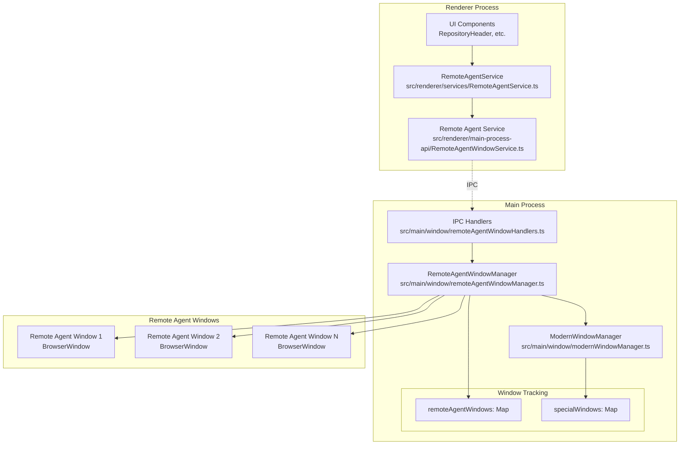
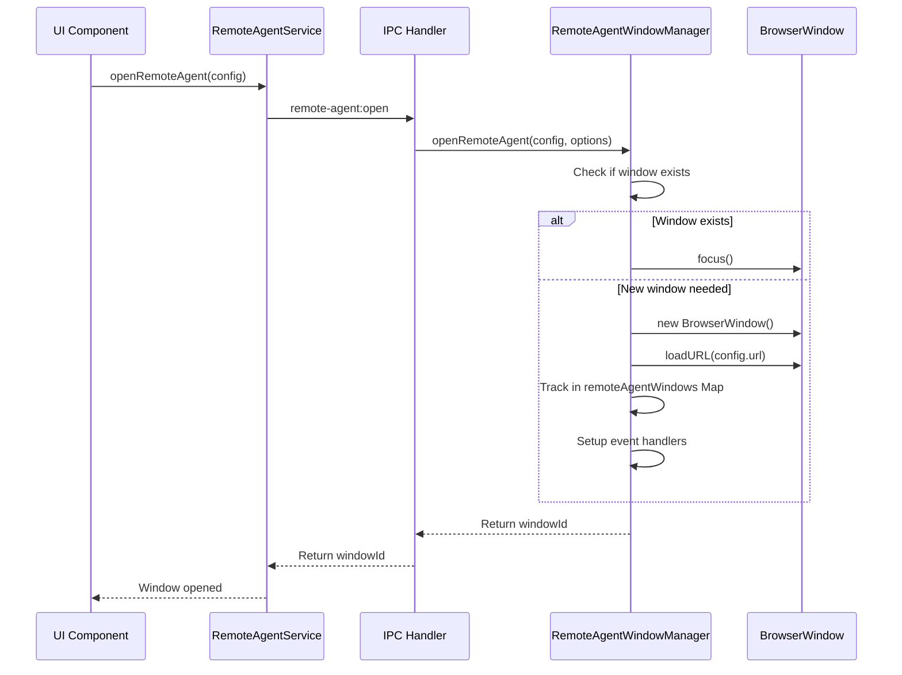
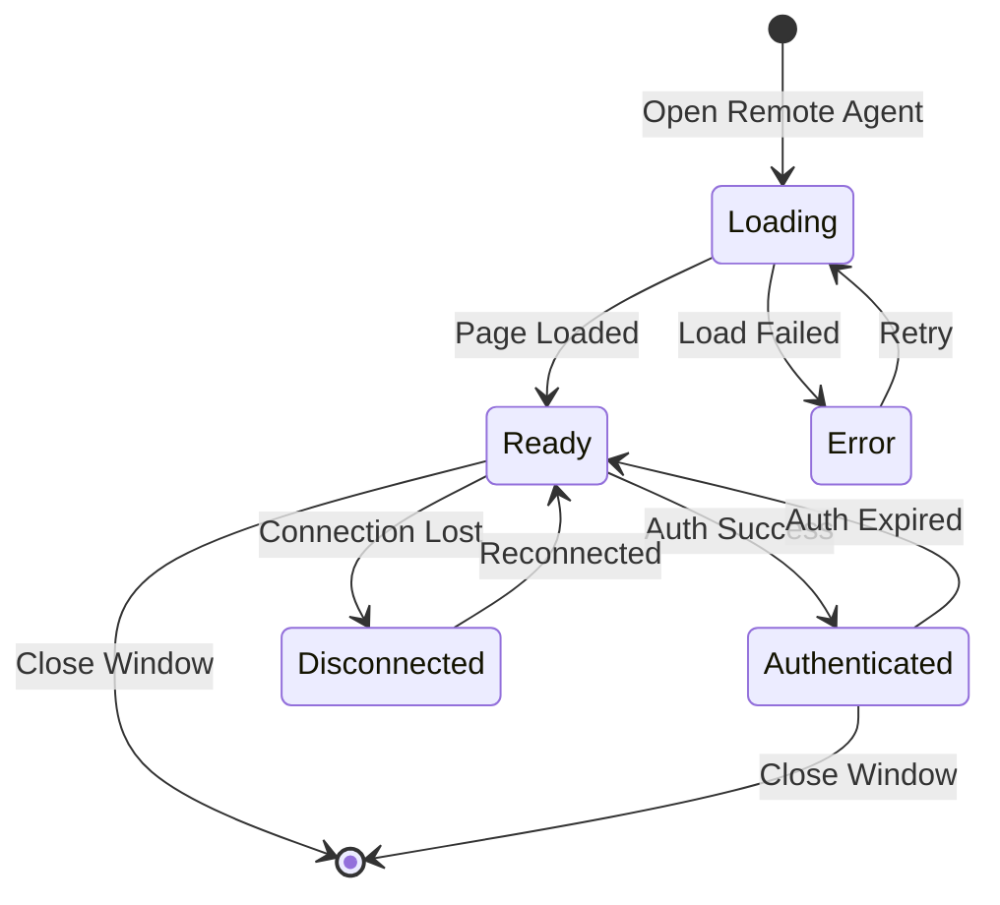

# Remote Agent Window Management System Design

## Overview
This document outlines the design for managing remote agent windows in the Electron application. The system supports opening cloud-based remote agents (like Jules) in dedicated Electron windows, with a migration path from multiple independent windows to a tabbed BrowserView system.

## Quick Start

### Opening a Remote Agent (Jules)
1. Navigate to Repository Explorer
2. Select a repository
3. Click the **"Open Jules"** button in the repository header
4. A new window opens with Jules at https://jules.google.com
5. Authenticate with your Google account

### For Developers: Adding a New Agent
See the **"How to Add a New Remote Agent"** section below for detailed steps.

## Architecture Phases

### Phase 1: Multiple Independent Windows (✅ Implemented)
Each remote agent opens in its own BrowserWindow, managed by a central RemoteAgentWindowManager.

**Status**: Complete
**Implementation Date**: 2025-09-29

**Key Features Implemented**:
- ✅ Dedicated BrowserWindow for each remote agent
- ✅ OAuth/Authentication support (Google, etc.)
- ✅ CSP header stripping for third-party sites
- ✅ User agent masking (removes Electron identifier)
- ✅ Domain whitelisting with auth domain support
- ✅ Window state tracking and management
- ✅ Event-based communication system
- ✅ Automatic cleanup on app shutdown
- ✅ Jules integration with "Open Jules" button

**Key Decisions**:
1. **Relaxed Security Model**: Disabled web security and sandbox to support OAuth flows and third-party authentication
2. **Service Layer Pattern**: Followed existing codebase convention with `RemoteAgentWindowService` accessing `window.mainProcess.remoteAgentWindow`
3. **CSP Removal**: Strip CSP headers via `webRequest.onHeadersReceived` to allow Google sites to load
4. **User Agent Masking**: Remove Electron identifier to prevent site restrictions

### Phase 2: BrowserView Tab System (Future)
Single window with multiple BrowserViews, custom tab UI for remote agent management.

## System Architecture



## Core Types

### Remote Agent Window Types
```typescript
// src/shared/types/remoteAgent.types.ts

export interface RemoteAgentConfig {
  id: string;                    // Unique identifier for the remote agent
  name: string;                   // Display name
  url: string;                    // Cloud remote agent URL
  icon?: string;                  // Optional icon URL
  capabilities?: string[];        // Remote agent capabilities
  requiresAuth?: boolean;         // Whether auth is required
  metadata?: Record<string, any>; // Additional metadata
}

export interface RemoteAgentWindow {
  id: string;                    // Remote agent ID
  windowId: number;               // Electron window ID
  window: BrowserWindow;          // Window instance
  config: RemoteAgentConfig;      // Remote agent configuration
  state: RemoteAgentWindowState;  // Current state
  createdAt: Date;               // Creation timestamp
  lastActiveAt: Date;            // Last activity timestamp
}

export enum RemoteAgentWindowState {
  LOADING = 'loading',
  READY = 'ready',
  ERROR = 'error',
  DISCONNECTED = 'disconnected',
  AUTHENTICATED = 'authenticated'
}

export interface RemoteAgentWindowOptions {
  width?: number;
  height?: number;
  alwaysOnTop?: boolean;
  resizable?: boolean;
  position?: { x: number; y: number };
  parentWindow?: BrowserWindow;
}
```

### IPC Event Types
```typescript
// src/shared/main-process-api-interfaces/RemoteAgentWindowAPI.ts

export enum RemoteAgentWindowEvent {
  OPEN_REMOTE_AGENT = 'remote-agent:open',
  CLOSE_REMOTE_AGENT = 'remote-agent:close',
  FOCUS_REMOTE_AGENT = 'remote-agent:focus',
  LIST_REMOTE_AGENTS = 'remote-agent:list',
  GET_REMOTE_AGENT_STATE = 'remote-agent:get-state',
  REMOTE_AGENT_STATE_CHANGED = 'remote-agent:state-changed',
  REMOTE_AGENT_MESSAGE = 'remote-agent:message',
}

export interface RemoteAgentWindowAPI {
  openRemoteAgent: (config: RemoteAgentConfig, options?: RemoteAgentWindowOptions) => Promise<string>;
  closeRemoteAgent: (agentId: string) => Promise<void>;
  focusRemoteAgent: (agentId: string) => Promise<void>;
  listRemoteAgents: () => Promise<RemoteAgentConfig[]>;
  getRemoteAgentState: (agentId: string) => Promise<RemoteAgentWindowState>;
  sendMessageToRemoteAgent: (agentId: string, message: any) => Promise<void>;
  onRemoteAgentStateChanged: (callback: (agentId: string, state: RemoteAgentWindowState) => void) => void;
  onRemoteAgentMessage: (callback: (agentId: string, message: any) => void) => void;
}
```

## Phase 1 Implementation Files

### Created Files ✅
- `src/main/window/remoteAgentWindowManager.ts` - Core manager class
- `src/main/window/remoteAgentWindowHandlers.ts` - IPC handlers
- `src/shared/types/remoteAgent.types.ts` - Type definitions
- `src/shared/main-process-api-interfaces/RemoteAgentWindowAPI.ts` - API interface
- `src/window/main-process-api-implementations/remoteAgentWindowApi.ts` - Preload API implementation
- `src/renderer/main-process-api/RemoteAgentWindowService.ts` - Renderer service layer
- `src/renderer/services/RemoteAgentService.ts` - Remote agent service with event handling

### Modified Files ✅
- `src/main/window/modernWindowManager.ts` - Added `sendToAllWindows` helper function
- `src/main/initialization.ts` - Integrated remote agent window manager initialization and cleanup
- `src/window/preload.ts` - Exposed remote agent API to renderer via mainProcess
- `src/shared/main-process-api-interfaces/index.ts` - Added RemoteAgentWindowAPI to MainProcessAPI
- `src/renderer/principal-window/views/RepositoryExplorer/components/RepositoryHeader.tsx` - Added "Open Jules" button with Bot icon

## Implementation Details

### Phase 1: RemoteAgentWindowManager
```typescript
// Core responsibilities:
class RemoteAgentWindowManager {
  private remoteAgentWindows: Map<string, RemoteAgentWindow>;

  // Window lifecycle
  async openRemoteAgent(config: RemoteAgentConfig, options?: RemoteAgentWindowOptions): Promise<string>;
  async closeRemoteAgent(agentId: string): Promise<void>;
  async closeAllRemoteAgents(): Promise<void>;

  // Window management
  focusRemoteAgent(agentId: string): void;
  getRemoteAgent(agentId: string): RemoteAgentWindow | undefined;
  listRemoteAgents(): RemoteAgentConfig[];

  // State management
  updateRemoteAgentState(agentId: string, state: RemoteAgentWindowState): void;

  // Communication
  sendMessage(agentId: string, message: any): void;
  handleRemoteAgentMessage(agentId: string, message: any): void;

  // Window configuration
  private createRemoteAgentWindow(config: RemoteAgentConfig, options?: RemoteAgentWindowOptions): BrowserWindow;
  private setupWindowHandlers(remoteAgentWindow: RemoteAgentWindow): void;
  private applySecurityPolicy(window: BrowserWindow, config: RemoteAgentConfig): void;
}
```

### Window Creation Flow


## Migration Path to Phase 2 (BrowserViews)

### Key Changes Required
1. **Single Container Window**: Replace multiple BrowserWindows with one container
2. **BrowserView Management**: Each remote agent becomes a BrowserView instead of BrowserWindow
3. **Tab UI Component**: Custom tab bar for switching between remote agents
4. **View Switching Logic**: Show/hide BrowserViews based on active tab

### Type Changes for Phase 2
```typescript
export interface RemoteAgentBrowserView {
  id: string;
  view: BrowserView;
  config: RemoteAgentConfig;
  state: RemoteAgentWindowState;
  bounds: Rectangle;
  isActive: boolean;
}

export interface RemoteAgentTabContainer {
  window: BrowserWindow;          // Single container window
  views: Map<string, RemoteAgentBrowserView>;
  activeViewId: string | null;
  tabOrder: string[];             // Order of tabs in UI
}
```

## Security Considerations

### Content Security Policy (Phase 1 Implementation)
Remote agent windows use a **relaxed security model** to support OAuth flows and third-party authentication:

- **Sandbox**: Disabled (`sandbox: false`) to allow full browser functionality
- **Web Security**: Disabled (`webSecurity: false`) to bypass CSP restrictions from embedded sites
- **Context Isolation**: Enabled (`contextIsolation: true`)
- **Node Integration**: Disabled (`nodeIntegration: false`)
- **CSP Headers**: Stripped via `webRequest.onHeadersReceived` to allow Google sites to load properly

### User Agent Masking
The Electron identifier is removed from the user agent string to prevent detection and restrictions:
```typescript
const userAgent = window.webContents.getUserAgent().replace(/Electron\/[^\s]+/, '').trim();
window.webContents.setUserAgent(userAgent);
```

### URL Validation
- **Whitelist**: Only pre-approved domains can be loaded
- **HTTPS Enforcement**: All remote agent URLs must use HTTPS
- **Auth Domain Support**: Google authentication domains are allowed for OAuth flows
  - `accounts.google.com`
  - `accounts.youtube.com`
  - `myaccount.google.com`

### Window Permissions
```typescript
const allowedPermissions = [
  'notifications',           // Allow notifications from remote agents
  'clipboard-read',          // Allow reading clipboard
  'clipboard-sanitized-write' // Allow writing to clipboard
];
```

### Navigation Control
- Main domain navigation is allowed
- Auth domains can navigate within the same window
- External links open in the system browser
- Untrusted domains are blocked

### Security Trade-offs
⚠️ **Important**: Remote agent windows sacrifice some security for functionality:
- Full web security is disabled to support OAuth and embedded authentication
- CSP headers are stripped to allow third-party scripts and resources
- This is acceptable because:
  - Only whitelisted domains can be loaded
  - No Node.js access is provided
  - Windows are isolated from the main application
  - Users explicitly choose to open these agents

## Event Flow

### Remote Agent State Management


## Testing Strategy

### Unit Tests
- RemoteAgentWindowManager methods
- IPC handler logic
- State transitions

### Integration Tests
- Window creation/destruction
- Multi-window management
- IPC communication
- State synchronization

### E2E Tests
- Open remote agent from UI
- Multiple remote agent windows
- Window focus/switching
- Close all remote agents on app quit

## Performance Considerations

### Memory Management
- Each BrowserWindow uses ~50-100MB
- Limit concurrent remote agent windows (configurable)
- Implement window recycling for Phase 2

### Window Limits
- Default max: 10 concurrent remote agent windows
- Configurable via settings
- Queue or replace strategy when limit reached

## Configuration

### Current Configuration
Located in `src/main/window/remoteAgentWindowManager.ts`:

```typescript
export const REMOTE_AGENT_WINDOW_CONFIG = {
  maxConcurrentWindows: 10,
  defaultWidth: 1200,
  defaultHeight: 800,
  minWidth: 600,
  minHeight: 400,
  allowedDomains: [
    'https://jules.google.com',
    'https://remote-agent.example.com',
    'https://cloud-agent.service.com',
  ],
};
```

## Supported Remote Agents

### Jules (Google AI Agent)
**Status**: ✅ Active
**URL**: https://jules.google.com
**Added**: 2025-09-29
**Access Point**: Repository Details Panel > "Open Jules" button

**Configuration**:
```typescript
{
  id: 'jules-{repositoryName}',
  name: 'Jules - {repositoryName}',
  url: 'https://jules.google.com',
}
```

**Special Requirements**:
- Requires Google authentication
- Uses OAuth flow via `accounts.google.com`
- CSP headers must be stripped
- Web security must be disabled
- User agent must hide Electron

**UI Integration**:
- Button location: `RepositoryHeader` component
- Icon: `Bot` from lucide-react
- Button style: Primary (filled)

---

## How to Add a New Remote Agent

### Step 1: Add Domain to Whitelist

Edit `src/main/window/remoteAgentWindowManager.ts`:

```typescript
export const REMOTE_AGENT_WINDOW_CONFIG = {
  // ... other config
  allowedDomains: [
    'https://jules.google.com',
    'https://your-new-agent.com',  // Add your domain here
  ],
};
```

### Step 2: Add Authentication Domains (if needed)

If your agent requires OAuth or authentication on separate domains, add them to the security policy in `remoteAgentWindowManager.ts`:

```typescript
private applySecurityPolicy(window: BrowserWindow, config: RemoteAgentConfig): void {
  const allowedAuthDomains = [
    'accounts.google.com',
    'auth.your-agent.com',  // Add auth domains here
  ];
  // ...
}
```

### Step 3: Create UI Integration

Add a button or menu item to launch the agent. Example in a React component:

```typescript
import { remoteAgentService } from '../../../../services/RemoteAgentService';

const handleOpenAgent = useCallback(async () => {
  try {
    await remoteAgentService.openRemoteAgent({
      id: 'your-agent-{uniqueId}',
      name: 'Your Agent Name',
      url: 'https://your-new-agent.com',
      icon: 'optional-icon-url',
      requiresAuth: true,
      metadata: {
        // Any additional metadata
      }
    });
  } catch (error) {
    console.error('Error opening agent:', error);
  }
}, []);
```

### Step 4: Test Authentication Flow

1. Open the agent window
2. Verify OAuth/authentication works correctly
3. Check console for CSP violations
4. Test navigation and external link handling

### Step 5: Document the Agent

Add an entry to the "Supported Remote Agents" section above with:
- Agent name and URL
- Configuration example
- Special requirements
- UI integration details

### Common Issues and Solutions

#### Issue: "Refused to frame" CSP errors
**Solution**: CSP headers are already stripped in Phase 1 implementation. If you still see this, verify the domain is in `allowedDomains`.

#### Issue: Authentication redirects are blocked
**Solution**: Add authentication domains to `allowedAuthDomains` in `applySecurityPolicy()`.

#### Issue: Agent detects Electron
**Solution**: User agent is automatically modified to remove Electron identifier. No additional changes needed.

#### Issue: External links don't open
**Solution**: The `setWindowOpenHandler` in `applySecurityPolicy()` automatically opens external links in the system browser.

### Example: Adding Claude.ai

```typescript
// Step 1: Add to allowedDomains
'https://claude.ai',

// Step 2: Add auth domains if needed (Anthropic uses different auth)
'auth.anthropic.com',

// Step 3: Create button
const handleOpenClaude = useCallback(async () => {
  await remoteAgentService.openRemoteAgent({
    id: 'claude-{repositoryName}',
    name: 'Claude - {repositoryName}',
    url: 'https://claude.ai',
    icon: 'https://claude.ai/favicon.ico',
    requiresAuth: true,
  });
}, []);
```

## Future Enhancements (Phase 2+)

1. **Tab System**: Full BrowserView implementation with tabs
2. **Window Recycling**: Reuse windows for better performance
3. **Remote Agent Communication**: Direct agent-to-agent messaging
4. **Persistence**: Save/restore remote agent window states
5. **Workspace**: Save sets of remote agents as workspaces
6. **Drag & Drop**: Drag tabs between windows
7. **Picture-in-Picture**: Floating remote agent windows
8. **Remote Agent Extensions**: Allow remote agents to extend app functionality