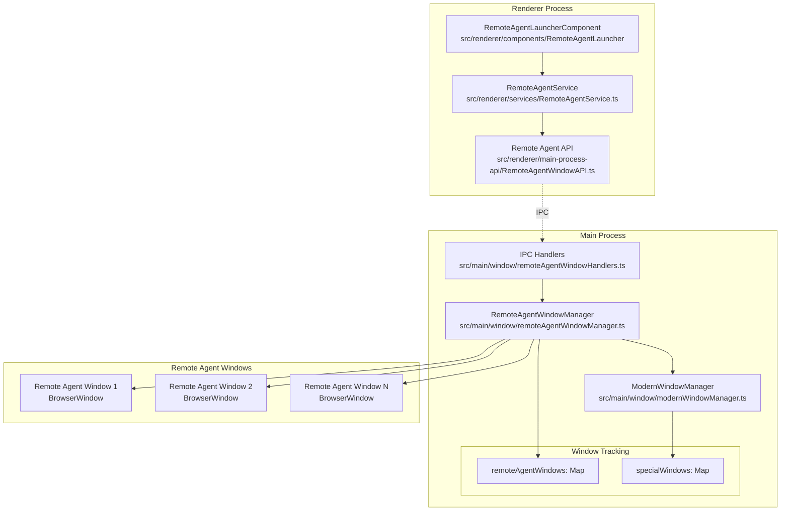
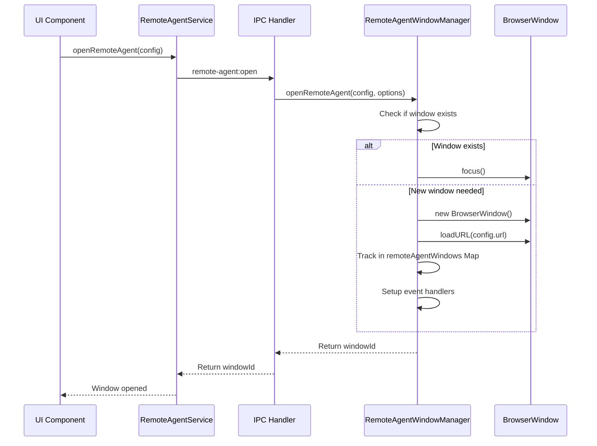
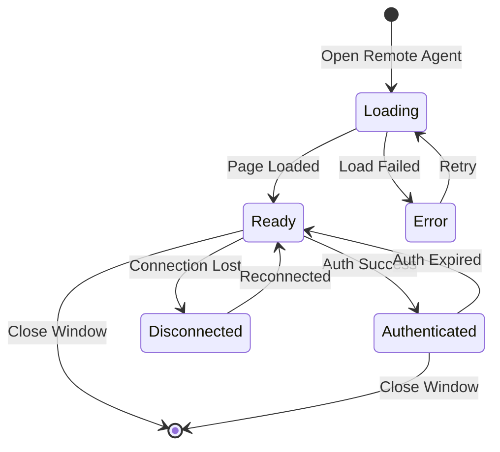

# Remote Agent Window Management System Design

## Overview
This document outlines the design for managing remote agent windows in the Electron application. The system will support opening cloud-based remote agents in dedicated Electron windows, with a migration path from multiple independent windows to a tabbed BrowserView system.

## Architecture Phases

### Phase 1: Multiple Independent Windows (Current Implementation)
Each remote agent opens in its own BrowserWindow, managed by a central RemoteAgentWindowManager.

### Phase 2: BrowserView Tab System (Future)
Single window with multiple BrowserViews, custom tab UI for remote agent management.

## System Architecture



## Core Types

### Remote Agent Window Types
```typescript
// src/shared/types/remoteAgent.types.ts

export interface RemoteAgentConfig {
  id: string;                    // Unique identifier for the remote agent
  name: string;                   // Display name
  url: string;                    // Cloud remote agent URL
  icon?: string;                  // Optional icon URL
  capabilities?: string[];        // Remote agent capabilities
  requiresAuth?: boolean;         // Whether auth is required
  metadata?: Record<string, any>; // Additional metadata
}

export interface RemoteAgentWindow {
  id: string;                    // Remote agent ID
  windowId: number;               // Electron window ID
  window: BrowserWindow;          // Window instance
  config: RemoteAgentConfig;      // Remote agent configuration
  state: RemoteAgentWindowState;  // Current state
  createdAt: Date;               // Creation timestamp
  lastActiveAt: Date;            // Last activity timestamp
}

export enum RemoteAgentWindowState {
  LOADING = 'loading',
  READY = 'ready',
  ERROR = 'error',
  DISCONNECTED = 'disconnected',
  AUTHENTICATED = 'authenticated'
}

export interface RemoteAgentWindowOptions {
  width?: number;
  height?: number;
  alwaysOnTop?: boolean;
  resizable?: boolean;
  position?: { x: number; y: number };
  parentWindow?: BrowserWindow;
}
```

### IPC Event Types
```typescript
// src/shared/main-process-api-interfaces/RemoteAgentWindowAPI.ts

export enum RemoteAgentWindowEvent {
  OPEN_REMOTE_AGENT = 'remote-agent:open',
  CLOSE_REMOTE_AGENT = 'remote-agent:close',
  FOCUS_REMOTE_AGENT = 'remote-agent:focus',
  LIST_REMOTE_AGENTS = 'remote-agent:list',
  GET_REMOTE_AGENT_STATE = 'remote-agent:get-state',
  REMOTE_AGENT_STATE_CHANGED = 'remote-agent:state-changed',
  REMOTE_AGENT_MESSAGE = 'remote-agent:message',
}

export interface RemoteAgentWindowAPI {
  openRemoteAgent: (config: RemoteAgentConfig, options?: RemoteAgentWindowOptions) => Promise<string>;
  closeRemoteAgent: (agentId: string) => Promise<void>;
  focusRemoteAgent: (agentId: string) => Promise<void>;
  listRemoteAgents: () => Promise<RemoteAgentConfig[]>;
  getRemoteAgentState: (agentId: string) => Promise<RemoteAgentWindowState>;
  sendMessageToRemoteAgent: (agentId: string, message: any) => Promise<void>;
  onRemoteAgentStateChanged: (callback: (agentId: string, state: RemoteAgentWindowState) => void) => void;
  onRemoteAgentMessage: (callback: (agentId: string, message: any) => void) => void;
}
```

## Files to Modify/Create

### New Files (Phase 1)
- `src/main/window/remoteAgentWindowManager.ts` - Core manager class
- `src/main/window/remoteAgentWindowHandlers.ts` - IPC handlers
- `src/shared/types/remoteAgent.types.ts` - Type definitions
- `src/shared/main-process-api-interfaces/RemoteAgentWindowAPI.ts` - API interface
- `src/renderer/main-process-api/RemoteAgentWindowAPI.ts` - Renderer API implementation
- `src/renderer/services/RemoteAgentService.ts` - Remote agent service
- `src/renderer/components/RemoteAgentLauncher/` - UI components

### Modified Files
- `src/main/window/modernWindowManager.ts` - Integration with remote agent windows
- `src/main/window/types.ts` - Add remote agent window features
- `src/main/preload.ts` - Expose remote agent API
- `src/renderer/principal-window/views/` - Add remote agent launcher to appropriate views

## Implementation Details

### Phase 1: RemoteAgentWindowManager
```typescript
// Core responsibilities:
class RemoteAgentWindowManager {
  private remoteAgentWindows: Map<string, RemoteAgentWindow>;

  // Window lifecycle
  async openRemoteAgent(config: RemoteAgentConfig, options?: RemoteAgentWindowOptions): Promise<string>;
  async closeRemoteAgent(agentId: string): Promise<void>;
  async closeAllRemoteAgents(): Promise<void>;

  // Window management
  focusRemoteAgent(agentId: string): void;
  getRemoteAgent(agentId: string): RemoteAgentWindow | undefined;
  listRemoteAgents(): RemoteAgentConfig[];

  // State management
  updateRemoteAgentState(agentId: string, state: RemoteAgentWindowState): void;

  // Communication
  sendMessage(agentId: string, message: any): void;
  handleRemoteAgentMessage(agentId: string, message: any): void;

  // Window configuration
  private createRemoteAgentWindow(config: RemoteAgentConfig, options?: RemoteAgentWindowOptions): BrowserWindow;
  private setupWindowHandlers(remoteAgentWindow: RemoteAgentWindow): void;
  private applySecurityPolicy(window: BrowserWindow, config: RemoteAgentConfig): void;
}
```

### Window Creation Flow


## Migration Path to Phase 2 (BrowserViews)

### Key Changes Required
1. **Single Container Window**: Replace multiple BrowserWindows with one container
2. **BrowserView Management**: Each remote agent becomes a BrowserView instead of BrowserWindow
3. **Tab UI Component**: Custom tab bar for switching between remote agents
4. **View Switching Logic**: Show/hide BrowserViews based on active tab

### Type Changes for Phase 2
```typescript
export interface RemoteAgentBrowserView {
  id: string;
  view: BrowserView;
  config: RemoteAgentConfig;
  state: RemoteAgentWindowState;
  bounds: Rectangle;
  isActive: boolean;
}

export interface RemoteAgentTabContainer {
  window: BrowserWindow;          // Single container window
  views: Map<string, RemoteAgentBrowserView>;
  activeViewId: string | null;
  tabOrder: string[];             // Order of tabs in UI
}
```

## Security Considerations

### Content Security Policy
- Each remote agent window will have restricted CSP
- No access to Node.js APIs
- Sandboxed renderer process
- Limited IPC communication

### URL Validation
- Whitelist of allowed remote agent domains
- HTTPS enforcement
- URL validation before loading

### Window Permissions
```typescript
const remoteAgentWindowCSP = {
  sandbox: true,
  contextIsolation: true,
  nodeIntegration: false,
  webSecurity: true,
  allowRunningInsecureContent: false,
  permissions: {
    media: false,
    geolocation: false,
    notifications: true,
    fullscreen: false,
    openExternal: false
  }
};
```

## Event Flow

### Remote Agent State Management


## Testing Strategy

### Unit Tests
- RemoteAgentWindowManager methods
- IPC handler logic
- State transitions

### Integration Tests
- Window creation/destruction
- Multi-window management
- IPC communication
- State synchronization

### E2E Tests
- Open remote agent from UI
- Multiple remote agent windows
- Window focus/switching
- Close all remote agents on app quit

## Performance Considerations

### Memory Management
- Each BrowserWindow uses ~50-100MB
- Limit concurrent remote agent windows (configurable)
- Implement window recycling for Phase 2

### Window Limits
- Default max: 10 concurrent remote agent windows
- Configurable via settings
- Queue or replace strategy when limit reached

## Configuration

```typescript
// src/main/config/remoteAgentConfig.ts
export const REMOTE_AGENT_WINDOW_CONFIG = {
  maxConcurrentWindows: 10,
  defaultWidth: 1200,
  defaultHeight: 800,
  minWidth: 600,
  minHeight: 400,
  preloadScript: 'remote-agent-preload.js',
  allowedDomains: [
    'https://remote-agent.example.com',
    'https://cloud-agent.service.com'
  ],
  windowRecycling: false, // Enable in Phase 2
  tabMode: false,         // Enable in Phase 2
};
```

## Future Enhancements (Phase 2+)

1. **Tab System**: Full BrowserView implementation with tabs
2. **Window Recycling**: Reuse windows for better performance
3. **Remote Agent Communication**: Direct agent-to-agent messaging
4. **Persistence**: Save/restore remote agent window states
5. **Workspace**: Save sets of remote agents as workspaces
6. **Drag & Drop**: Drag tabs between windows
7. **Picture-in-Picture**: Floating remote agent windows
8. **Remote Agent Extensions**: Allow remote agents to extend app functionality