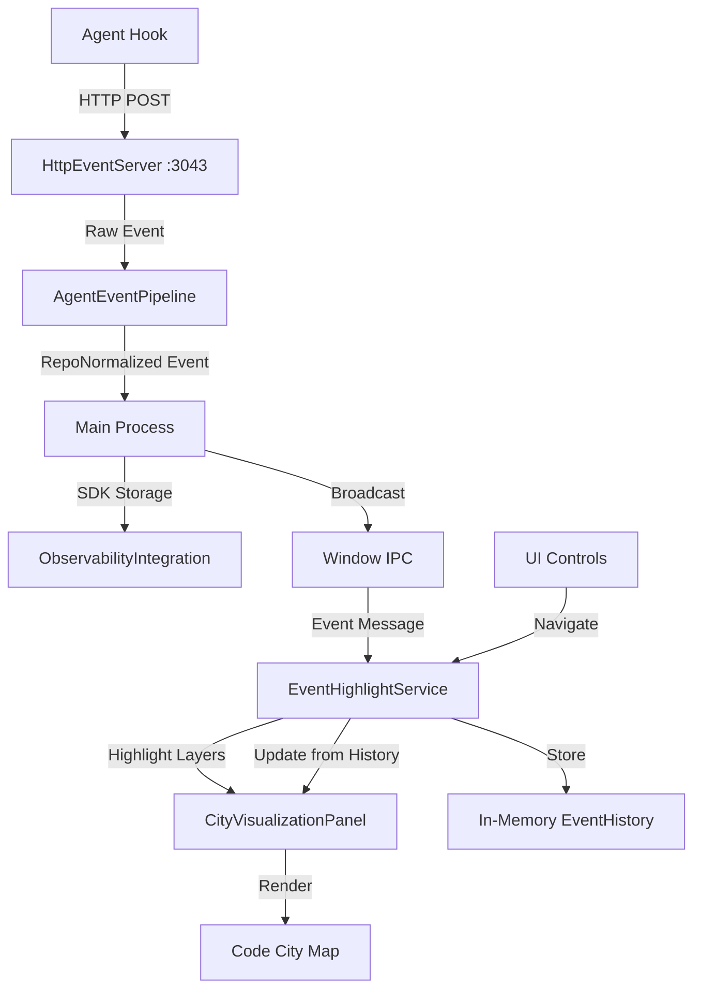
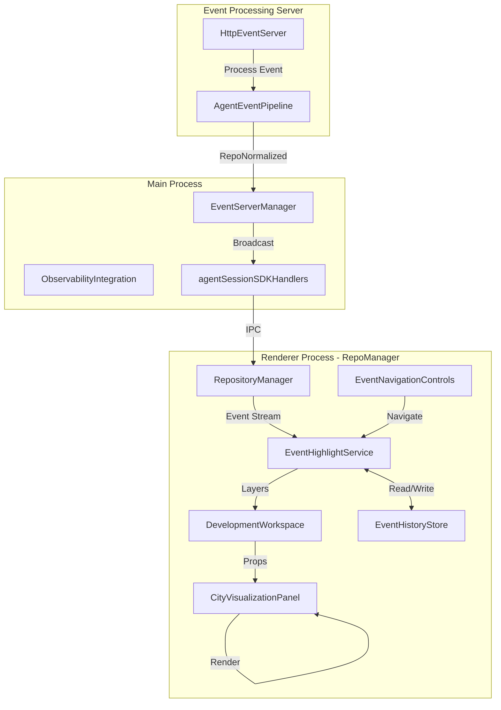
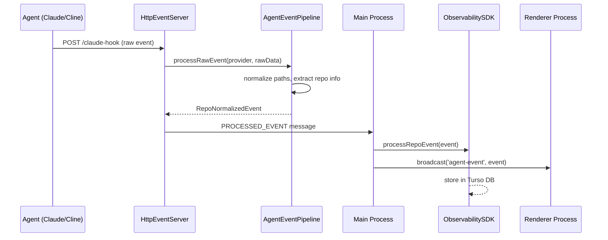
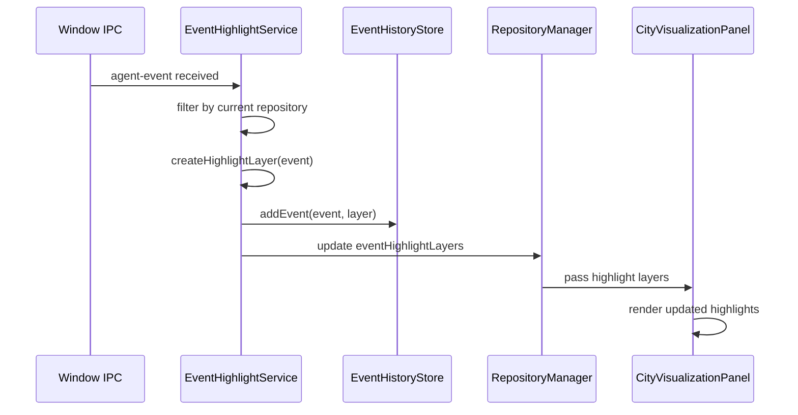
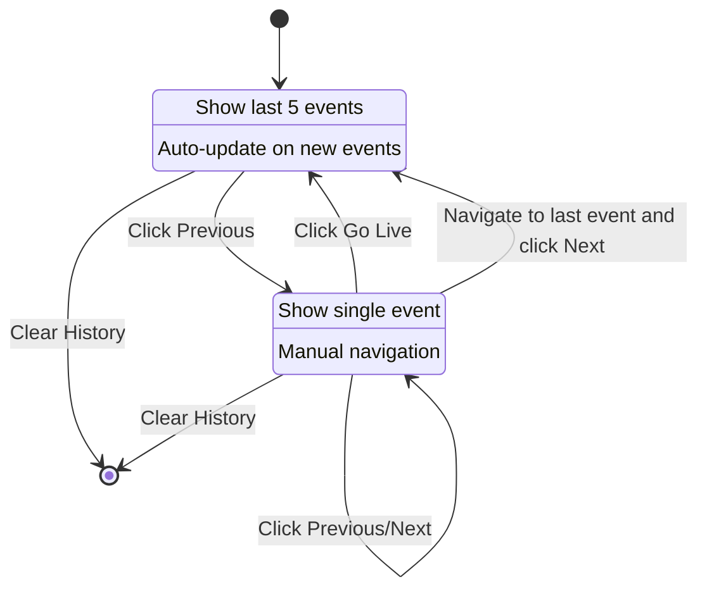

# Event-Driven Map Highlighting Feature - Design Document

## Overview

This document outlines the design for a prototype feature that displays event-driven highlights on the Code City visualization in the Repository Manager. The feature will visualize events received through the HTTP bridge from the observability SDK, allowing users to see real-time agent activity mapped onto the repository structure.

## Goals

1. **Real-time Visualization**: Display agent events as highlights on the Code City map
2. **Event History**: Maintain an in-memory history of events since the last stop
3. **User Navigation**: Allow users to cycle through event history
4. **Minimal Persistence**: Keep prototype simple with in-memory storage only
5. **Non-intrusive**: Integrate seamlessly with existing map highlighting system

## Architecture

### High-Level Data Flow



### Component Architecture



## Event Flow

### 1. Event Reception



### 2. Highlight Layer Creation



## File Structure

### New Files

```
src/
├── renderer/
│   ├── repo-manager/
│   │   ├── services/
│   │   │   ├── EventHighlightService.ts          # Core service for event highlighting
│   │   │   └── EventHistoryStore.ts              # In-memory event history
│   │   └── components/
│   │       └── EventNavigationControls.tsx       # UI controls for event navigation
│   └── types/
│       └── event-highlight.types.ts              # Type definitions
└── docs/
    └── design/
        └── event-driven-map-highlighting.md      # This document
```

### Modified Files

```
src/
├── renderer/
│   ├── repo-manager/
│   │   ├── RepositoryManager.tsx                 # Add EventHighlightService integration
│   │   ├── DevelopmentWorkspace.tsx              # Pass event layers to visualization
│   │   └── shared/
│   │       └── CityMapManager.tsx                # Optional: event layer management
└── main/
    └── agent-session-events/
        └── agentSessionSDKHandlers.ts            # Broadcast events to renderer
```

## Detailed Component Design

### 1. EventHighlightService

**Responsibility**: Convert agent events into map highlight layers

```typescript
// src/renderer/repo-manager/services/EventHighlightService.ts

import { EventEmitter } from 'events';
import type { HighlightLayer } from '@principal-ai/code-city-react';
import type { RepoNormalizedUniversalAgentSessionEvent } from '@principal-ai/agent-monitoring';
import { EventHistoryStore } from './EventHistoryStore';

export interface EventHighlightConfig {
  maxHistorySize: number;
  defaultColor: string;
  defaultOpacity: number;
  defaultPriority: number;
}

export class EventHighlightService extends EventEmitter {
  private historyStore: EventHistoryStore;
  private config: EventHighlightConfig;
  private currentRepositoryKey: string | null = null;
  private currentIndex: number = -1; // -1 = live mode, >= 0 = history navigation

  constructor(config?: Partial<EventHighlightConfig>) {
    super();
    this.config = {
      maxHistorySize: 100,
      defaultColor: '#ff6b6b',
      defaultOpacity: 0.8,
      defaultPriority: 50,
      ...config,
    };
    this.historyStore = new EventHistoryStore(this.config.maxHistorySize);
  }

  /**
   * Set the current repository context
   */
  setRepository(repositoryKey: string): void {
    if (this.currentRepositoryKey !== repositoryKey) {
      this.currentRepositoryKey = repositoryKey;
      this.historyStore.clear();
      this.currentIndex = -1;
      this.emit('repository-changed', repositoryKey);
    }
  }

  /**
   * Process incoming agent event
   */
  processEvent(event: RepoNormalizedUniversalAgentSessionEvent): void {
    // Filter by current repository
    const eventRepoKey = this.getRepositoryKey(event);
    if (!this.currentRepositoryKey || eventRepoKey !== this.currentRepositoryKey) {
      return;
    }

    // Create highlight layer
    const layer = this.createHighlightLayer(event);

    // Add to history
    this.historyStore.addEvent({
      event,
      layer,
      timestamp: Date.now(),
    });

    // If in live mode, emit the new layer
    if (this.currentIndex === -1) {
      this.emit('highlight-update', [layer]);
    }
  }

  /**
   * Create a highlight layer from an event
   */
  private createHighlightLayer(event: RepoNormalizedUniversalAgentSessionEvent): HighlightLayer {
    const filePaths = this.extractFilePaths(event);

    return {
      id: `event-${event.sessionId}-${event.timestamp}`,
      name: this.getEventDisplayName(event),
      enabled: true,
      color: this.getEventColor(event),
      opacity: this.config.defaultOpacity,
      priority: this.config.defaultPriority,
      items: filePaths.map(path => ({
        path: this.normalizePathForMap(path, event),
        type: 'file' as const,
        renderStrategy: 'fill' as const,
      })),
    };
  }

  /**
   * Extract file paths from event based on event type
   */
  private extractFilePaths(event: RepoNormalizedUniversalAgentSessionEvent): string[] {
    const paths: string[] = [];

    switch (event.eventType) {
      case 'file_read':
      case 'file_write':
      case 'file_edit':
        if (event.data?.path) {
          paths.push(event.data.path);
        }
        break;
      case 'tool_use':
        // Extract paths from tool parameters if available
        if (event.data?.parameters) {
          const params = event.data.parameters;
          if (params.file_path) paths.push(params.file_path);
          if (params.path) paths.push(params.path);
          if (params.paths && Array.isArray(params.paths)) {
            paths.push(...params.paths);
          }
        }
        break;
    }

    return paths.filter(Boolean);
  }

  /**
   * Normalize path to be relative to repository root
   */
  private normalizePathForMap(path: string, event: RepoNormalizedUniversalAgentSessionEvent): string {
    if (!event.repositoryInfo?.root) {
      return path;
    }

    const repoRoot = event.repositoryInfo.root;
    if (path.startsWith(repoRoot)) {
      return path.substring(repoRoot.length + 1);
    }

    return path;
  }

  /**
   * Get repository key from event
   */
  private getRepositoryKey(event: RepoNormalizedUniversalAgentSessionEvent): string | null {
    if (event.repositoryInfo?.owner && event.repositoryInfo?.repo) {
      return `${event.repositoryInfo.owner}/${event.repositoryInfo.repo}`;
    }
    return event.repositoryInfo?.remoteUrl || null;
  }

  /**
   * Get display name for event
   */
  private getEventDisplayName(event: RepoNormalizedUniversalAgentSessionEvent): string {
    const timestamp = new Date(event.timestamp).toLocaleTimeString();
    return `${event.agent} - ${event.eventType} (${timestamp})`;
  }

  /**
   * Get color based on event type
   */
  private getEventColor(event: RepoNormalizedUniversalAgentSessionEvent): string {
    const colorMap: Record<string, string> = {
      file_read: '#3b82f6',     // Blue
      file_write: '#22c55e',    // Green
      file_edit: '#f59e0b',     // Amber
      tool_use: '#8b5cf6',      // Purple
      error: '#ef4444',         // Red
    };

    return colorMap[event.eventType] || this.config.defaultColor;
  }

  /**
   * Navigate to previous event in history
   */
  navigatePrevious(): void {
    const maxIndex = this.historyStore.getEventCount() - 1;

    if (this.currentIndex === -1) {
      // Switch from live mode to last event
      this.currentIndex = maxIndex;
    } else if (this.currentIndex > 0) {
      this.currentIndex--;
    }

    this.emitCurrentEvent();
  }

  /**
   * Navigate to next event in history
   */
  navigateNext(): void {
    const maxIndex = this.historyStore.getEventCount() - 1;

    if (this.currentIndex >= 0 && this.currentIndex < maxIndex) {
      this.currentIndex++;
      this.emitCurrentEvent();
    } else if (this.currentIndex === maxIndex) {
      // Switch back to live mode
      this.currentIndex = -1;
      this.emit('highlight-update', this.getLiveHighlightLayers());
    }
  }

  /**
   * Return to live mode
   */
  goLive(): void {
    this.currentIndex = -1;
    this.emit('highlight-update', this.getLiveHighlightLayers());
  }

  /**
   * Get current highlight layers based on navigation state
   */
  getCurrentHighlightLayers(): HighlightLayer[] {
    if (this.currentIndex === -1) {
      return this.getLiveHighlightLayers();
    }

    const eventEntry = this.historyStore.getEventAt(this.currentIndex);
    return eventEntry ? [eventEntry.layer] : [];
  }

  /**
   * Get live highlight layers (last N events)
   */
  private getLiveHighlightLayers(): HighlightLayer[] {
    // In live mode, show last 5 events
    const recentEvents = this.historyStore.getRecentEvents(5);
    return recentEvents.map(e => e.layer);
  }

  /**
   * Emit current event based on navigation index
   */
  private emitCurrentEvent(): void {
    const layers = this.getCurrentHighlightLayers();
    const eventEntry = this.historyStore.getEventAt(this.currentIndex);

    this.emit('highlight-update', layers);
    if (eventEntry) {
      this.emit('event-selected', eventEntry.event, this.currentIndex);
    }
  }

  /**
   * Get current navigation state
   */
  getNavigationState() {
    return {
      currentIndex: this.currentIndex,
      totalEvents: this.historyStore.getEventCount(),
      isLive: this.currentIndex === -1,
    };
  }

  /**
   * Clear all history
   */
  clear(): void {
    this.historyStore.clear();
    this.currentIndex = -1;
    this.emit('highlight-update', []);
  }
}
```

### 2. EventHistoryStore

**Responsibility**: Manage in-memory event history with circular buffer

```typescript
// src/renderer/repo-manager/services/EventHistoryStore.ts

import type { HighlightLayer } from '@principal-ai/code-city-react';
import type { RepoNormalizedUniversalAgentSessionEvent } from '@principal-ai/agent-monitoring';

export interface EventHistoryEntry {
  event: RepoNormalizedUniversalAgentSessionEvent;
  layer: HighlightLayer;
  timestamp: number;
}

export class EventHistoryStore {
  private events: EventHistoryEntry[] = [];
  private maxSize: number;

  constructor(maxSize: number = 100) {
    this.maxSize = maxSize;
  }

  /**
   * Add event to history (circular buffer)
   */
  addEvent(entry: EventHistoryEntry): void {
    this.events.push(entry);

    // Maintain max size using circular buffer
    if (this.events.length > this.maxSize) {
      this.events.shift();
    }
  }

  /**
   * Get event at specific index
   */
  getEventAt(index: number): EventHistoryEntry | null {
    if (index >= 0 && index < this.events.length) {
      return this.events[index];
    }
    return null;
  }

  /**
   * Get recent N events
   */
  getRecentEvents(count: number): EventHistoryEntry[] {
    const startIndex = Math.max(0, this.events.length - count);
    return this.events.slice(startIndex);
  }

  /**
   * Get all events
   */
  getAllEvents(): EventHistoryEntry[] {
    return [...this.events];
  }

  /**
   * Get total event count
   */
  getEventCount(): number {
    return this.events.length;
  }

  /**
   * Clear all events
   */
  clear(): void {
    this.events = [];
  }

  /**
   * Get events in time range
   */
  getEventsInRange(startTime: number, endTime: number): EventHistoryEntry[] {
    return this.events.filter(
      entry => entry.timestamp >= startTime && entry.timestamp <= endTime
    );
  }
}
```

### 3. EventNavigationControls

**Responsibility**: UI component for navigating event history

```typescript
// src/renderer/repo-manager/components/EventNavigationControls.tsx

import React from 'react';
import { useTheme } from '@a24z/industry-theme';
import { ChevronLeft, ChevronRight, Circle, Pause } from 'lucide-react';

export interface EventNavigationControlsProps {
  currentIndex: number;
  totalEvents: number;
  isLive: boolean;
  onPrevious: () => void;
  onNext: () => void;
  onGoLive: () => void;
  onClear: () => void;
}

export const EventNavigationControls: React.FC<EventNavigationControlsProps> = ({
  currentIndex,
  totalEvents,
  isLive,
  onPrevious,
  onNext,
  onGoLive,
  onClear,
}) => {
  const { theme } = useTheme();

  if (totalEvents === 0) {
    return null;
  }

  const displayIndex = isLive ? totalEvents : currentIndex + 1;

  return (
    <div
      style={{
        position: 'absolute',
        bottom: '20px',
        left: '50%',
        transform: 'translateX(-50%)',
        display: 'flex',
        alignItems: 'center',
        gap: '8px',
        padding: '8px 16px',
        backgroundColor: theme.colors.backgroundSecondary,
        border: `1px solid ${theme.colors.border}`,
        borderRadius: '8px',
        boxShadow: '0 2px 8px rgba(0, 0, 0, 0.1)',
        zIndex: 100,
      }}
    >
      {/* Previous Button */}
      <button
        onClick={onPrevious}
        disabled={currentIndex === 0 && !isLive}
        style={{
          padding: '6px',
          backgroundColor: 'transparent',
          border: 'none',
          borderRadius: '4px',
          cursor: currentIndex === 0 && !isLive ? 'not-allowed' : 'pointer',
          color: currentIndex === 0 && !isLive ? theme.colors.textSecondary : theme.colors.text,
          display: 'flex',
          alignItems: 'center',
          opacity: currentIndex === 0 && !isLive ? 0.5 : 1,
        }}
        title="Previous event"
      >
        <ChevronLeft size={18} />
      </button>

      {/* Event Counter */}
      <div
        style={{
          display: 'flex',
          alignItems: 'center',
          gap: '8px',
          padding: '0 12px',
          fontSize: '14px',
          color: theme.colors.text,
        }}
      >
        <span style={{ fontWeight: 500 }}>
          {displayIndex} / {totalEvents}
        </span>
        {isLive && (
          <Circle
            size={8}
            fill={theme.colors.success}
            style={{ color: theme.colors.success }}
          />
        )}
      </div>

      {/* Next/Live Button */}
      <button
        onClick={isLive || currentIndex === totalEvents - 1 ? onGoLive : onNext}
        disabled={isLive}
        style={{
          padding: '6px',
          backgroundColor: 'transparent',
          border: 'none',
          borderRadius: '4px',
          cursor: isLive ? 'not-allowed' : 'pointer',
          color: isLive ? theme.colors.textSecondary : theme.colors.text,
          display: 'flex',
          alignItems: 'center',
          opacity: isLive ? 0.5 : 1,
        }}
        title={currentIndex === totalEvents - 1 ? 'Go live' : 'Next event'}
      >
        <ChevronRight size={18} />
      </button>

      {/* Pause/Live Toggle */}
      <div
        style={{
          width: '1px',
          height: '20px',
          backgroundColor: theme.colors.border,
          margin: '0 4px',
        }}
      />

      <button
        onClick={onGoLive}
        disabled={isLive}
        style={{
          padding: '6px 12px',
          backgroundColor: isLive ? theme.colors.success : 'transparent',
          border: `1px solid ${isLive ? theme.colors.success : theme.colors.border}`,
          borderRadius: '4px',
          cursor: isLive ? 'not-allowed' : 'pointer',
          color: isLive ? theme.colors.background : theme.colors.text,
          fontSize: '12px',
          fontWeight: 500,
          display: 'flex',
          alignItems: 'center',
          gap: '4px',
        }}
        title="Go live"
      >
        {isLive ? (
          <>
            <Circle size={8} fill="currentColor" />
            LIVE
          </>
        ) : (
          <>
            <Pause size={14} />
            PAUSED
          </>
        )}
      </button>

      {/* Clear Button */}
      <button
        onClick={onClear}
        style={{
          padding: '6px 12px',
          backgroundColor: 'transparent',
          border: `1px solid ${theme.colors.border}`,
          borderRadius: '4px',
          cursor: 'pointer',
          color: theme.colors.text,
          fontSize: '12px',
          fontWeight: 500,
        }}
        title="Clear event history"
      >
        Clear
      </button>
    </div>
  );
};
```

### 4. Type Definitions

```typescript
// src/renderer/types/event-highlight.types.ts

import type { HighlightLayer } from '@principal-ai/code-city-react';
import type { RepoNormalizedUniversalAgentSessionEvent } from '@principal-ai/agent-monitoring';

export interface EventHighlightLayer extends HighlightLayer {
  eventId: string;
  eventType: string;
  agent: string;
  timestamp: number;
}

export interface EventNavigationState {
  currentIndex: number;
  totalEvents: number;
  isLive: boolean;
  currentEvent?: RepoNormalizedUniversalAgentSessionEvent;
}

export interface EventHighlightOptions {
  color?: string;
  opacity?: number;
  priority?: number;
  renderStrategy?: 'fill' | 'border';
}
```

## Integration Points

### 1. RepositoryManager Integration

```typescript
// src/renderer/repo-manager/RepositoryManager.tsx (additions)

import { EventHighlightService } from '../services/EventHighlightService';
import type { RepoNormalizedUniversalAgentSessionEvent } from '@principal-ai/agent-monitoring';

// In component state:
const [eventHighlightService] = useState(() => new EventHighlightService());
const [eventHighlightLayers, setEventHighlightLayers] = useState<HighlightLayer[]>([]);

// Set up event listener on mount
useEffect(() => {
  // Set current repository
  eventHighlightService.setRepository(repositoryKey);

  // Listen for agent events from main process
  const handleAgentEvent = (event: CustomEvent<RepoNormalizedUniversalAgentSessionEvent>) => {
    eventHighlightService.processEvent(event.detail);
  };

  // Listen for highlight updates
  const handleHighlightUpdate = (layers: HighlightLayer[]) => {
    setEventHighlightLayers(layers);
  };

  window.addEventListener('agent-event', handleAgentEvent as EventListener);
  eventHighlightService.on('highlight-update', handleHighlightUpdate);

  return () => {
    window.removeEventListener('agent-event', handleAgentEvent as EventListener);
    eventHighlightService.off('highlight-update', handleHighlightUpdate);
  };
}, [repositoryKey, eventHighlightService]);

// Pass to DevelopmentWorkspace
<DevelopmentWorkspace
  // ... existing props
  eventHighlightLayers={eventHighlightLayers}
  eventHighlightService={eventHighlightService}
/>
```

### 2. DevelopmentWorkspace Integration

```typescript
// src/renderer/repo-manager/DevelopmentWorkspace.tsx (additions)

import { EventNavigationControls } from '../components/EventNavigationControls';
import type { EventHighlightService } from '../services/EventHighlightService';

interface DevelopmentWorkspaceProps {
  // ... existing props
  eventHighlightLayers?: HighlightLayer[];
  eventHighlightService?: EventHighlightService;
}

// In component:
const [navState, setNavState] = useState({
  currentIndex: -1,
  totalEvents: 0,
  isLive: true,
});

// Update nav state when service changes
useEffect(() => {
  if (!eventHighlightService) return;

  const updateNavState = () => {
    setNavState(eventHighlightService.getNavigationState());
  };

  eventHighlightService.on('highlight-update', updateNavState);
  eventHighlightService.on('event-selected', updateNavState);

  return () => {
    eventHighlightService.off('highlight-update', updateNavState);
    eventHighlightService.off('event-selected', updateNavState);
  };
}, [eventHighlightService]);

// Combine all highlight layers including event layers
const allHighlightLayers = useMemo(() => {
  return [
    ...(showFileColors ? fileColorHighlightLayers : []),
    ...noteHighlightLayers,
    ...folderFilterHighlightLayers,
    ...(searchHighlightLayer ? [searchHighlightLayer] : []),
    ...(hoveredSearchLayer ? [hoveredSearchLayer] : []),
    ...(selectedFileLayer ? [selectedFileLayer] : []),
    ...dependencyAnalysisHighlightLayer,
    ...packageHighlightLayers,
    ...toolsHighlightLayers,
    ...gitHighlightLayers,
    ...(eventHighlightLayers || []), // Add event highlight layers
  ];
}, [
  // ... existing dependencies
  eventHighlightLayers,
]);

// In render, add navigation controls
<CityVisualizationPanel
  cityData={managedCityData}
  highlightLayers={allHighlightLayers}
  // ... other props
>
  {eventHighlightService && (
    <EventNavigationControls
      currentIndex={navState.currentIndex}
      totalEvents={navState.totalEvents}
      isLive={navState.isLive}
      onPrevious={() => eventHighlightService.navigatePrevious()}
      onNext={() => eventHighlightService.navigateNext()}
      onGoLive={() => eventHighlightService.goLive()}
      onClear={() => eventHighlightService.clear()}
    />
  )}
</CityVisualizationPanel>
```

### 3. Main Process Event Broadcasting

```typescript
// src/main/agent-session-events/agentSessionSDKHandlers.ts (modifications)

// When receiving PROCESSED_EVENT from HttpEventServer
case 'PROCESSED_EVENT': {
  const { event, provider } = message as ProcessedEventMessage;

  // Send to observability SDK
  await observabilityIntegration.processRepoEvent(event);

  // Broadcast to all renderer windows
  const allWindows = BrowserWindow.getAllWindows();
  allWindows.forEach(window => {
    window.webContents.send('agent-event', event);
  });

  break;
}
```

## Event Types and Highlighting Behavior

### Event Type Color Mapping

| Event Type | Color | Description |
|------------|-------|-------------|
| `file_read` | Blue (#3b82f6) | File reading operations |
| `file_write` | Green (#22c55e) | File creation/write operations |
| `file_edit` | Amber (#f59e0b) | File modification operations |
| `tool_use` | Purple (#8b5cf6) | Tool executions |
| `error` | Red (#ef4444) | Error events |
| Default | Red-Orange (#ff6b6b) | Unknown event types |

### Navigation Modes

#### Live Mode (Default)
- Shows last 5 events as highlight layers
- Auto-updates as new events arrive
- Indicated by green "LIVE" indicator

#### History Mode
- Pauses live updates
- Shows single event at current index
- Navigate with Previous/Next buttons
- "Go Live" returns to live mode

## User Interactions



## Performance Considerations

### Memory Management
- **Circular Buffer**: EventHistoryStore uses a circular buffer with max 100 events
- **Auto-cleanup**: Old events automatically removed when buffer is full
- **Per-repository**: Each repository has its own event history (cleared on switch)

### Rendering Optimization
- **Layer Limit**: Live mode shows max 5 events to avoid performance impact
- **History Mode**: Single event shown during navigation
- **Layer Reuse**: HighlightLayer objects cached in history store

### Event Processing
- **Filter Early**: Events filtered by repository before processing
- **Async Processing**: Event handling doesn't block rendering
- **Debouncing**: Consider debouncing rapid event streams if needed

## Future Enhancements (Out of Scope for Prototype)

1. **Persistence**: Save event history to disk for session recovery
2. **Event Filtering**: Filter by event type, agent, time range
3. **Timeline View**: Visual timeline of events
4. **Event Details Panel**: Show full event details on selection
5. **Heatmap Mode**: Aggregate events to show hotspots
6. **Playback Controls**: Play/pause/speed controls for event replay
7. **Export**: Export event history for analysis
8. **Collaborative Mode**: Show events from multiple developers

## Testing Strategy

### Unit Tests
- EventHistoryStore: circular buffer behavior, event retrieval
- EventHighlightService: layer creation, path normalization, navigation logic

### Integration Tests
- Event flow from HTTP server to map visualization
- Repository switching and history clearing
- Navigation state management

### Manual Testing Scenarios
1. Open repository in RepoManager
2. Trigger agent events (file edits, tool use)
3. Verify highlights appear on map
4. Navigate through history (previous/next)
5. Switch to another repository
6. Verify history cleared
7. Return to live mode
8. Clear history manually

## Migration Path

Since this is a prototype with in-memory storage:

1. **Phase 1** (Current): In-memory only, session-scoped
2. **Phase 2** (Future): Add localStorage persistence
3. **Phase 3** (Future): Integrate with observability SDK storage
4. **Phase 4** (Future): Add advanced filtering and analytics

## Conclusion

This design provides a clean, non-intrusive way to visualize agent events on the Code City map. The in-memory approach keeps the prototype simple while establishing the architecture for future enhancements. The circular buffer ensures bounded memory usage, and the navigation controls provide an intuitive way to explore event history.
