# Git Event Library Integration Plan

## Overview
This document outlines the implementation plan to integrate the `@principal-ai/repository-monitoring` library's new git event watching capabilities into the electron-app codebase.

## Current Architecture

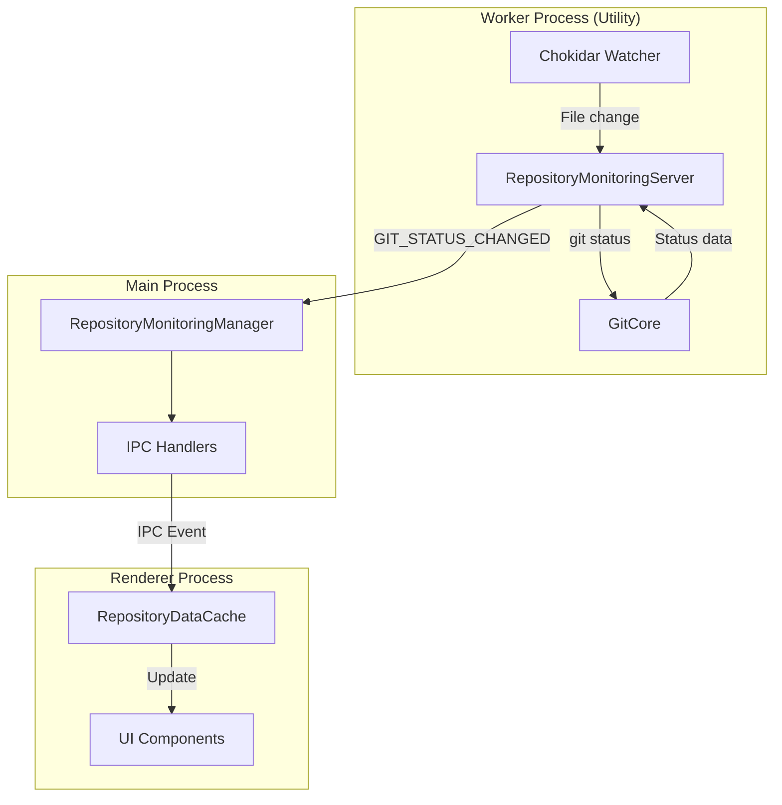

## Current Architecture Analysis

### Existing Components
1. **RepositoryMonitoringServer** (`src/repository-monitoring-server/RepositoryMonitoringServer.ts`)
   - Currently uses custom chokidar watchers for `.git` directory
   - Has methods: `setupMinimalGitWatching`, `setupFallbackGitWatching`
   - Emits `MonitoringInternalEvent.GIT_STATUS_CHANGED` events

2. **RepositoryMonitoringManager** (`src/main/repository-monitoring/RepositoryMonitoringManager.ts`)
   - Manages worker process lifecycle
   - Forwards events from worker to main process

3. **IPC Handlers** (`src/main/repository-monitoring/ipcHandlers.ts`)
   - Handles repository registration/unregistration
   - Manages git status requests

4. **RepositoryDataCache** (`src/renderer/services/RepositoryDataCache.ts`)
   - Event-driven cache for repository data
   - Has `queueUpdate` method for triggering refreshes
   - Maintains git status, file tree, and other repository data

## How Both Systems Work Together

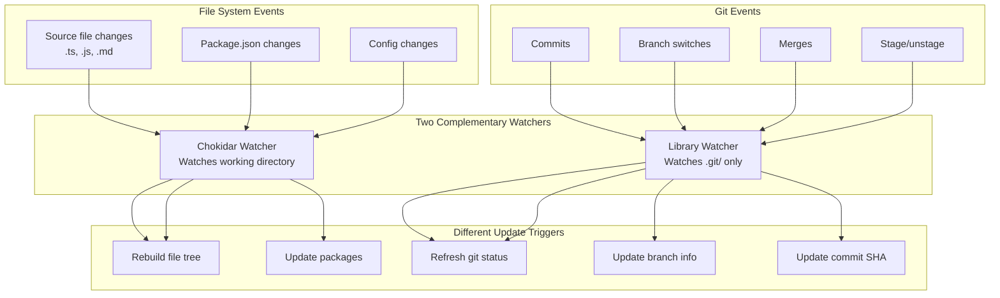

## Target Architecture with Library

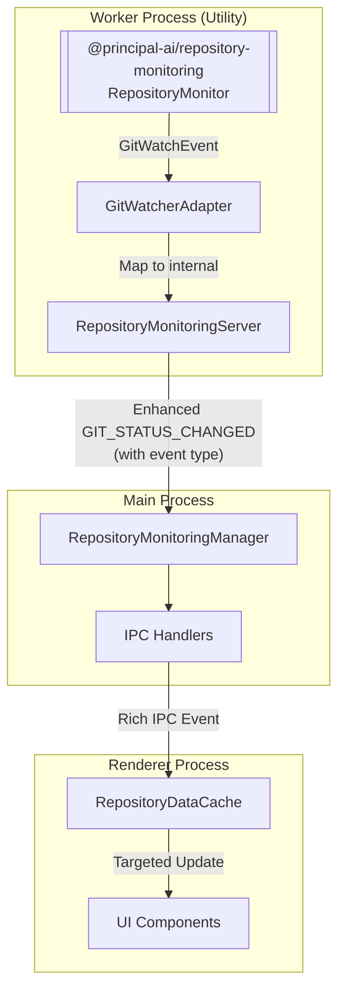

## Integration Points

### 1. Library Integration in RepositoryMonitoringServer
**File**: `src/repository-monitoring-server/RepositoryMonitoringServer.ts`

Replace custom git watching with library:
- Import `RepositoryMonitor` from `@principal-ai/repository-monitoring`
- Replace `setupMinimalGitWatching` and `setupFallbackGitWatching` methods
- Subscribe to `GitWatchEvent` from the library
- Map library events to existing `MonitoringInternalEvent.GIT_STATUS_CHANGED`

### 2. Event Type Mapping
**File**: `src/repository-monitoring-server/types.ts`

Add new interface for library events:
```typescript
interface GitWatchEventMapping {
  libraryEvent: GitWatchEvent; // from @principal-ai/repository-monitoring
  internalEvent: MonitoringInternalEvent.GIT_STATUS_CHANGED;
  cacheFields: string[]; // ['gitStatus', 'fileTree'] for merges
}
```

### 3. Event Forwarding Enhancement
**File**: `src/main/repository-monitoring/RepositoryMonitoringManager.ts`

Enhance event forwarding to include richer git event data:
- Pass through event type (commit/branch-switch/merge/dirty-state-change)
- Include SHA and branch information
- Forward to RepositoryDataCache with appropriate cache fields

### 4. Cache Update Triggering
**File**: `src/renderer/services/RepositoryDataCache.ts`

Enhance cache update logic:
- Accept git event type in `queueUpdate`
- Trigger appropriate cache refreshes based on event type
- Add 'fileTree' refresh for merge events

## Event Flow Comparison

### Current Event Flow
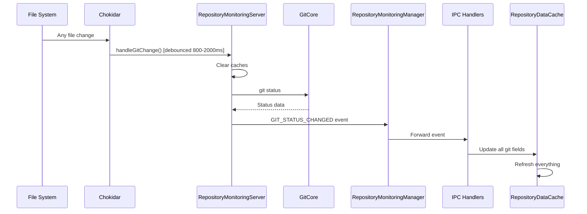

### New Event Flow with Library
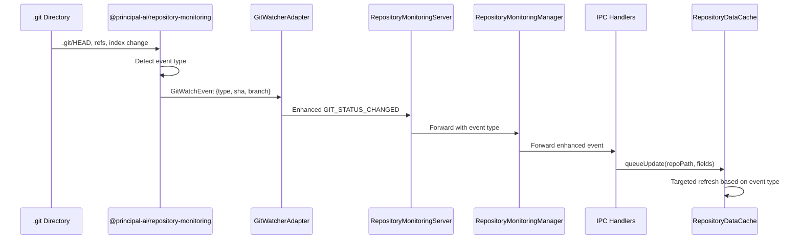

## Implementation Steps

### Phase 1: Library Setup (Day 1)
1. ✅ Install `@principal-ai/repository-monitoring@latest`
2. Create adapter module for library integration
3. Add TypeScript types for library interfaces

### Phase 2: Replace Git Watching (Day 1-2)
1. Create `GitWatcherAdapter` class in `RepositoryMonitoringServer`
2. Initialize `RepositoryMonitor` instance per repository
3. Subscribe to `GitWatchEvent` events
4. Map events to existing internal event structure
5. Remove legacy chokidar-based git watching code

### Phase 3: Event Pipeline Enhancement (Day 2)
1. Update event payload types in `types.ts`
2. Enhance `RepositoryMonitoringManager` to forward rich event data
3. Update IPC event handlers to process new event structure
4. Modify `RepositoryDataCache.queueUpdate` to handle event types

### Phase 4: Testing & Validation (Day 3)
1. Unit tests for GitWatcherAdapter
2. Integration tests for event flow
3. Manual testing of git operations:
   - Commits trigger updates
   - Branch switches refresh UI
   - Merges update file tree
   - Dirty state changes are reflected

### Phase 5: Cleanup & Optimization (Day 3-4)
1. Remove redundant git status calls from file change handler
2. Keep file watching for source changes, use library for git events
3. Optimize debounce settings for both systems
4. Document how both systems complement each other

## Data Flow for Different Event Types

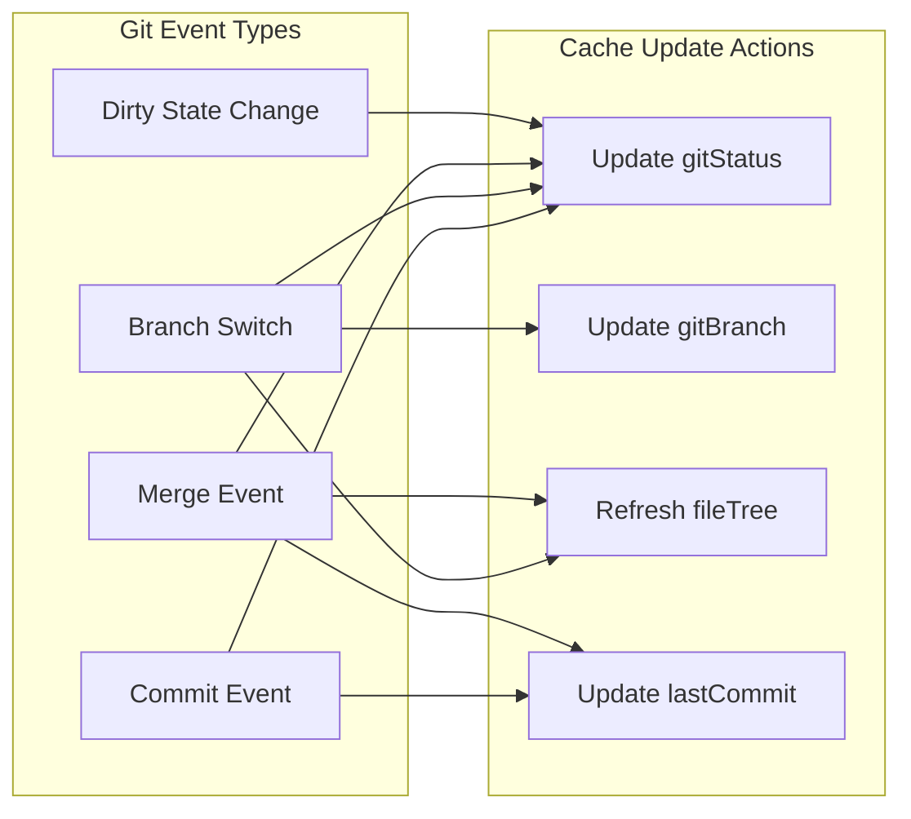

## GitWatcherAdapter Class Design

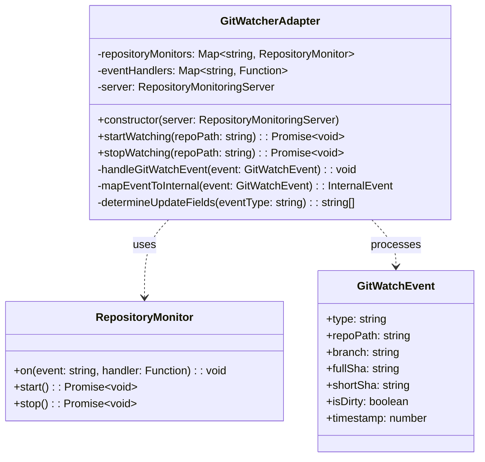

## File Changes Summary

### Modified Files
1. `src/repository-monitoring-server/RepositoryMonitoringServer.ts`
   - Replace git watching implementation
   - Add library integration

2. `src/repository-monitoring-server/types.ts`
   - Add GitWatchEvent interface
   - Enhance event payload types

3. `src/main/repository-monitoring/RepositoryMonitoringManager.ts`
   - Update event forwarding logic

4. `src/renderer/services/RepositoryDataCache.ts`
   - Enhance queueUpdate method
   - Add event-type based cache invalidation

### New Files
1. `src/repository-monitoring-server/GitWatcherAdapter.ts`
   - Adapter for library integration
   - Event mapping logic

2. `src/repository-monitoring-server/GitWatcherAdapter.test.ts`
   - Unit tests for adapter

## Configuration

### Environment Variables
- `GIT_WATCHER_DEBOUNCE_MS`: Debounce delay (default: 500ms)
- `GIT_WATCHER_MODE`: 'watch' | 'poll' (default: 'watch')

### Feature Flags
- `USE_LIBRARY_GIT_WATCHER`: Enable library integration (default: false initially)

## Risk Mitigation

1. **Backward Compatibility**
   - Maintain existing event structure initially
   - Use feature flag for gradual rollout
   - Keep legacy code path during transition

2. **Performance**
   - Configure appropriate debounce delays
   - Limit watched paths to `.git` metadata
   - Monitor memory usage with multiple repositories

3. **Error Handling**
   - Graceful fallback if library fails
   - Clear error messages for debugging
   - Maintain repository state consistency

## Success Metrics

1. **Functional**
   - Git events detected within 500ms
   - All event types properly handled
   - No missed updates

2. **Performance**
   - CPU usage < 5% during idle
   - Memory usage stable with 10+ repositories
   - Event processing < 100ms

3. **Reliability**
   - No crashes during git operations
   - Proper cleanup on repository unregister
   - Consistent state after restarts

## Timeline

| Phase | Duration | Status |
|-------|----------|--------|
| Phase 1: Library Setup | 0.5 day | ✅ Complete |
| Phase 2: Replace Git Watching | 1.5 days | Pending |
| Phase 3: Event Pipeline | 1 day | Pending |
| Phase 4: Testing | 1 day | Pending |
| Phase 5: Cleanup | 1 day | Pending |
| **Total** | **5 days** | |

## Integration Testing Strategy

```mermaid
flowchart TB
    subgraph TestScenarios["Test Scenarios"]
        T1[Make a commit]
        T2[Switch branches]
        T3[Perform merge]
        T4[Stage/unstage files]
    end

    subgraph Validations["Expected Outcomes"]
        V1[UI shows new SHA]
        V2[Branch name updates]
        V3[File tree refreshes]
        V4[Dirty indicator toggles]
    end

    subgraph Metrics["Success Metrics"]
        M1[Event latency < 500ms]
        M2[Correct event type]
        M3[No duplicate events]
        M4[Cache consistency]
    end

    T1 --> V1
    T2 --> V2
    T3 --> V3
    T4 --> V4

    V1 --> M1
    V2 --> M2
    V3 --> M3
    V4 --> M4

```

## What We're Actually Adding (Not Migrating!)

### Current System Limitations
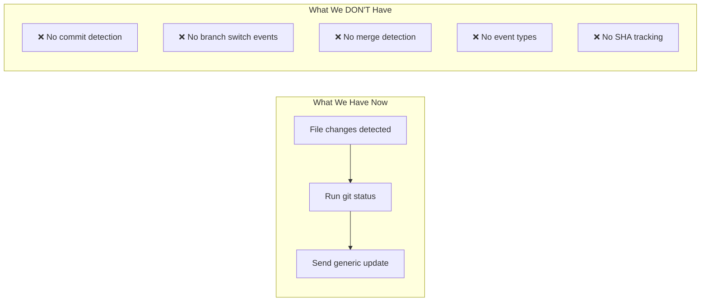

### New Capabilities from Library
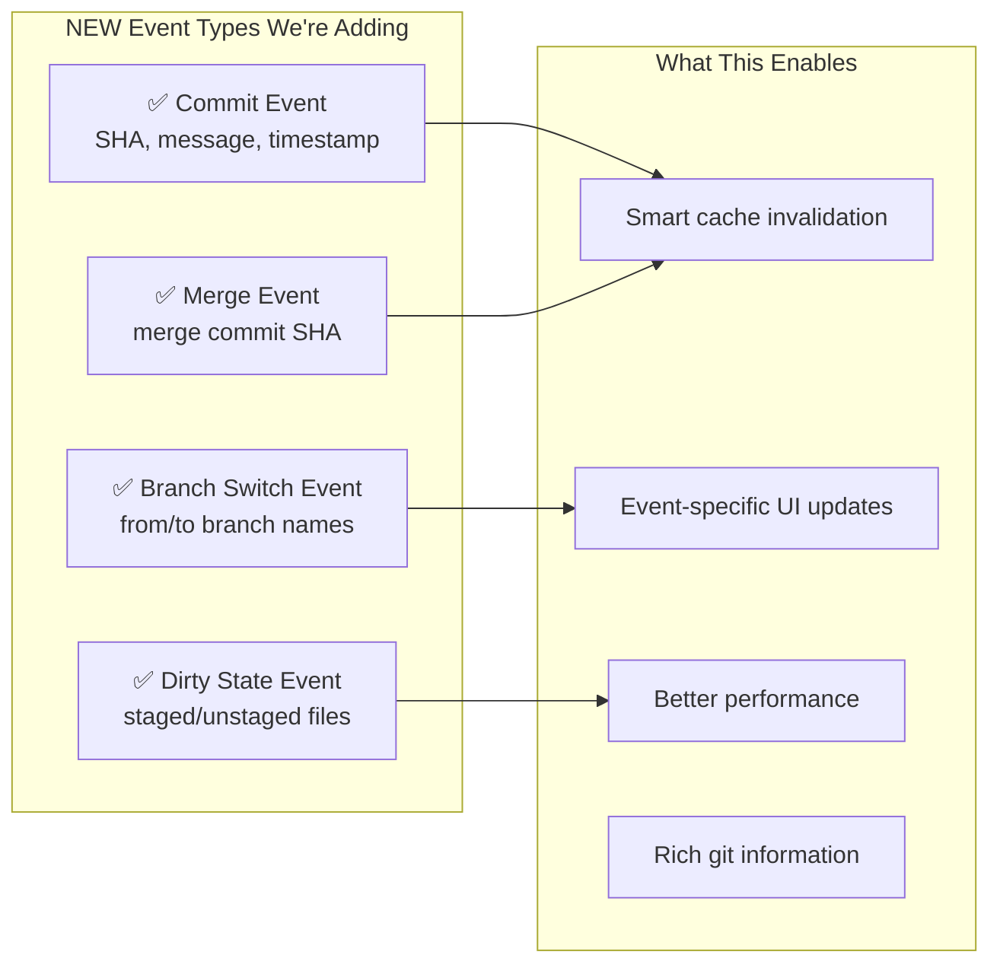

## Implementation Approach (Not Migration!)

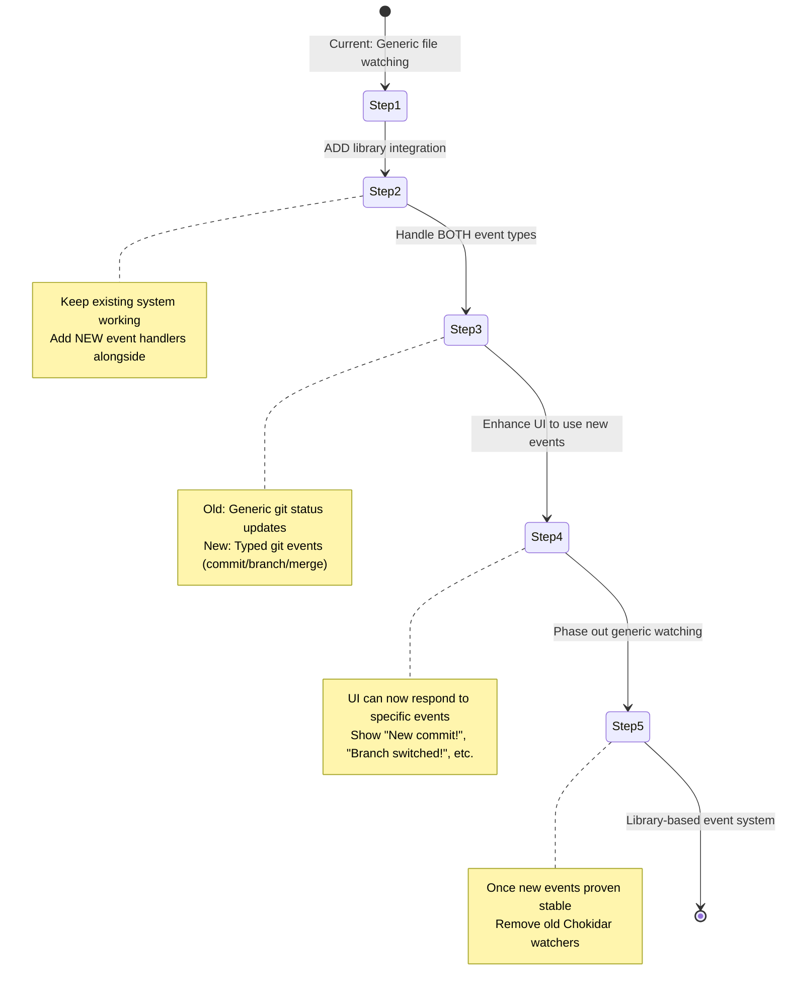

## Concrete Example: What Changes

### Before (Current System)
```typescript
// User makes a commit
// System: "Some file changed, let me check git status"
handleGitChange() {
  const status = await git.status();  // Generic status check
  emit('GIT_STATUS_CHANGED', status); // Generic event
}

// UI receives:
{
  branch: "main",
  isDirty: false,
  // That's it! No idea a commit happened
}
```

### After (With Library)
```typescript
// User makes a commit
// Library: "Detected a commit event!"
onGitWatchEvent(event: GitWatchEvent) {
  if (event.type === 'commit') {
    emit('GIT_STATUS_CHANGED', {
      ...existingStatus,
      eventType: 'commit',        // NEW!
      sha: event.fullSha,          // NEW!
      shortSha: event.shortSha,    // NEW!
      timestamp: event.timestamp   // NEW!
    });
  }
}

// UI receives:
{
  branch: "main",
  isDirty: false,
  eventType: "commit",           // UI knows this is a commit!
  sha: "abc123...",              // UI can show the SHA
  timestamp: 1234567890          // UI can show when
}

// UI can now show: "✅ New commit: abc123"
```

## Why This Isn't Really a "Migration"

We're not migrating from one event system to another. We're:
1. **Adding** a proper event system (we don't have one now)
2. **Enhancing** our generic file watching with specific git events
3. **Keeping** the existing system working during the transition
4. **Enriching** the data flow with new event types and metadata

The word "migration" was misleading - this is really an **enhancement** that adds capabilities we don't currently have!

## Next Actions

1. Create `GitWatcherAdapter` class
2. Set up library integration with feature flag
3. Write unit tests for adapter
4. Begin phased migration with single repository
5. Monitor and validate event flow