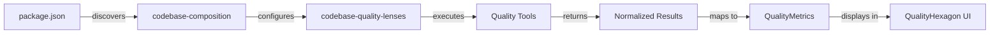

# Quality Hexagon Integration Plan

## Overview
This document outlines the current state and remaining work needed to integrate the Quality Hexagon visualization from alexandria-ui into the electron-app, using codebase-composition for tool discovery and codebase-quality-lenses for execution.

## Architecture Components

### 1. alexandria-ui (Visualization Layer)
**Package**: `@principal-ai/agent-monitoring-ui`
**Purpose**: Provides the QualityHexagon React component for visualizing code quality metrics

**Key Files**:
- `/Users/griever/Developer/alexandria-ui/src/components/QualityHexagon.tsx` - Main hexagon component
- `/Users/griever/Developer/alexandria-ui/src/components/QualityHexagon.stories.tsx` - Usage examples

**Quality Metrics Displayed**:
- **Tests** (0°): Test coverage percentage
- **Dead Code** (60°): Amount of unused code (inverted - less is better)
- **Formatting** (120°): Code formatting compliance
- **Linting** (180°): Linting rule compliance
- **Types** (-120°): TypeScript coverage
- **Documentation** (-60°): Documentation coverage

**Quality Tiers**:
- Bronze: >60% average
- Silver: >75% average
- Gold: >85% average
- Platinum: >95% average

### 2. codebase-composition (Discovery & Orchestration Layer)
**Package**: `@principal-ai/codebase-composition`
**Purpose**: Discovers available quality tools in a project and maps them to hexagon metrics

**Key Files**:
- `/Users/griever/Developer/codebase-composition/src/modules/PackageLayerModule.ts` - Discovers package.json scripts
- `/Users/griever/Developer/codebase-composition/src/helpers/QualityMetricsCalculator.ts` - Maps tools to quality metrics

**How it Works**:
1. Reads package.json scripts (lines 136-150 in PackageLayerModule.ts)
2. Identifies quality tool commands using naming convention:
   - Explicit: `lens:eslint:check`, `lens:jest:coverage`, etc.
   - Fallback: `lint`, `test`, `typecheck`, `format`, etc.
3. Maps tools to hexagon metrics (lines 8-36 in QualityMetricsCalculator.ts):
   ```typescript
   'eslint' → 'linting'
   'typescript' → 'types'
   'jest'/'vitest' → 'tests'
   'prettier' → 'formatting'
   'knip' → 'deadCode'
   'typedoc' → 'documentation'
   ```

### 3. codebase-quality-lenses (Execution Layer)
**Package**: `@principal-ai/codebase-quality-lenses`
**Purpose**: Executes quality tools and normalizes their output

**Current Integration in electron-app**:
- `/Users/griever/Developer/electron-app/src/main/quality-lenses/GitLensAdapter.ts` - Git operations adapter
- `/Users/griever/Developer/electron-app/src/main/quality-lenses/ElectronCLIBridgeExecutor.ts` - Command executor
- `/Users/griever/Developer/codebase-quality-lenses/INTEGRATION.md` - Integration guide

**Supported Tools** (from README.md line 14-21):
- ESLint - JavaScript/TypeScript linting
- TypeScript - Type checking
- Jest - Test runner and coverage
- Git - Version control status
- Knip - Find unused files, exports, and dependencies

## Current State in electron-app (Last Updated: 2025-10-11)

### ✅ What's Already Integrated:

#### Core Infrastructure
1. **All required packages installed**:
   - `@principal-ai/codebase-quality-lenses@^0.1.5` - Tool execution with parsing
   - `@principal-ai/codebase-composition@^0.2.0` - Tool discovery and package analysis
   - `@principal-ai/agent-monitoring-ui@^0.0.4` - QualityHexagon UI components

2. **Quality Lens Service** (`src/main/quality-lenses/QualityLensService.ts`):
   - Singleton service for executing quality tools through lenses
   - Supports ESLint, TypeScript, Jest, Knip, Git, and Prettier (direct parsing)
   - Uses ElectronCLIBridgeExecutor for command execution
   - Provides intelligent tool matching and alias support

3. **Type Definitions** (`src/repository-monitoring-server/types.ts`):
   - `PackageWithMetrics` interface extends `PackageLayer` with quality data
   - `QualityMetrics` imported from `@principal-ai/codebase-composition`
   - `ToolResults` type for storing lens execution results
   - `QualitySuggestion` interface for improvement recommendations

4. **Package Processing** (`src/repository-monitoring-server/PackageProcessor.ts`):
   - Uses `PackageLayerModule` from codebase-composition for package discovery
   - Extracts packages from FileTree with full monorepo support
   - Generates PackageSummary with aggregated information

5. **UI Components**:
   - `QualityHexagonPanel.tsx` implemented in two locations:
     - `src/renderer/components/quality/` (legacy)
     - `src/renderer/principal-window/views/RepositoryExplorer/components/quality/` (active)
   - Currently displays package information (name, version, dependencies, scripts)
   - Uses QualityHexagonCompact and QualityHexagonDetailed from alexandria-ui (imported but not yet rendered)
   - Integrated into RepositoryExplorer

6. **Mock Service** (Development):
   - `MockQualityMetricsService.ts` provides realistic test data
   - Simulates analysis delays and progress updates
   - Available in both renderer locations

### ❌ What's Missing:

1. **Quality Metrics Calculation**:
   - PackageProcessor doesn't calculate quality metrics yet
   - No integration between QualityLensService and PackageProcessor
   - Hexagon scoring algorithms not implemented

2. **UI Rendering**:
   - QualityHexagonPanel shows package info, but NOT the hexagon visualization
   - Mock data not connected to actual UI rendering
   - Quality metrics not fetched from PackageWithMetrics

3. **Tool Discovery & Execution**:
   - No automatic detection of lens: commands in package.json
   - No execution of quality tools during package processing
   - No caching of quality metrics results

## Next Integration Steps

### ~~Step 1: Install Missing Dependencies~~ ✅ COMPLETED
All required packages are now installed in package.json.

### Step 2: Add Quality Metrics Calculation to PackageProcessor
Create a service that orchestrates the full quality analysis flow:

```typescript
// src/main/services/QualityAnalysisService.ts
import { PackageLayerModule } from '@principal-ai/codebase-composition';
import { QualityMetricsCalculator } from '@principal-ai/codebase-composition';
import { ESLintLens, TypeScriptLens, JestLens, KnipLens } from '@principal-ai/codebase-quality-lenses';
import { ElectronCLIBridgeExecutor } from '../quality-lenses/ElectronCLIBridgeExecutor';

class QualityAnalysisService {
  async analyzeProject(projectPath: string) {
    // 1. Discover available tools using codebase-composition
    const packageLayer = new PackageLayerModule();
    const analysis = await packageLayer.analyze(fileTree);

    // 2. Detect quality commands
    const qualityProfile = QualityMetricsCalculator.calculateQualityProfile(
      analysis.packageData.availableCommands
    );

    // 3. Execute each detected lens
    const executor = new ElectronCLIBridgeExecutor();
    const results = {};

    for (const lensId of qualityProfile.availableLenses) {
      // Execute lens and collect metrics
      const lens = this.createLens(lensId, executor);
      const result = await lens.run();
      // Map result to metric value
    }

    // 4. Return metrics for QualityHexagon
    return {
      metrics: qualityProfile.hexagon,
      tier: this.calculateTier(qualityProfile.hexagon)
    };
  }
}
```

### Step 3: Add UI Components
Create React components in the renderer process:

```typescript
// src/renderer/components/QualityHexagon.tsx
import { QualityHexagon } from '@principal-ai/agent-monitoring-ui';

export function ProjectQualityView({ projectPath }) {
  const [metrics, setMetrics] = useState(null);

  useEffect(() => {
    // Request quality analysis from main process
    window.electron.ipcRenderer.invoke('analyze-quality', projectPath)
      .then(setMetrics);
  }, [projectPath]);

  if (!metrics) return <div>Analyzing quality...</div>;

  return (
    <QualityHexagon
      metrics={metrics.metrics}
      tier={metrics.tier}
      size="lg"
    />
  );
}
```

### Step 4: Configure Package.json Scripts
To enable automatic tool discovery, projects should use the lens naming convention:

```json
{
  "scripts": {
    "lens:eslint:check": "eslint . --ext .js,.jsx,.ts,.tsx",
    "lens:typescript:check": "tsc --noEmit",
    "lens:jest:coverage": "jest --coverage",
    "lens:prettier:check": "prettier --check .",
    "lens:knip:check": "knip",
    "lens:typedoc:check": "typedoc"
  }
}
```

Or use standard script names that will be auto-detected:
- `lint` → maps to linting metric
- `test` → maps to tests metric
- `typecheck` → maps to types metric
- `format` → maps to formatting metric

## Data Flow



## Missing Tool Support

Currently missing lenses that would complete the hexagon:
- **Prettier Lens** - For formatting metric (not yet in codebase-quality-lenses)
- **Documentation Lens** - For documentation metric (TypeDoc/JSDoc support planned)

## Testing Approach

1. Start with a project that has all quality tools configured
2. Verify codebase-composition discovers all tools correctly
3. Test each lens execution independently
4. Validate metric calculations match expected ranges (0-100)
5. Ensure QualityHexagon renders correctly with real data

## References

### Documentation
- Quality Levels: `/Users/griever/Developer/alexandria-ui/docs/quality-levels.md`
- Integration Guide: `/Users/griever/Developer/codebase-quality-lenses/INTEGRATION.md`
- Git Lens Migration: `/Users/griever/Developer/electron-app/docs/git-lens-migration-audit.md`

### Example Implementations
- QualityHexagon Stories: `/Users/griever/Developer/alexandria-ui/src/components/QualityHexagon.stories.tsx`
- GitLens Adapter: `/Users/griever/Developer/electron-app/src/main/quality-lenses/GitLensAdapter.ts`

### Package Sources
- alexandria-ui: `/Users/griever/Developer/alexandria-ui/`
- codebase-composition: `/Users/griever/Developer/codebase-composition/`
- codebase-quality-lenses: `/Users/griever/Developer/codebase-quality-lenses/`

## Contact

For questions about:
- **Quality Hexagon UI**: Check alexandria-ui repository
- **Tool Discovery**: Check codebase-composition repository
- **Lens Execution**: Check codebase-quality-lenses repository
- **Electron Integration**: Check existing GitLensAdapter implementation

## Estimated Effort (Updated)

- **~~Step 1~~**: ✅ COMPLETED - All dependencies installed
- **Step 2**: 2-3 days - Add quality metrics calculation to PackageProcessor
- **Step 3**: 1-2 days - Wire hexagon visualization in UI
- **Step 4**: 1 day - Testing and refinement
- **Remaining**: ~4-6 days for full integration

Primary complexity is now focused on:
1. Implementing the hexagon scoring algorithms from lens results
2. Wiring quality metrics calculation into the package processing pipeline
3. Connecting the UI to display actual quality data instead of package info