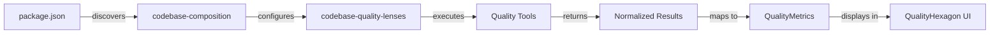

# Quality Hexagon Integration Plan

## Overview
This document outlines the current state and remaining work needed to integrate the Quality Hexagon visualization from alexandria-ui into the electron-app, using codebase-composition for tool discovery and codebase-quality-lenses for execution.

## Architecture Components

### 1. alexandria-ui (Visualization Layer)
**Package**: `@a24z/alexandria-ui`
**Purpose**: Provides the QualityHexagon React component for visualizing code quality metrics

**Key Files**:
- `/Users/griever/Developer/alexandria-ui/src/components/QualityHexagon.tsx` - Main hexagon component
- `/Users/griever/Developer/alexandria-ui/src/components/QualityHexagon.stories.tsx` - Usage examples

**Quality Metrics Displayed**:
- **Tests** (0°): Test coverage percentage
- **Dead Code** (60°): Amount of unused code (inverted - less is better)
- **Formatting** (120°): Code formatting compliance
- **Linting** (180°): Linting rule compliance
- **Types** (-120°): TypeScript coverage
- **Documentation** (-60°): Documentation coverage

**Quality Tiers**:
- Bronze: >60% average
- Silver: >75% average
- Gold: >85% average
- Platinum: >95% average

### 2. codebase-composition (Discovery & Orchestration Layer)
**Package**: `@principal-ai/codebase-composition`
**Purpose**: Discovers available quality tools in a project and maps them to hexagon metrics

**Key Files**:
- `/Users/griever/Developer/codebase-composition/src/modules/PackageLayerModule.ts` - Discovers package.json scripts
- `/Users/griever/Developer/codebase-composition/src/helpers/QualityMetricsCalculator.ts` - Maps tools to quality metrics

**How it Works**:
1. Reads package.json scripts (lines 136-150 in PackageLayerModule.ts)
2. Identifies quality tool commands using naming convention:
   - Explicit: `lens:eslint:check`, `lens:jest:coverage`, etc.
   - Fallback: `lint`, `test`, `typecheck`, `format`, etc.
3. Maps tools to hexagon metrics (lines 8-36 in QualityMetricsCalculator.ts):
   ```typescript
   'eslint' → 'linting'
   'typescript' → 'types'
   'jest'/'vitest' → 'tests'
   'prettier' → 'formatting'
   'knip' → 'deadCode'
   'typedoc' → 'documentation'
   ```

### 3. codebase-quality-lenses (Execution Layer)
**Package**: `@principal-ai/codebase-quality-lenses`
**Purpose**: Executes quality tools and normalizes their output

**Current Integration in electron-app**:
- `/Users/griever/Developer/electron-app/src/main/quality-lenses/GitLensAdapter.ts` - Git operations adapter
- `/Users/griever/Developer/electron-app/src/main/quality-lenses/ElectronCLIBridgeExecutor.ts` - Command executor
- `/Users/griever/Developer/codebase-quality-lenses/INTEGRATION.md` - Integration guide

**Supported Tools** (from README.md line 14-21):
- ESLint - JavaScript/TypeScript linting
- TypeScript - Type checking
- Jest - Test runner and coverage
- Git - Version control status
- Knip - Find unused files, exports, and dependencies

## Current State in electron-app

### ✅ What's Already Integrated:
1. **codebase-quality-lenses** package is installed (referenced in GitLensAdapter.ts)
2. **ElectronCLIBridgeExecutor** bridges quality lenses with electron-cli-bridge
3. **GitLensAdapter** implements Git operations using quality lenses

### ❌ What's Missing:
1. **codebase-composition** package not in dependencies (checked package.json)
2. **alexandria-ui** package not in dependencies
3. No Quality Hexagon UI components
4. No integration layer connecting all three systems

## Integration Steps

### Step 1: Install Missing Dependencies
```bash
npm install @principal-ai/codebase-composition @a24z/alexandria-ui
```

### Step 2: Create Quality Analysis Service
Create a service that orchestrates the full quality analysis flow:

```typescript
// src/main/services/QualityAnalysisService.ts
import { PackageLayerModule } from '@principal-ai/codebase-composition';
import { QualityMetricsCalculator } from '@principal-ai/codebase-composition';
import { ESLintLens, TypeScriptLens, JestLens, KnipLens } from '@principal-ai/codebase-quality-lenses';
import { ElectronCLIBridgeExecutor } from '../quality-lenses/ElectronCLIBridgeExecutor';

class QualityAnalysisService {
  async analyzeProject(projectPath: string) {
    // 1. Discover available tools using codebase-composition
    const packageLayer = new PackageLayerModule();
    const analysis = await packageLayer.analyze(fileTree);

    // 2. Detect quality commands
    const qualityProfile = QualityMetricsCalculator.calculateQualityProfile(
      analysis.packageData.availableCommands
    );

    // 3. Execute each detected lens
    const executor = new ElectronCLIBridgeExecutor();
    const results = {};

    for (const lensId of qualityProfile.availableLenses) {
      // Execute lens and collect metrics
      const lens = this.createLens(lensId, executor);
      const result = await lens.run();
      // Map result to metric value
    }

    // 4. Return metrics for QualityHexagon
    return {
      metrics: qualityProfile.hexagon,
      tier: this.calculateTier(qualityProfile.hexagon)
    };
  }
}
```

### Step 3: Add UI Components
Create React components in the renderer process:

```typescript
// src/renderer/components/QualityHexagon.tsx
import { QualityHexagon } from '@a24z/alexandria-ui';

export function ProjectQualityView({ projectPath }) {
  const [metrics, setMetrics] = useState(null);

  useEffect(() => {
    // Request quality analysis from main process
    window.electron.ipcRenderer.invoke('analyze-quality', projectPath)
      .then(setMetrics);
  }, [projectPath]);

  if (!metrics) return <div>Analyzing quality...</div>;

  return (
    <QualityHexagon
      metrics={metrics.metrics}
      tier={metrics.tier}
      size="lg"
    />
  );
}
```

### Step 4: Configure Package.json Scripts
To enable automatic tool discovery, projects should use the lens naming convention:

```json
{
  "scripts": {
    "lens:eslint:check": "eslint . --ext .js,.jsx,.ts,.tsx",
    "lens:typescript:check": "tsc --noEmit",
    "lens:jest:coverage": "jest --coverage",
    "lens:prettier:check": "prettier --check .",
    "lens:knip:check": "knip",
    "lens:typedoc:check": "typedoc"
  }
}
```

Or use standard script names that will be auto-detected:
- `lint` → maps to linting metric
- `test` → maps to tests metric
- `typecheck` → maps to types metric
- `format` → maps to formatting metric

## Data Flow



## Missing Tool Support

Currently missing lenses that would complete the hexagon:
- **Prettier Lens** - For formatting metric (not yet in codebase-quality-lenses)
- **Documentation Lens** - For documentation metric (TypeDoc/JSDoc support planned)

## Testing Approach

1. Start with a project that has all quality tools configured
2. Verify codebase-composition discovers all tools correctly
3. Test each lens execution independently
4. Validate metric calculations match expected ranges (0-100)
5. Ensure QualityHexagon renders correctly with real data

## References

### Documentation
- Quality Levels: `/Users/griever/Developer/alexandria-ui/docs/quality-levels.md`
- Integration Guide: `/Users/griever/Developer/codebase-quality-lenses/INTEGRATION.md`
- Git Lens Migration: `/Users/griever/Developer/electron-app/docs/git-lens-migration-audit.md`

### Example Implementations
- QualityHexagon Stories: `/Users/griever/Developer/alexandria-ui/src/components/QualityHexagon.stories.tsx`
- GitLens Adapter: `/Users/griever/Developer/electron-app/src/main/quality-lenses/GitLensAdapter.ts`

### Package Sources
- alexandria-ui: `/Users/griever/Developer/alexandria-ui/`
- codebase-composition: `/Users/griever/Developer/codebase-composition/`
- codebase-quality-lenses: `/Users/griever/Developer/codebase-quality-lenses/`

## Contact

For questions about:
- **Quality Hexagon UI**: Check alexandria-ui repository
- **Tool Discovery**: Check codebase-composition repository
- **Lens Execution**: Check codebase-quality-lenses repository
- **Electron Integration**: Check existing GitLensAdapter implementation

## Estimated Effort

- **Step 1-2**: 2-3 days (service creation and wiring)
- **Step 3**: 1-2 days (UI integration)
- **Step 4**: 1 day (testing and refinement)
- **Total**: ~1 week for full integration

Primary complexity is in coordinating the three libraries and ensuring proper data flow between electron's main and renderer processes.