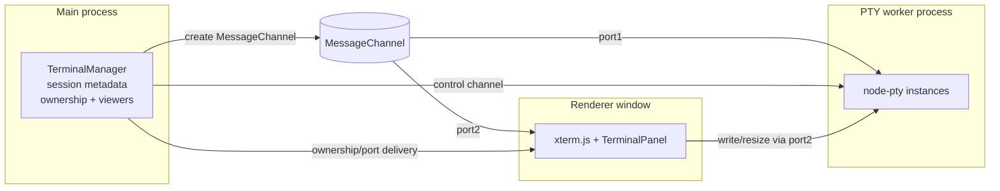
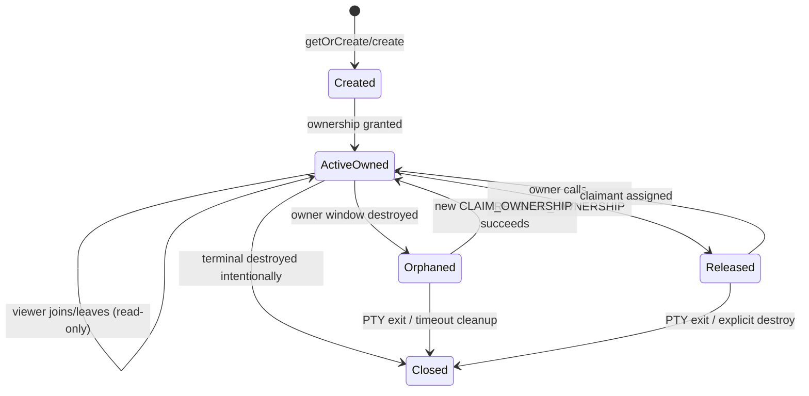

# Terminal MessagePort Architecture Proposal

## Goals
- Move PTY streaming off the main process while retaining existing terminal session semantics (session reuse by repo/context, ownership tracking, active viewer routing).
- Reduce per-chunk IPC overhead by handing renderers a direct `MessagePort` for each session.
- Preserve compatibility with existing session lifecycle APIs (`create`, `getOrCreate`, `destroy`, resize, write, refresh, ownership/claim) during migration.

## Current state
- The main process owns all `node-pty` instances and streams data to renderers via session-specific IPC channels (`terminal:data:<sessionId>`) in `sendToActiveViewers`. Windows subscribed for a session receive raw PTY strings through `webContents.send` when they are in the `activeViewers` set.【F:src/main/terminal.ts†L59-L99】
- Session identity is tied to a directory/context key; `getOrCreate` and `create` reuse or create sessions, then automatically claim ownership for the requesting window and add it to `activeViewers`. Previous owners are notified via `OWNERSHIP_LOST` when ownership changes.【F:src/main/terminal.ts†L335-L391】
- Ownership APIs (`CHECK_OWNERSHIP`, `CLAIM_OWNERSHIP`, `RELEASE_OWNERSHIP`) enforce single-writer semantics, track `ownedByWindowId` and `ownershipClaimedAt`, and gate viewership updates/notifications when the owner changes or drops.【F:src/main/terminal.ts†L817-L910】
- The preload/renderer surface already exposes session-scoped data subscriptions via `onDataForSession`, so UI components expect to write raw strings to xterm.js when data arrives.【F:src/shared/main-process-api-interfaces/TerminalService.ts†L1-L71】

## Proposed architecture
### Components
- **PTY worker (utility process):** Spawned by the main process using `utilityProcess.fork` (or a Node `Worker` fallback). Hosts all `node-pty` instances and owns the session-to-PTY map.
- **Main-process router:** Maintains authoritative session metadata (directory/context lookup, ownership, active viewers) and lifecycle IPC (create/claim/destroy). For each session, it establishes a `MessageChannel` and transfers one port to the PTY worker and the other to the requesting renderer.
- **Renderer adapters:** Minimal changes in preload/renderer to accept a transferred `MessagePort` per session and pipe its `message` events into the existing xterm.js write path. Fallback to legacy IPC if a port is unavailable (e.g., older windows).

### Architecture overview (Mermaid)

Key points illustrated above:
- The main process still owns control-plane state (session identity, ownership, viewer list) but does not broker data chunks.
- PTY output flows worker → port1 → port2 → renderer, bypassing per-chunk main-process IPC.
- Write/resize commands travel renderer → port2 → worker; the main process only redistributes ports when ownership/viewers change.

### Data flow
1. **Session creation:**
   - Renderer calls `getOrCreate`/`create`; main process resolves/creates the session as today, updates ownership, and builds a `MessageChannel` for the session.
   - Main transfers `port1` to the PTY worker with metadata `{ sessionId, cols, rows, cwd, env }`; worker binds PTY output to `port1.postMessage(data)` and listens for inbound `write`, `resize`, `destroy` commands on `port1`.
   - Main transfers `port2` to the requesting renderer via a new IPC event (e.g., `terminal:port:<sessionId>`). The renderer registers the port and starts consuming messages.
2. **Streaming:**
   - PTY output flows worker → `port1` → `port2` → renderer without main-process per-chunk handlers. Ownership checks still run in main when registering viewers; only windows in `activeViewers` receive `port2`.
3. **Commands:**
   - Renderer actions (`write`, `resize`) post to `port2`; main no longer brokers the payload. Worker validates session ownership tokens (see below) to avoid rogue renderers.
4. **Exit/teardown:**
   - Worker notifies main of PTY exit via a control channel (separate `MessagePort` or `ipcMain` event). Main emits existing `ON_EXIT` and cleans up `sessionsByRepo`, ownership, and active viewers, then closes both ports.

### Ownership integration
- **Ownership gating:** Main process remains the source of truth for `ownedByWindowId`, `ownershipClaimedAt`, and `activeViewers`. When ownership changes (manual claim or implicit via `getOrCreate`), the main process sends a fresh `MessagePort` to the new owner and optionally closes/pauses the previous port to enforce single active writer.
- **Viewer management:** Active viewers keep read-only ports. When a window loses ownership, its port remains readable but write capability is disabled by clearing per-port write tokens. If the owner window is destroyed or releases ownership, main grants ownership to a claimer and distributes a new write-enabled port.
- **Backpressure & replay:** The PTY worker can buffer output per session and replay to late subscribers when the main process requests a refresh, preserving today’s `refresh` behavior with minimal main-process work.

### Session state machine (Mermaid)

State handling highlights:
- **Window close vs. intentional terminal close:** Closing a window transitions `ActiveOwned → Orphaned`, keeping the PTY alive so another claimant (or the same window after reload) can reattach. An intentional terminal close (`destroy` or PTY exit) goes to `Closed` and tears down ports, PTY, and session metadata.
- **Viewer churn:** Viewer joins/leaves do not change ownership state; the main process simply sends/withdraws read-only ports.

### API and compatibility
- **New event:** Add `TerminalAPIEvents.PORT_READY` (e.g., `terminal:port`) that delivers `{ sessionId, port, writable }` to renderers; legacy `onDataForSession` remains for fallback.
- **Token-based writes:** Main issues a per-session capability token with each writable port. Worker validates the token on incoming `write`/`resize` commands to honor ownership decisions without main involvement for each command.
- **Opt-in rollout:** Feature flag in main process; when disabled, main continues using `sendToActiveViewers` and PTY in-process.

### Failure handling
- **Worker crash:** Main detects worker exit, notifies renderers via `ON_EXIT`, and tears down sessions. A reconnection path can respawn the worker and rebuild PTYs using stored directory/context metadata when feasible.
- **Renderer restart:** On window reload, main re-sends the session’s `port` to the active owner/viewers after they re-register; ownership auto-claim rules stay the same.
- **Port loss:** If a port transfer fails, main falls back to the legacy IPC channel for that window and logs telemetry for debugging.

### Migration steps
1. Implement PTY worker module with control channel for session CRUD and port wiring.
2. Extend `TerminalManager` to create `MessageChannel`s per session, transfer to worker/renderer, and guard write tokens based on ownership.
3. Update preload/renderer terminal service to register `PORT_READY`, pipe `MessagePort` data to xterm.js, and retain legacy IPC listeners for fallback.
4. Add feature flag and metrics to compare throughput/latency and crash isolation against the current main-process PTY path.
