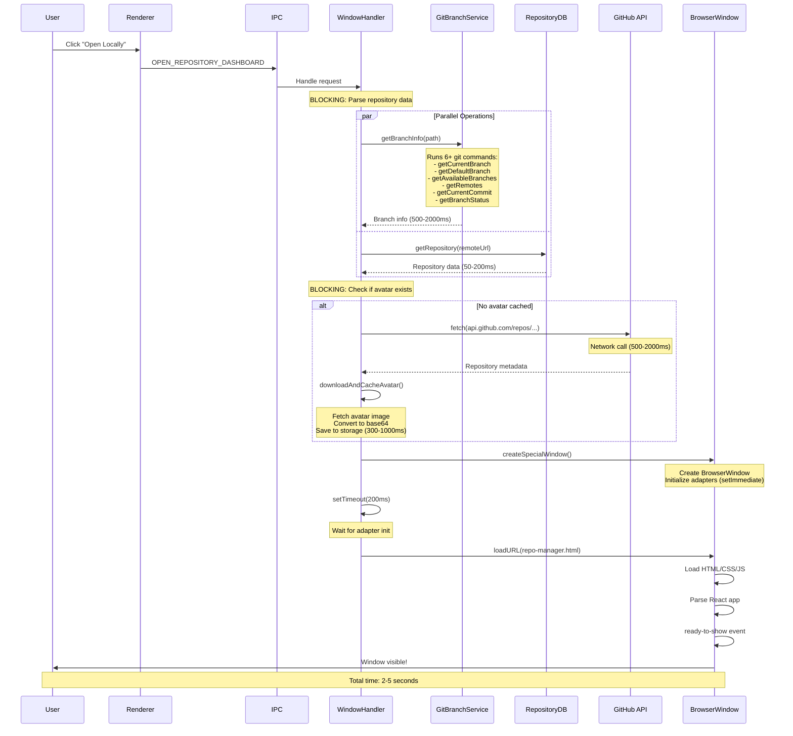
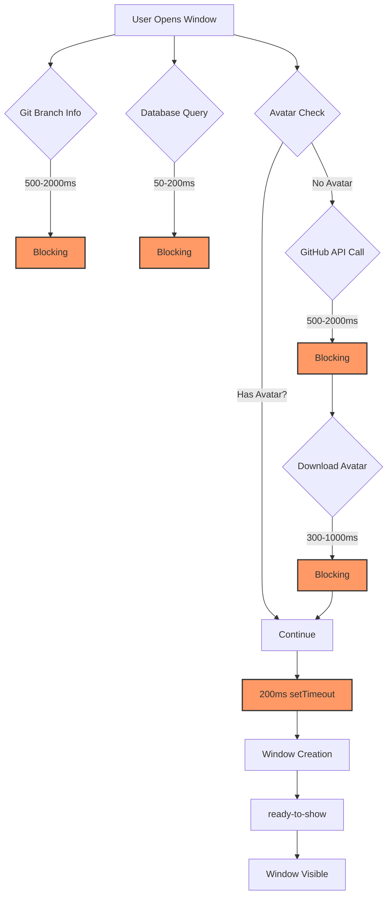
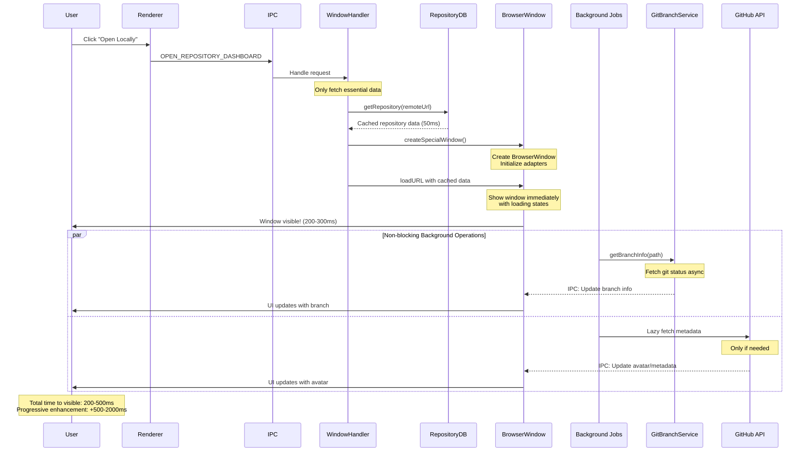
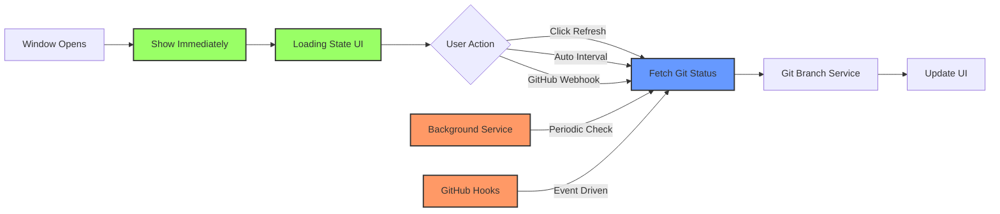
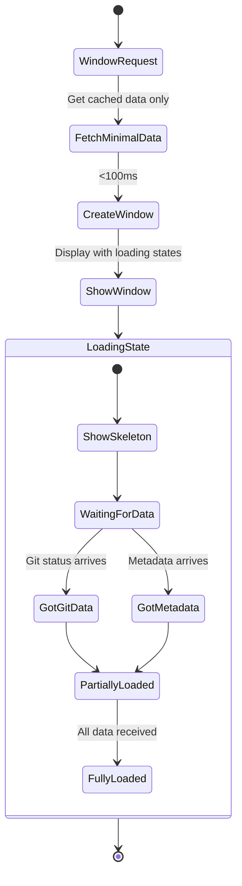
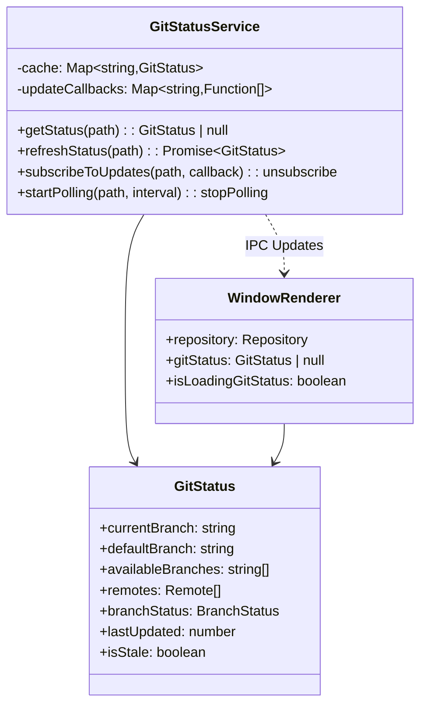
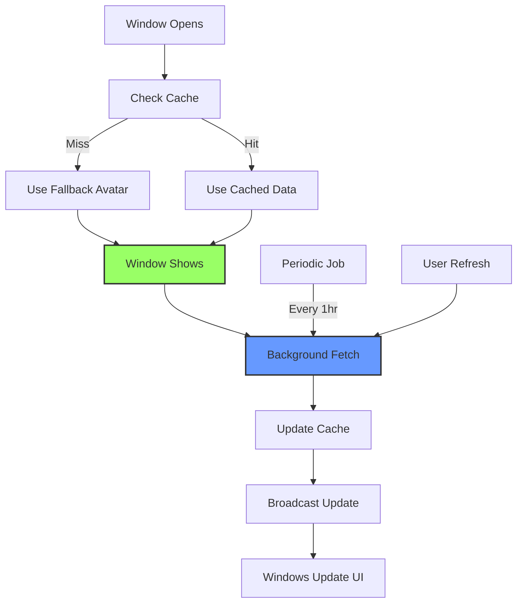
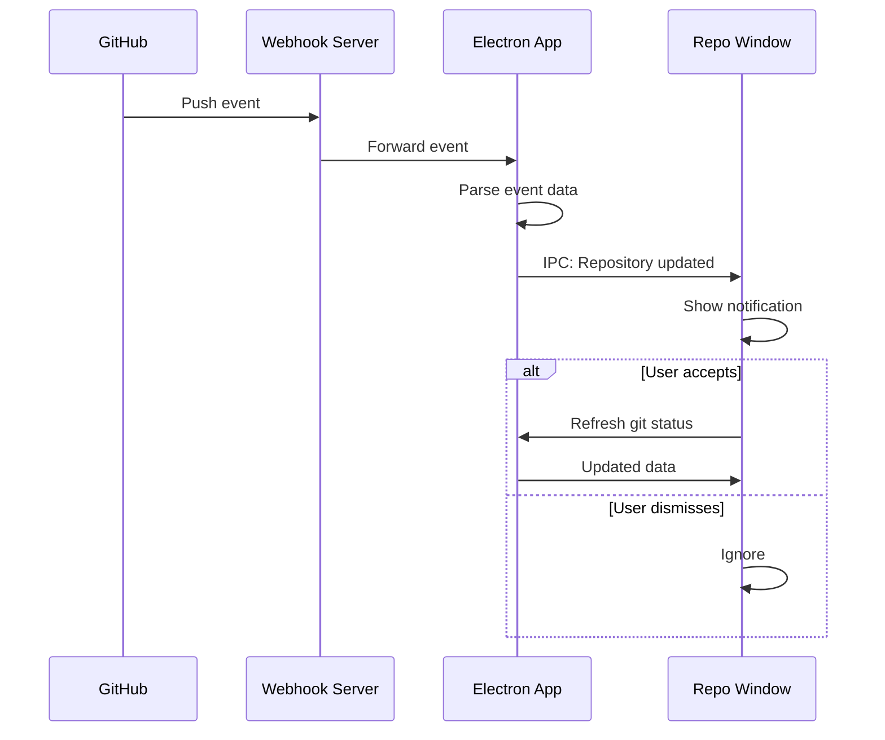
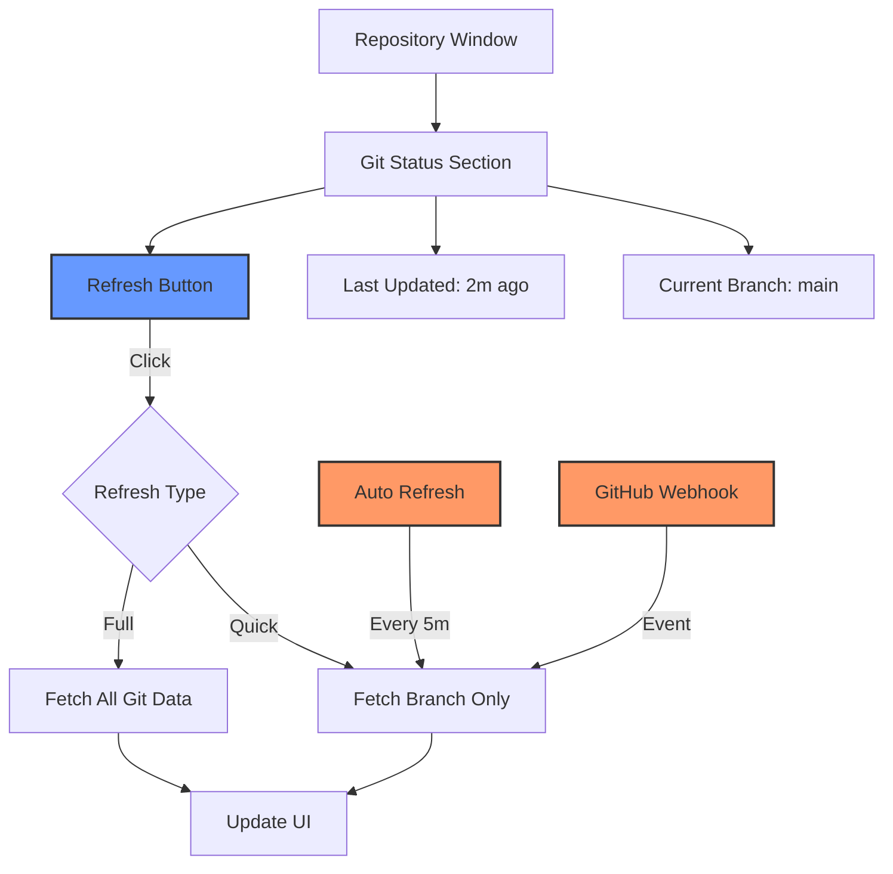

# Window Opening Performance Analysis

## Overview

This document analyzes the performance bottlenecks in opening repository windows and proposes architectural improvements to decouple blocking operations from window initialization.

## Current Architecture

### Repository Window Opening Flow



### Current Bottlenecks



## Problem Analysis

### 1. Git Operations Block Window Opening

**Current Implementation:** `src/main/window/modernWindowHandlers.ts:224-240`

```typescript
if (repository.path) {
  try {
    const branchService = new GitBranchService();
    const branchInfo = await branchService.getBranchInfo(repository.path);
    currentBranch = branchInfo?.currentBranch;
  } catch (error) {
    console.error('[modernWindowHandlers] Failed to get branch info:', error);
  }
}
```

**Issues:**
- Blocks window creation until git commands complete
- Makes 6+ git subprocess calls serially
- Can take 500-2000ms depending on repository size
- TODO comment at `src/main/stores/RepositoryApiEventHandler.ts:465` acknowledges this is blocking

### 2. GitHub API Calls Block Window Opening

**Current Implementation:** `src/main/window/modernWindowHandlers.ts:260-273`

```typescript
if (existingRepo && !existingRepo.avatarUrl && vcsType === 'github') {
  console.log('[modernWindowHandlers] Fetching avatar for repository:', remoteUrl);
  try {
    existingRepo = await repositoryHandler.refreshRepositoryMetadata(remoteUrl);
  } catch (error) {
    console.error('[modernWindowHandlers] Failed to refresh metadata:', error);
  }
}
```

**Issues:**
- Network call to `api.github.com` (500-2000ms)
- Downloads and converts avatar to base64 (300-1000ms)
- Blocks window creation for cosmetic data
- User sees nothing while waiting for avatar

### 3. Artificial 200ms Delay

**Current Implementation:** `src/main/window/modernWindowHandlers.ts:389-395`

```typescript
setTimeout(() => {
  console.log('[ModernWindow] Loading repository dashboard URL after adapter init delay:', url);
  window.window.loadURL(url);
}, 200);
```

**Issues:**
- Hardcoded delay to ensure adapters initialize
- Adds 200ms to every window open
- Should use event-driven approach instead

## Proposed Architecture

### Decoupled Repository Window Opening



### Atomic Git Operations Architecture



### Progressive Data Loading



## Implementation Plan

### Phase 1: Decouple Git Operations

#### 1.1 Create Git Status Event System

**New file:** `src/main/services/GitStatusService.ts`



#### 1.2 Update Window Handler

**Changes to:** `src/main/window/modernWindowHandlers.ts`

```typescript
// BEFORE (Blocking)
if (repository.path) {
  try {
    const branchService = new GitBranchService();
    const branchInfo = await branchService.getBranchInfo(repository.path);
    currentBranch = branchInfo?.currentBranch;
  } catch (error) {
    console.error('[modernWindowHandlers] Failed to get branch info:', error);
  }
}

// AFTER (Non-blocking)
let currentBranch: string | undefined;
if (repository.path) {
  // Try to get cached status first
  const cachedStatus = gitStatusService.getCachedStatus(repository.path);
  currentBranch = cachedStatus?.currentBranch;

  // Trigger async refresh (doesn't block)
  gitStatusService.refreshStatus(repository.path).then((status) => {
    // Send update to window via IPC
    window.webContents.send('git-status-updated', status);
  });
}
```

#### 1.3 Update Renderer to Handle Async Git Data

**Changes to:** `src/renderer/repo-manager/RepoManagerApp.tsx`

```typescript
const [gitStatus, setGitStatus] = useState<GitStatus | null>(null);
const [isLoadingGitStatus, setIsLoadingGitStatus] = useState(true);

useEffect(() => {
  if (!repository?.localPath) return;

  // Subscribe to git status updates
  const unsubscribe = GitStatusService.onStatusUpdate(
    repository.localPath,
    (status) => {
      setGitStatus(status);
      setIsLoadingGitStatus(false);
    }
  );

  return unsubscribe;
}, [repository?.localPath]);

// User-triggered refresh
const handleRefreshGitStatus = async () => {
  if (!repository?.localPath) return;
  setIsLoadingGitStatus(true);
  await GitStatusService.refreshStatus(repository.localPath);
};
```

### Phase 2: Decouple GitHub API Calls

#### 2.1 Lazy Load Metadata

**Changes to:** `src/main/window/modernWindowHandlers.ts`

```typescript
// BEFORE (Blocking)
if (existingRepo && !existingRepo.avatarUrl && vcsType === 'github') {
  existingRepo = await repositoryHandler.refreshRepositoryMetadata(remoteUrl);
}

// AFTER (Non-blocking)
if (existingRepo && !existingRepo.avatarUrl && vcsType === 'github') {
  // Don't block - fetch in background after window opens
  repositoryHandler.refreshRepositoryMetadata(remoteUrl).then((updated) => {
    // Broadcast update to all interested windows
    broadcastRepositoryMetadataUpdated(remoteUrl, updated);
  });
}
```

#### 2.2 Create Metadata Cache Service



### Phase 3: Remove Artificial Delays

#### 3.1 Event-Driven Adapter Initialization

**Changes to:** `src/main/window/modernWindowManager.ts`

```typescript
// BEFORE
setTimeout(() => {
  window.window.loadURL(url);
}, 200);

// AFTER
// Wait for adapters to be ready, then load
this.waitForAdaptersReady().then(() => {
  window.window.loadURL(url);
});

private async waitForAdaptersReady(): Promise<void> {
  const promises: Promise<void>[] = [];

  if (this.features.fileSystemAdapter) {
    promises.push(this.fileSystemAdapter.ready());
  }
  if (this.features.githubAdapter) {
    promises.push(this.githubAdapter.ready());
  }
  if (this.features.windowManagerAdapter) {
    promises.push(this.windowManagerAdapter.ready());
  }

  await Promise.all(promises);
}
```

### Phase 4: Future Event-Driven Architecture

#### 4.1 GitHub Webhook Integration



#### 4.2 User-Controlled Refresh



## Expected Performance Improvements

### Before vs After Comparison

```mermaid
gantt
    title Window Opening Timeline Comparison
    dateFormat X
    axisFormat %Lms

    section Current (Blocking)
    Database Query: 0, 200
    Git Branch Info: 0, 1500
    GitHub API Call: 0, 2000
    Avatar Download: 0, 800
    200ms Delay: 2000, 200
    Window Creation: 2200, 300
    Window Visible: milestone, 2500, 0

    section Proposed (Non-blocking)
    Database Query: 0, 50
    Window Creation: 50, 200
    Window Visible: milestone, 250, 0
    Git Branch Info (Async): 250, 1000
    GitHub API Call (Async): 250, 1500
    UI Updates: 1250, 100
```



### Metrics

| Metric | Current | Proposed | Improvement |
|--------|---------|----------|-------------|
| Time to window visible | 2-5 seconds | 200-500ms | **80-90% faster** |
| Blocking operations | 4 | 1 | **75% reduction** |
| Network calls blocking UI | 2 | 0 | **100% reduction** |
| User perceived performance | Poor | Excellent | **Instant feedback** |

## Implementation Checklist

### Phase 1: Git Decoupling
- [ ] Create `GitStatusService` with caching
- [ ] Add IPC handlers for git status updates
- [ ] Update `modernWindowHandlers.ts` to use async git calls
- [ ] Add loading states to repository window UI
- [ ] Add manual refresh button for git status
- [ ] Implement status staleness detection
- [ ] Add periodic refresh capability

### Phase 2: Metadata Decoupling
- [ ] Create `RepositoryMetadataService` with caching
- [ ] Move GitHub API calls to background
- [ ] Add fallback avatars (use GitHub URL placeholder)
- [ ] Broadcast metadata updates to open windows
- [ ] Implement cache expiration (1 hour)
- [ ] Add manual metadata refresh option

### Phase 3: Delay Removal
- [ ] Add `ready()` method to all adapters
- [ ] Replace `setTimeout` with `waitForAdaptersReady()`
- [ ] Add adapter initialization timeout (5s)
- [ ] Add error handling for adapter init failures

### Phase 4: Event-Driven (Future)
- [ ] Design GitHub webhook integration
- [ ] Create webhook server for localhost
- [ ] Add webhook configuration UI
- [ ] Implement event parsing and routing
- [ ] Add user preferences for auto-refresh intervals
- [ ] Create notification system for repository changes

## Migration Strategy

### Step 1: Add New Services (Non-breaking)
Add the new `GitStatusService` and `RepositoryMetadataService` alongside existing code. These services should include the old blocking behavior as a fallback.

### Step 2: Feature Flag
Add a feature flag to toggle between old and new behavior:
```typescript
const USE_ASYNC_GIT_STATUS = process.env.ASYNC_GIT_STATUS === 'true';
```

### Step 3: Gradual Rollout
1. Internal testing with feature flag enabled
2. Beta release with opt-in
3. Default enabled for new windows
4. Remove old code after 2 releases

### Step 4: Monitor Performance
Track metrics:
- Time to window visible
- User interactions with refresh button
- Cache hit rates
- Error rates for async operations

## Benefits

### Immediate (Phase 1-3)
- **Instant window opening** (200-500ms vs 2-5 seconds)
- **Better user experience** (progressive loading)
- **More responsive app** (no blocking operations)
- **Reduced network load** (cached data)

### Future (Phase 4)
- **Real-time updates** (GitHub webhooks)
- **User control** (manual refresh, intervals)
- **Scalability** (event-driven architecture)
- **Extensibility** (easy to add more data sources)

## Risks & Mitigations

### Risk: Stale Data
**Mitigation:**
- Show "last updated" timestamp
- Visual indicator for stale data
- Easy refresh button
- Automatic background refresh

### Risk: Race Conditions
**Mitigation:**
- Use proper state management
- Cancel in-flight requests on window close
- Sequence ID for updates

### Risk: Error Handling
**Mitigation:**
- Graceful fallbacks for failed requests
- Retry logic with exponential backoff
- Clear error messages to user
- Fallback to blocking mode on repeated failures

## References

### Related Files
- `src/main/window/modernWindowHandlers.ts` - Window opening handlers
- `src/main/window/modernWindowManager.ts` - Window creation
- `src/main/version-control-providers/gitBranchService.ts` - Git operations
- `src/main/stores/RepositoryApiEventHandler.ts` - Repository metadata
- `src/renderer/repo-manager/RepoManagerApp.tsx` - Repository window UI

### Related Issues
- TODO at `src/main/stores/RepositoryApiEventHandler.ts:465` - Blocking git operations
- TODO at `src/main/version-control-providers/gitBranchService.ts:88` - Remote operations

### Design Documents
- `docs/design/GIT_REMOTE_INFORMATION_ARCHITECTURE.md` (referenced in TODOs)
